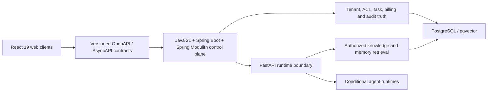

**English** | [简体中文](README.zh-CN.md)

# Enterprise Agent Platform

[](https://github.com/tacitjj/enterprise-agent-platform/actions/workflows/ci.yml)
[](LICENSE)
[](dianlian-platform/pom.xml)
[](dianlian-ai-runtime/pyproject.toml)
[](dianlian-web/package.json)

A governed, fail-closed reference platform for enterprise digital employees and AI agents. The project focuses on the control-plane problems that become critical beyond a chat demo: tenant isolation, authorization, durable execution, auditable context, model routing, and cost control.

> [!WARNING]
> This is an early-stage reference implementation for local research, architecture validation, and community collaboration. It has not completed production hardening or compatibility guarantees. Do not use it with sensitive data or deploy it to production without an independent security review.

## Why this project exists

Enterprise agents rarely fail only because of model quality. They fail when model calls are allowed to become the source of truth for permissions, task state, memory, billing, or side effects. This repository explores a different boundary:

- Java owns tenant, identity, authorization, task, billing, and audit truth.
- Python provides a constrained anti-corruption boundary for retrieval and conditional agent runtimes.
- React consumes real APIs through explicit adapters and never silently falls back to prototype data.
- OpenAPI and AsyncAPI contracts version the boundaries shared by all three stacks.
- Unavailable or unauthorized capabilities fail closed instead of fabricating success.

## Architecture



Read the concise [architecture overview](docs/architecture/overview.md) or the detailed [Chinese technical specification](docs/architecture/%E7%82%B9%E8%81%94%E6%95%B0%E5%AD%97%E5%91%98%E5%B7%A5V1%E6%8A%80%E6%9C%AF%E6%96%B9%E6%A1%88.md).

## Repository map

| Path | Responsibility |
| --- | --- |
| `dianlian-platform/` | Java 21 business control plane built with Spring Boot and Spring Modulith |
| `dianlian-ai-runtime/` | FastAPI anti-corruption boundary for context and agent runtime integrations |
| `dianlian-web/` | React 19 user, enterprise administration, and platform operation surfaces |
| `contracts/` | Shared OpenAPI, AsyncAPI, and contract fixtures |
| `deploy/local/` | Local-only PostgreSQL and Redis orchestration |
| `docs/` | ADRs, product/design material, and the detailed architecture specification |

## Implementation status

| Area | Status | Boundary |
| --- | --- | --- |
| Modular Java control plane | Implemented and tested | Identity, employee configuration, tasks, billing, knowledge, memory, context, models, interaction, and integration modules |
| Versioned API and event contracts | Implemented | Public and internal OpenAPI plus AsyncAPI contracts and fixtures |
| React application surfaces | Working prototype, API migration in progress | API mode fails visibly and does not fall back to demo facts |
| FastAPI context boundary | Implemented and tested | Health, internal authentication, indexing, retrieval, migrations, and PostgreSQL integration |
| Long-running agent runtime | Conditional / planned | Enabled only after recovery, fencing, security, and quality gates pass |
| Production deployment | Not supported | Independent hardening, threat modeling, observability, and operational review are still required |

See [ROADMAP.md](ROADMAP.md) for the planned sequence and [CHANGELOG.md](CHANGELOG.md) for released changes.

## Prerequisites

- Java 21 and Maven 3.8.6+
- Python 3.12+ and `uv`
- Node.js 22+
- Docker Desktop for local PostgreSQL/pgvector and Redis

All credentials must come from environment variables or a local `.env`. The repository contains placeholders only.

## Quick start

Create local configuration, set non-empty local-only values for
`DIANLIAN_POSTGRES_PASSWORD` and `DIANLIAN_JWT_SECRET`, then start PostgreSQL
and Redis:

```bash
cp deploy/local/.env.example deploy/local/.env
docker compose --env-file deploy/local/.env -f deploy/local/compose.yaml up -d postgres redis
```

In the first terminal, load that configuration, map the Compose database
settings to Spring Boot, then build and start the Java API:

```bash
set -a
source deploy/local/.env
set +a
export DIANLIAN_DB_URL="jdbc:postgresql://127.0.0.1:${DIANLIAN_POSTGRES_PORT}/${DIANLIAN_POSTGRES_DB}"
export DIANLIAN_DB_USERNAME="${DIANLIAN_POSTGRES_USER}"
export DIANLIAN_DB_PASSWORD="${DIANLIAN_POSTGRES_PASSWORD}"
env JAVA_HOME=/path/to/java-21 mvn -f dianlian-platform/pom.xml \
  -pl dianlian-bootstrap -am -DskipTests package
env JAVA_HOME=/path/to/java-21 java \
  -jar dianlian-platform/dianlian-bootstrap/target/dianlian-bootstrap-0.1.0-SNAPSHOT.jar \
  --spring.profiles.active=local
```

Keep the Java process running. From a second terminal, verify that the API is
live before starting the web application in API mode:

```bash
curl --fail http://127.0.0.1:8080/actuator/health/liveness
cd dianlian-web
npm ci
env VITE_DATA_SOURCE=api DIANLIAN_DEV_API_TARGET=http://127.0.0.1:8080 npm run dev
```

Run the Python boundary:

```bash
cd dianlian-ai-runtime
uv sync --frozen
uv run uvicorn dianlian_runtime.app:create_app --factory --host 127.0.0.1 --port 8091
```

Local seed data and verification steps are documented in [`deploy/local/README.md`](deploy/local/README.md).

## Validation

The CI workflow runs the same three stack-level checks:

```bash
env JAVA_HOME=/path/to/java-21 mvn -f dianlian-platform/pom.xml test

cd dianlian-web
npm ci
npm test
npm run build
npm run test:sites

cd ../dianlian-ai-runtime
uv sync --frozen
uv run pytest
```

## Security model

The architecture treats model output, retrieval results, runtime events, and remote side effects as untrusted inputs. Important invariants include:

- authorization and tenant boundaries are rechecked by the business control plane;
- model credentials are referenced from the environment and are never stored as plaintext definitions;
- runtime and context integrations are disabled unless explicitly configured;
- task, billing, and side-effect operations use explicit idempotency and fencing boundaries;
- knowledge and memory retrieval is scoped before context assembly;
- failures remain visible instead of being converted into synthetic success.

Report vulnerabilities privately as described in [SECURITY.md](SECURITY.md).

## Contributing

Read [CONTRIBUTING.md](CONTRIBUTING.md) before opening a change. General questions belong in [GitHub Discussions or Issues](SUPPORT.md), while security reports must use the private advisory flow.

This project is available under the [MIT License](LICENSE).
