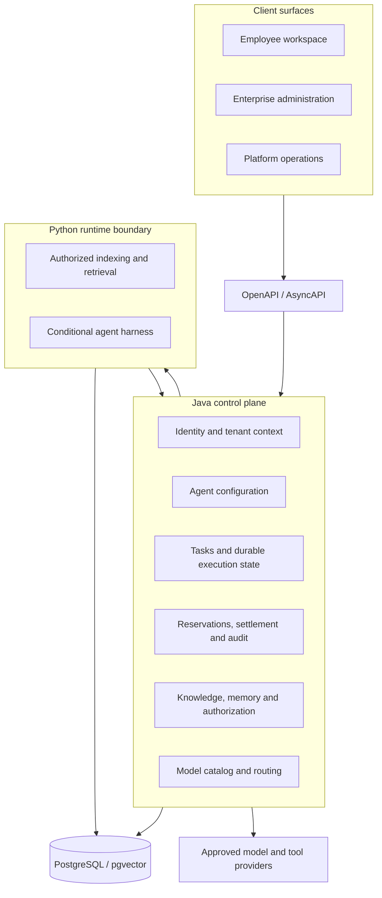

# Architecture overview

## Problem statement

The project treats an enterprise agent as a governed business actor rather than a model endpoint. Model quality matters, but production failures usually emerge at the boundaries around the model: authorization, durable state, context provenance, retries, side effects, auditability, and cost.

The architecture therefore separates the business control plane from AI execution. The control plane decides what may happen and records what did happen. Runtime components may propose or execute work only within explicit, short-lived boundaries.

## System boundary

## Core invariants

1. **Business truth stays deterministic.** Tenant, permissions, task state, approvals, billing, and audit facts are owned by Java and PostgreSQL, not by an LLM or a workflow graph.
2. **Context is authorized before assembly.** Knowledge and memory candidates are filtered by the current tenant, actor, agent, task, and scope before they enter a prompt.
3. **Execution is durable and fenced.** Idempotency keys, execution generations, leases, and fencing tokens prevent retries or stale workers from duplicating accepted work.
4. **Side effects are explicit.** Unknown remote outcomes enter reconciliation instead of being retried blindly.
5. **Credentials remain external.** Model definitions reference environment-backed credentials and approved endpoints; secrets are not stored in the catalog.
6. **Failure remains visible.** Disabled or unavailable integrations produce a controlled failure or waiting state, never a fabricated result.

## Stack responsibilities

### Java 21 control plane

Spring Boot and Spring Modulith provide a modular business system for identity, enterprise agent configuration, tasks, billing, knowledge, memory, context authority, interaction, model routing, and integration adapters. Explicit module boundaries keep AI infrastructure replaceable without transferring business authority to it.

### FastAPI runtime boundary

The Python service provides internal authentication, health contracts, context indexing and retrieval, migrations, and a narrow boundary for future agent runtimes. Optional LlamaIndex or DeerFlow capabilities are enabled only after their corresponding authorization, recovery, fencing, and quality gates are satisfied.

### React application surfaces

The web project contains separate user, enterprise-administration, and platform-operation information architectures. API adapters make the migration from prototype data explicit. API mode does not silently return to local demo facts when a request fails.

### Versioned contracts

OpenAPI, AsyncAPI, and fixtures are kept in the repository so Java, Python, and React can evolve against reviewable boundaries. Internal runtime contracts are distinct from public application APIs.

## Maturity

This repository is an early reference implementation, not a supported production distribution. The implemented control-plane and context slices are covered by automated tests, while long-running agent execution and production deployment remain gated work. See [ROADMAP.md](../../ROADMAP.md) for the current sequence.
