# 点联数字员工 V1 技术方案

> 文档版本：V1.0-draft.9  
> 文档状态：架构评审稿  
> 对应产品文档：《点联数字员工 V1 产品方案》  
> 适用范围：点联 V1 用户端（含产品内个人会话与群聊）、企业管理端、平台管理端；钉钉/飞书仅预留扩展接口  
> 核心行业：展览 / 会展 / 活动执行  
> 更新时间：2026-08-10

---

## 1. 文档目的

本文用于确定点联 V1 的技术边界、系统架构、核心数据模型、可扩展角色与能力体系、知识与记忆方案、可引导执行机制、按需 GraphRAG、接口约束、部署方式、阶段交付和验收标准。

本文是一份可进入研发评审和任务拆分的技术基线，不是最终接口文档，也不替代后续的数据库设计、OpenAPI、部署手册和测试用例。

本文定义的是“可生产化的设计基线”，不是对生产稳定性的提前承诺。只有完成本文规定的运行监督、容量压测、安全攻击测试、备份恢复、故障注入和小流量试点门禁，并保留可复现证据后，相关能力才能标记为生产就绪。

V1 的技术重点不是“再封装一个大模型聊天窗口”，也不是围绕某一个岗位写死一套流程，而是建立六项可持续扩展的企业能力：

1. 数字员工的岗位、权限、工具和工作流程可配置。
2. 同一套底座可组合出几十种角色，能力、工具、流程和成果物按版本复用。
3. 同一数字员工面对不同用户、点联内部群聊和项目时拥有隔离且可治理的记忆；点联内部群聊在 V1 交付，钉钉/飞书等外部群入口后续接入。
4. 对话贯穿任务执行全程，用户可随时补充、纠正、改目标、暂停、继续和批准。
5. 企业知识、历史经验和业务事实可被可靠检索、引用和追溯；模型不取代权限、规则和业务真相。
6. 每次模型和工具消耗都可计量、计价、扣减智点、对账并形成企业与平台两级经营分析。

### 1.1 品牌、工程名与商业单位

| 对象 | 冻结名称 |
|---|---|
| 正式品牌 | 点联 |
| 逻辑仓库 | `dianlian-workforce` |
| Java 平台 | `dianlian-platform` |
| Python AI Runtime | `dianlian-ai-runtime` |
| Web 前端 | `dianlian-web` |
| 用户端 | 点联企业数字办公大厅 |
| 企业端 | 点联企业管理中心 |
| 平台端 | 点联平台运营中心 |
| 页面额度名称 | 智点，固定展示 `1 元 = 100 智点` |

REST API 继续使用中性 `/api/v1`。账务内部可保留稳定的 `quota_*`、`credit-*` 和 `micro_credit` 契约名称，但它们不能出现在用户界面；`1 智点 = 1,000,000 micro_credit`，因此 `1 CNY = 100,000,000 micro_credit`。价格、余额、预占、实扣、释放和退回只使用整数最小单位或高精度定点数，禁止浮点账务。

---

## 2. V1 结论摘要

### 2.1 架构结论

| 决策项 | V1 结论 |
|---|---|
| 总体形态 | Java 模块化单体为业务主系统；Python LlamaIndex 上下文服务保持无状态，负责知识、记忆召回编排和按需 GraphRAG |
| Java 技术底座 | Java 21 LTS、Spring Boot、Spring Modulith、Maven 多模块 |
| Java AI 框架 | 只选 LangChain4j，不同时引入 Spring AI 作为第二套主框架 |
| Java 持久化 | 普通目录、配置和分页查询可使用 MyBatis-Plus；智点账本、成员撤权、消息序号、任务/Run、Outbox/Inbox、幂等与 CAS/行锁事务继续使用显式 SQL/JDBC。MyBatis-Plus 多租户插件不作为权限安全边界 |
| Python AI 运行单元 | V1 使用同一 `dianlian-ai-runtime` 代码库和镜像版本：LlamaIndex 负责知识/记忆上下文，DeerFlow Harness 作为复杂长任务的条件运行时；Context 与 Agent 使用独立进程角色、Worker、数据库账号和连接池，达到组织或发布门禁后再拆服务 |
| Agent 运行时 | LangChain4j 是普通问答和短任务默认实现；DeerFlow Harness 仅处理深度研究、沙箱、文件/浏览器操作和内部子 Agent 等复杂步骤，由 Java `AgentRuntimePort` 路由，不部署完整 DeerFlow App 作为点联入口 |
| Agent 生产监督 | `dianlian-ai-runtime` 必须提供独立于 Agent Graph 的持久化 Run Supervisor，负责 Run 准入、排队、单活、lease/heartbeat、fencing、接管、取消、事件日志和故障恢复；PostgreSQL Checkpointer 只负责图状态，不替代运行监督器 |
| Java-Python 服务治理 | 短检索可同步、复杂 Run 必须异步；Java/Python 使用独立有界资源池、超时、限流、熔断和统一 Trace。V1 不为调用一个 Python Runtime 强制引入完整 Spring Cloud |
| 角色扩展 | 角色模板 + 能力包 + 版本化执行计划；角色不对应一个硬编码 Java 模块 |
| 首批能力切片 | 首批优先验证平面出图、法务合同审核和报价；三者共用知识、记忆、会话、任务、成果、审批和计费内核，只通过能力包、执行模板、规则与工具形成差异 |
| 交互方式 | 产品内个人会话与群聊共同作为工作与任务控制面；群内通过显式选择、`@` 或回复数字员工触发，支持普通问答及执行中补充、纠正、暂停、继续和重新规划 |
| GraphRAG | 不作为 V1.0 默认基础设施；先在一个关系密集能力上离线评估，基础检索不达标且图检索有可证明增益时，可在 V1.0 试点中升级启用 |
| 长期记忆 | 自研 Memory Service 为权威服务；LlamaIndex 只负责在授权范围内检索 |
| 业务主库 | V1.0 默认使用阿里云托管 RDS PostgreSQL 作为唯一权威数据库，业务、记忆治理、知识元数据和检索索引不拆成多套自建数据库 |
| 向量与词法检索 | V1.0 默认使用同一 RDS PostgreSQL 的 pgvector + 全文检索；通过 `KnowledgeRetrievalPort` 预留百炼知识库、OpenSearch、DashVector 等托管增强实现 |
| 关系图 | V1.0 默认不部署 Neo4j；关系事实先落 PostgreSQL，未来按评估结果选择 PolarDB PostgreSQL GraphRAG、托管图服务或其他 `GraphRetrievalPort` 实现 |
| 文件存储 | 阿里云 OSS 保存原始文件、解析中间物和成果；数据库只保存受控元数据和引用 |
| 缓存与短会话 | Redis 不是权威存储；试点期按多实例广播、限流和热点缓存需要决定是否启用托管 Redis |
| 异步任务 | 业务事实与 Outbox 同事务；复杂 Run 先持久化再由 Worker 领取，SSE 不是任务真相。试点期可使用数据库驱动 Worker，任务量或隔离要求达到门禁后在 V1.0 内升级托管消息队列 |
| 模型与 AI 基础服务 | 文本、视觉理解、生图、图片编辑和 OCR/内容安全均通过版本化 Provider 接入统一 Model Gateway；模型、路由和费率均版本化，凭据只保存 `env:DIANLIAN_MODEL_*` 引用，调用端点同时经过精确主机白名单和公网地址校验；Embedding 和 Rerank 默认接入阿里云百炼。百炼知识库、长期记忆仅作为可替换增强服务，不保存点联唯一业务真相 |
| 实时输出 | Web 写入使用 REST，个人/群消息及任务事件使用 SSE 接收和断线补拉；V1 不以 WebSocket 作为默认聊天链路 |
| 前端 | 保留现有 React 19 + Vite，按真实接口接入顺序逐步迁移 TypeScript/TSX，不另起 Vue 重写；用户端以数字员工办公室为唯一主入口，渲染实现通过 `OfficeRenderer` 隔离；企业/平台管理端共享设计系统与领域类型，但保持路由和权限边界分离 |
| 商业计费 | 智点账户 + 调用预占 + 实际结算 + 不可变账本；不直接修改一个余额数字 |
| 模型价格 | 上游单价、计费倍率和生效时间全部版本化，每次调用冻结价格快照 |
| 统计 | 企业侧看额度与自身多维消耗；平台侧额外看供应商成本、计费消耗、直接贡献额和对账 |
| 高风险动作 | 合同审核结论确认、报价定稿、外部发布、外部系统写入等必须经过预览、确认或审批 |

### 2.2 最关键的边界

```text
大模型 / LangChain4j
  负责：意图理解、任务规划、结构化抽取、内容生成、工具选择、结果说明
  不负责：租户权限真相、长期记忆真相、确定性业务规则、审批状态、交付状态

LlamaIndex
  负责：文档摄取、索引、混合检索、重排、案例图检索、上下文组装、检索评估
  不负责：记忆授权、记忆确认、业务审批、领域计算、任务状态真相

DeerFlow Harness（条件启用）
  负责：复杂步骤的长任务、Checkpoint、沙箱、上下文压缩和步骤内部子 Agent
  不负责：企业数字员工协作真相、业务权限、长期记忆、审批、预算、计费和外部入口

GraphRAG Provider（条件启用）
  负责：为指定能力包发现实体、事件、资源、结果之间的多跳关系
  不负责：保存唯一业务事实、自由执行模型生成的查询、直接决定业务结果

RDS PostgreSQL
  负责：租户、用户、数字员工、权限、记忆、知识元数据、知识片段、向量、领域事实、任务与审计真相
```

### 2.3 V1 为什么现在引入 LlamaIndex，以及如何使用 GraphRAG

点联的商业差异不主要来自模型，而来自企业知识和工作记忆。LlamaIndex 因此不应再作为后续优化组件，而应从 V1 承担上下文数据工程。

GraphRAG 进入 V1 的评估范围，但不作为 V1.0 默认运行依赖。只有确实需要多跳关系推理、且在同一黄金数据集上显著优于结构化查询 + 词法 + 向量混合检索的能力，才通过 `GraphRetrievalPort` 在试点期间升级启用。不能为了“首版有 GraphRAG”把全企业文档构造成一张大图，也不默认让每个角色、每次问答都走图检索。

这样可以在首版形成真实优势：

- 能为报价、合同条款与历史处置、投标、客户服务等关系密集场景找到可解释的历史路径。
- 能解释为什么推荐某些历史案例或处理方式，而不是只返回语义相似的文本片段。
- 能将已确认的业务结果、实际执行结果和人工修订反向沉淀为企业经验。
- 同时避免全量 GraphRAG 带来的抽取成本、错误关系、难以更新和排查困难。

### 2.4 V1.0 当前方案、试点升级与未来规划

V1.0 采用“托管基础设施、点联掌握业务真相、效果门禁驱动升级”的路线。外部服务解决运维和通用 AI 数据处理问题，不替代点联的租户隔离、记忆治理、知识权限、版本、审计和计费能力。

| 阶段 | 默认组件 | 目标 | 明确不做 |
|---|---|---|---|
| V1.0 当前基线 | 托管 RDS PostgreSQL + pgvector/全文检索、OSS、统一 Model Gateway 下的文本/视觉/生图/编辑/OCR Provider、百炼 Embedding/Rerank、`dianlian-ai-runtime`（LlamaIndex + 持久 Run Supervisor；DeerFlow 通过故障注入 PoC 后按能力启用）、Java Memory Service | 用最少组件交付知识、分层记忆、三个首批能力、个人/群聊和任务闭环 | 不默认部署 Neo4j、独立向量库、OpenSearch；不把百炼或 DeerFlow 记忆作为权威记忆库 |
| V1.0 试点增强 | 在同一 Provider 端口后按问题选配百炼知识库、OpenSearch/DashVector、托管消息队列或受控 GraphRAG | 当真实黄金集、延迟、容量或交付稳定性不达标时，在不改业务模型的前提下增强 | 不同时引入多个同类检索后端；每次只解决一个已量化问题 |
| V1.1 规模化 | 多实例、托管缓存/消息、专用检索服务、索引迁移与双读验证 | 支撑更多企业、文档和并发，降低单租户故障影响 | 不因规模化把派生索引升级为业务事实主库 |
| V2 平台开放 | 动态自主组队、开放开发者平台、公开技能市场、跨企业分发与商业结算 | 把 V1 已有的受控协作、技能中心和第三方接入契约升级为开放平台 | 不让外部渠道、开发者或模型平台反向拥有点联核心数据语义 |

V1.0 的“升级”不是版本失败，也不要求等到 V1.1。只要试点中出现可复现、可量化的效果问题，并且增强方案在同一数据集上通过回归、安全、成本和回滚评估，就可以作为 V1.0 的兼容增强发布。

---

## 3. V1 范围

### 3.1 交付端

| 端 | 主要能力 |
|---|---|
| 点联企业数字办公大厅 | 用户端唯一主入口；通过员工工位找人并发起个人会话/任务，通过协作房间进入点联内部群聊，通过任务看板和成果区查看、控制和交付工作 |
| 点联企业管理中心 | 配置企业数字员工、成员权限、知识、记忆、模型策略、智点，并查看企业多维用量与费用 |
| 点联平台运营中心 | 管理模板、能力包、知识、模型价格与倍率、租户智点，并查看平台级成本和经营统计 |
| 后续外部协同渠道 | 钉钉/飞书只定义适配器契约和身份模型，V1 不交付外部机器人、外部群聊回调和渠道 H5；不影响点联内部群聊交付 |

#### 3.1.1 统一企业入口与管理域

上表的“交付端”表示权限域和信息架构，不表示必须建设三套登录系统或三套前端工程：

- 企业普通员工、审批人、项目/群管理者和企业管理员共用同一账号体系、Bearer JWT、设备会话、活动租户与企业工作平台。所有企业成员先进入企业数字办公大厅。
- 企业管理中心是同一企业应用内的受限管理域。只有服务端会话含相应企业管理权限时才显示入口和页面；“能查看或使用数字员工”不等于“能招聘、配置或启用数字员工”。
- 点联平台运营中心属于点联内部运营上下文。平台会话不携带活动租户；如同一自然人同时拥有平台和企业身份，必须显式切换上下文并重新计算权限，不能把两类权限合并进同一个 `AccessContext`。
- Web、App、小程序和桌面端复用同一登录命令、JWT、权限码和领域接口，只改变导航与展示密度，不重新定义角色、记忆作用域或业务状态。
- EVENT 原型的顶栏、左侧工作入口、组织大厅和右侧渐进抽屉作为企业工作平台的首要视觉与交互基线；固定演示身份、固定房间、固定员工、假进度和本地恢复数据不得进入生产事实链。

### 3.2 首批数字员工与平台边界

1. 点联平面出图员工：接收文字、参考图和品牌素材，完成多模态需求理解、文生图/图生图与受控编辑、尺寸变体、质量与安全检查，交付具有完整来源链和图片用量账单的版本化成果。
2. 点联法务合同审核员工：对合同文件安全解析和 OCR，完成条款分段与原文定位、依据检索、风险分级、修改建议和红线差异，最终由有权限的企业法务或审批人确认；输出只用于辅助审核，不能表述为法律结论。
3. 点联报价员工：从文本、图片和文件提取结构化需求，在授权范围内关联历史项目和价格事实，由确定性规则完成计价与复算，生成绑定依据、版本和审批的报价草案。

这三个角色是 V1 的验收样例，不是平台固定上限，也不应分别写死成三套运行框架。知识与记忆不再单独包装成一个首批岗位，而是三类员工及后续全部角色共同使用的上下文底座：平面出图检索已授权品牌规范、素材和历史确认成图，合同审核检索已授权模板、条款库和企业规则，报价检索已授权价格资产、历史案例和已确认结果；所有召回继续执行同一 ACL、引用、记忆确认和作用域隔离规则。

公众号及其他内容平台发布继续保留为通用 `Delivery` 适配器能力，可被未来内容类角色或任意合规成果复用，但不属于上述三个首批角色的核心执行链，也不作为三类能力验收成功的替代条件。后续投标专员、销售助理、客服专员、招聘助理、会议助理、项目复盘专员等角色，应通过复用能力包、工具和执行模板完成组装。

### 3.3 V1 必须完成

- 多租户、成员、角色和数据权限。
- 数字员工模板与企业实例分离。
- 能力注册、能力包、工具授权、输入输出 Schema 和版本化执行模板。
- 受控多数字员工协作：任务计划显式声明参与员工、步骤负责人、依赖、输入输出、转交和失败策略；支持人工确认、暂停、改派和统一审批。
- 平台技能中心、技能版本与发布治理，以及白名单第三方工具/业务 API Provider 契约；V1 不要求开放公共市场和开发者自助上架。
- 文本、图片、文件、个人/群多轮会话和流式回复。
- 点联内部群聊、成员与访问策略、可用数字员工绑定、显式选择/`@`/回复路由、群消息顺序与实时广播，以及普通问答或群聊转任务、检查点、成果和审批的闭环。
- 对话中发起任务、执行中补充/纠正/暂停/继续，以及局部重算或重新规划。
- 企业知识入库、版本、权限、检索、引用和删除。
- 用户、点联内部群聊、项目、数字员工维度的长期记忆；`GROUP_AGENT` 是 V1 真实群聊生产作用域，必须完成跨群、私人到群和成员变更后的隔离测试。
- 至少一个关系密集能力包完成 GraphRAG 对照评估；仅当基础混合检索未达门禁且图检索有可证明增益时，才在 V1.0 试点中启用受控图检索，其他角色不产生图服务依赖。
- 领域规则引擎接口，以及首批能力所需的确定性规则、版本和人工调整审计。
- 任务状态、重试、取消、人工确认和审批。
- 预留统一外部协同渠道适配接口，实际钉钉/飞书接入进入后续版本。
- 模型路由、智点、价格倍率、预占扣款、费用账本、调用审计、限额和降级。
- 企业按员工、模型、能力、用户/部门、点联内部群聊和时间查看消耗；平台查看更完整的成本、扣费、直接贡献额和对账。

### 3.4 V1 明确不做

- 不做无限自由编排的通用 Agent 搭建平台。
- 不做任意多个数字员工动态组队、无限互聊和自主扩权的开放式多 Agent 网络；该限制不排除 V1 计划内的受控协作和任务转交。
- 不让 LLM 或 GraphRAG 直接决定金额、审批、权限、发布等确定性业务结果。
- 不把所有企业文档默认转成知识图谱。
- 不开放任意 Text-to-Cypher 查询生产图数据库。
- 不承诺首版覆盖所有内容平台的一键发布。
- 不默认把所有聊天内容都写入长期记忆。
- 不在 V1 同时维护 LangChain4j 与 Spring AI 两套主链路。
- 不在 V1 进行模型微调；优先使用提示词、检索、工具和结构化数据。
- 不在 V1 实现钉钉/飞书机器人、外部群聊回调和渠道 H5，只保留可扩展接口；该排除项不包含点联产品内部群聊。

---

## 4. 架构原则

### 4.1 权威事实与派生索引分离

租户、权限、记忆、业务对象、审批、成果和交付结果等事实保存在关系数据库中。向量、全文和条件启用的关系图均为派生索引，必须能够从权威数据重建。

### 4.2 先鉴权，后检索

检索系统不能先从全局召回，再仅靠提示词要求模型忽略无权数据。所有查询必须携带服务端生成的 `AccessContext`，在向量、全文、图和结构化查询阶段进行前置过滤。

### 4.3 当前明确指令高于历史记忆

长期记忆用于辅助，而不是永久控制用户。当前任务中的明确要求应覆盖旧偏好；冲突记忆必须可修订、失效和删除。

### 4.4 业务流程由可干预状态机控制

LangChain4j 的工具调用用于单个步骤中的能力编排，不承担跨小时、跨审批、可重试的长期流程。平台状态机保存执行计划、步骤依赖、人工检查点和版本。用户在执行中提交的新指令必须进入状态机，经过影响分析后继续、局部重做或重新规划。

### 4.5 高风险动作始终保留人

以下动作不能仅凭模型输出自动完成：

- 对外正式发布内容。
- 提交财务或业务规则计算结果。
- 修改企业主数据或第三方系统业务数据。
- 将敏感推断写入长期记忆。
- 跨项目、跨共享作用域或跨成员扩散信息。

### 4.6 框架可替换，业务语义不可被框架绑架

核心业务层只依赖点联自己的 `ModelRequest`、`ContextBundle`、`MemoryItem`、`ToolInvocation`、`TaskRun` 等对象，不直接暴露 LangChain4j、LlamaIndex 或某一模型厂商的类型。

---

## 5. 总体架构

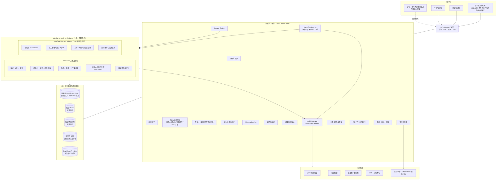

### 5.1 对话驱动且可随时干预的请求主链路

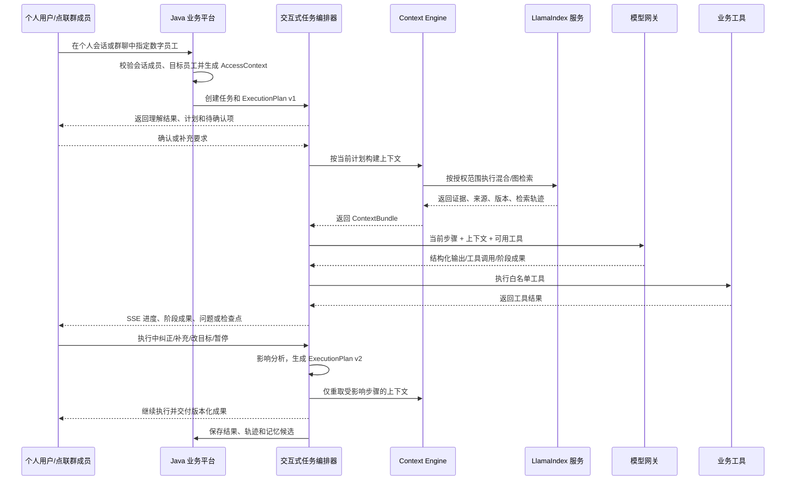

这条链路是平台所有角色的公共运行方式。数字员工不是“输入一次、后台跑完、最后返回”的黑盒；对话本身就是任务的控制面。

### 5.2 Java 与 Python 的通信和运行时路由

Java 与 Python 采用独立进程/容器，通过版本化内部 HTTP/JSON API 通信；长任务进度使用 SSE。V1 不使用 Java 进程直接执行 Python 脚本、JNI、Jython 或共享进程内对象。

Java 调用 Python 的“创建 Thread / 创建 Run”只负责持久化命令并返回运行标识，不在外部 HTTP 请求、Java 数据库事务或公共 API 工作线程中同步等待 Agent 执行完成。Python `runtime-api` 在 `QUEUED` Run 提交成功后返回，`agent-worker` 再异步领取执行；Java 通过可重放事件和状态查询推进业务任务。

LlamaIndex 检索可以在明确的短时 deadline 内同步调用；超时后必须明确降级、追问或返回暂不可用，不能无限占用请求线程。分钟到小时级 DeerFlow Run 一律走异步控制面。任一 SSE 连接中断都不得取消 Run、丢失终态或触发重复 Run。

Java 公共 API、Runtime 命令、Runtime 事件消费、Model Gateway、Tool Gateway 和用户端 SSE 使用独立有界资源池。Python 的 `runtime-api`、`context-worker`、`agent-worker`、Sandbox Provisioner 及模型/工具回调客户端同样隔离，避免“Java 等 Python、Python 又等待已耗尽的 Java 资源”形成反馈式资源自锁。

请求按任务步骤路由，不按整个数字员工永久绑定运行时：

| 请求类型 | 默认执行位置 |
|---|---|
| 企业管理、权限、群聊消息、任务、审批、额度和统计 | Java 业务平台 |
| 普通对话、简单生成、结构化提取、单步工具调用 | Java `LangChain4jAgentRuntime` |
| 企业知识、长期记忆和历史经验召回 | Python `LlamaIndexContextModule` |
| 深度调研、大量文件处理、浏览器操作、代码沙箱、长时间执行 | Python `DeerFlowAgentRuntime` |

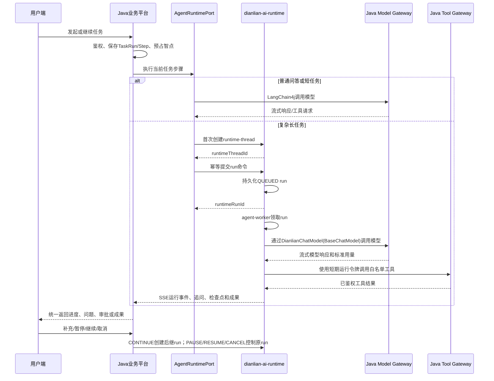

Java `task_run/task_step` 是业务状态真相；DeerFlow Thread、Run 和 Checkpoint 只是执行状态。一个需要连续追问、补充和纠正的点联 `task_step` 映射到一个 `runtime_thread_id`：首次执行使用 `operation_kind=START` 创建 Run；用户在持久 Checkpoint 后回答、补充或明确“继续”时，使用 `operation_kind=CONTINUE` 创建新的后继 `runtime_run_id` 并引用 `predecessor_runtime_run_id + expected_checkpoint_id`；显式重试、重规划和替代执行分别创建 `RETRY / REPLAN / REPLACE` Run。`RESUME` 仅表示把同一个 `PAUSED` Run 恢复为 `RUNNING`，保持原 `runtime_run_id`、`task_execution_generation`、费用意图和 Checkpoint，不创建第二个 Run。

`CONTINUE` 准入时必须保持 Thread 单 Active Operation：若前序 Run 已在 `WAITING_USER_INPUT` 并持久化安全 Checkpoint，Run Supervisor 在同一事务中以 `terminal_reason=CHECKPOINT_HANDOFF` 封存前序 Run、递增 `task_execution_generation` 并创建后继 `QUEUED` Run；若前序 Run 仍在执行，则只保存 `SAFE_QUEUE` 控制意图，到达安全点后再执行上述原子切换。两者通过 `task_run_id + task_step_id + task_execution_generation + runtime_thread_id + runtime_run_id + runtime_checkpoint_id` 映射，不能由 Python 状态直接替代企业任务、审批或扣费状态；重新规划产生语义完全不同的新步骤时创建新 Thread，不复用旧执行上下文。

数字员工之间的分工、转交和统一审批由 Java 任务计划控制。DeerFlow 子 Agent 只能作为当前数字员工步骤内部的执行手段，不能自行创建企业数字员工身份、扩大知识/工具权限或改变预算归属。

Spring Cloud 不是该边界稳定运行的前置条件。V1 使用 Spring Boot + Spring Modulith、版本化 HTTP/JSON + SSE、独立资源池、熔断/限流和 OpenTelemetry 即可；如果未来拆出多个 Java 服务，或企业已有统一注册发现、配置和网关平台，再按组织门禁选择性引入 Spring Cloud Alibaba。Spring Cloud、OpenFeign 或 gRPC 均不能替代持久 RunStore、lease、Checkpoint、事件重放和副作用幂等。

---

## 6. 工程与代码组织

### 6.1 推荐仓库结构

V1 推荐采用单仓库或同一项目组下的多应用仓库，逻辑结构如下：

```text
dianlian-workforce/
├── dianlian-platform/              # Java 业务主系统
│   ├── dianlian-bootstrap/
│   ├── dianlian-identity/
│   ├── dianlian-employee/
│   ├── dianlian-interaction/
│   ├── dianlian-task/
│   ├── dianlian-capability/
│   ├── dianlian-context/
│   ├── dianlian-memory/
│   ├── dianlian-knowledge/
│   ├── dianlian-artifact/
│   ├── dianlian-delivery/
│   ├── dianlian-billing/
│   ├── dianlian-analytics/
│   ├── dianlian-integration/
│   └── dianlian-governance/
├── capability-packs/             # 领域能力包，不进入平台核心依赖
│   ├── graphic-design/
│   ├── contract-review/
│   └── quotation/
├── dianlian-ai-runtime/            # V1 同一代码库/镜像版本，按进程角色独立扩缩容
│   ├── dianlian_context/           # LlamaIndex：摄取、检索、上下文、评估
│   ├── dianlian_deer_runtime/      # DeerFlow Harness Adapter：复杂长任务（按能力启用）
│   ├── dianlian_model_provider/    # BaseChatModel适配器，调用Java Model Gateway
│   ├── dianlian_tool_client/       # 调用 Java 白名单工具网关
│   └── dianlian_runtime_api/       # HTTP/SSE 契约、Checkpoint、运行事件
├── dianlian-web/
│   ├── apps/portal/              # 数字员工办公室用户端
│   ├── apps/admin/               # 企业/平台管理端
│   └── packages/design-system/
├── deploy/
├── scripts/
│   ├── dev/
│   ├── migration/
│   ├── evaluation/
│   └── operations/
└── docs/
```

如果团队决定拆分代码仓库，模块职责和契约仍保持不变，不应按“一个页面一个服务”拆分微服务。

### 6.2 Java 模块边界

| 模块 | 数据所有权 | 主要职责 | 禁止直接承担 |
|---|---|---|---|
| identity | 租户、用户、企业成员、角色；外部渠道身份映射接口预留 | 登录、租户上下文、权限、组织 | 保存点联内部群成员关系、内容检索和模型调用 |
| employee | 员工模板、企业员工实例、能力、提示词版本 | 员工生命周期和配置 | 保存用户聊天记忆 |
| interaction | 个人/群会话、参与人、可用数字员工绑定、消息、MessageTarget、附件、读取位置、引导指令 | 成员生命周期、消息顺序、显式选择/`@`/回复的目标归一化、SSE 广播与补拉、将对话路由到进行中任务；预留外部渠道消息归一化端口 | 自行改变任务状态或把内部群聊实现成外部渠道适配器 |
| task | 任务、计划版本、步骤、检查点、重试、人工节点 | 长任务编排、影响分析和可干预状态机 | 直接实现模型厂商逻辑 |
| capability | 能力定义、能力包、执行模板、工具授权 | 让多个角色复用能力并按版本运行 | 硬编码某个岗位的人设 |
| context | 上下文请求、检索策略、上下文包 | 统一组织记忆、知识、案例和当前任务 | 自己保存图索引 |
| memory | 记忆项、候选、冲突、策略、删除记录 | 长期记忆治理和权限 | 把 ChatMemory 当长期记忆 |
| knowledge | 知识空间、文档、版本、ACL、索引任务 | 知识生命周期和索引协调 | 直接回答用户问题 |
| artifact | 成果物、版本、格式、来源和依赖 | 统一管理文章、图片、表格、报告等结果 | 保存唯一外部投递状态 |
| delivery | 投递目标、回执、重试和部分成功 | 成果下载、内容平台和业务系统交付；外部协同消息渠道后续适配 | 承担点联内部群消息事实，或绕过确认、审批和权限 |
| billing | 模型费率、倍率、价格快照、智点账户、预占、结算、账本 | 商业计量与强一致扣费 | 从统计聚合反推余额 |
| analytics | 企业与平台统计查询、日聚合、导出 | 基于事实账本生成多维经营视图 | 成为新的费用事实来源 |
| integration | 模型、OCR、后续钉钉/飞书等外部协同渠道、内容平台适配器 | 外部协议隔离 | 拥有点联内部群聊或其他核心业务状态 |
| governance | 审批、审计、调用策略、风险规则 | 合规、追踪和运营治理 | 修改原模块权威事实 |

平面出图、合同审核、报价和投标等领域实现属于 `capability-packs`，可以拥有自己的领域表和规则引擎，但只能通过平台公开扩展接口接入。平台核心不反向依赖任何一个能力包。

### 6.3 模块内部结构

每个业务模块建议采用四层结构：

```text
module/
├── api/             # 对其他模块暴露的命令、查询、事件和 DTO
├── application/     # 用例编排和事务边界
├── domain/          # 聚合、实体、值对象、领域规则
└── infrastructure/  # 数据库、消息、第三方适配器
```

模块间通过公开 API 或领域事件协作，不直接读取其他模块的数据表。Spring Modulith 用于校验模块依赖和发布内部事件，不把实验性的 Agent 框架当业务工作流引擎。

### 6.4 核心抽象接口

以下为建议的业务抽象，实际包名和字段在详细设计阶段固化：

```java
public interface ContextEngine {
    ContextBundle build(ContextRequest request, AccessContext accessContext);
}

public interface AgentRuntimePort {
    RuntimeType type();
    CompletionStage<RunSubmission> submit(StartRunCommand command);
    CompletionStage<ControlSubmission> control(RuntimeControlCommand command);
    CompletionStage<RuntimeRunSnapshot> getRun(RuntimeRunId runId);
    CompletionStage<List<RuntimeArtifact>> getArtifacts(RuntimeRunId runId);
    CompletionStage<RuntimeEventPage> replayEvents(RuntimeEventReplayRequest request);
    Flow.Publisher<RuntimeEvent> subscribeEvents(RuntimeEventSubscription request);
}

public interface LongTermMemoryService {
    List<MemoryEvidence> recall(MemoryQuery query, AccessContext accessContext);
    MemoryCandidateId propose(MemoryCandidate candidate, AccessContext accessContext);
    void confirm(MemoryCandidateId candidateId, Actor actor);
    void forget(MemoryItemId memoryItemId, Actor actor);
}

public interface KnowledgeRetrievalClient {
    RetrievalResult retrieve(RetrievalRequest request, AccessContext accessContext);
}

public interface ModelGateway {
    ModelResponse invoke(ModelRequest request, ModelPolicy policy);
}

public interface UsageMeter {
    UsageEventId record(UsageMeterEvent event);
}

public interface PricingService {
    PricingSnapshot snapshot(PricingContext context);
    ChargeCalculation calculate(PricingSnapshot snapshot, NormalizedUsage usage);
}

public interface CreditAccountService {
    CreditReservation reserve(CreditEstimate estimate, IdempotencyKey key);
    CreditSettlement settle(CreditReservationId reservationId, ChargeCalculation charge);
    void release(CreditReservationId reservationId, ReleaseReason reason);
}

public interface CapabilityExecutor {
    CapabilityResult execute(CapabilityCommand command, ExecutionContext context);
}

public interface ExecutionPlanService {
    ExecutionPlan create(WorkGoal goal, AgentVersion agentVersion);
    PlanRevision applyGuidance(TaskGuidance guidance, ExecutionPlan currentPlan);
}

public interface BusinessRuleEngine<I, O> {
    O evaluate(I input, RuleSetVersion ruleSetVersion);
}

public interface ToolExecutor {
    ToolResult execute(ToolInvocation invocation, ToolPermission permission);
}
```

`submit` 只等待 Run 被幂等持久化为 `QUEUED`，不等待 Agent 执行完成。`control` 只返回 `PAUSE / RESUME / CANCEL` 控制意图已经持久化；其中 `RESUME` 必须指向原 `PAUSED runtime_run_id`。需要新用户输入或继续执行时调用 `submit(operationKind=CONTINUE)` 创建后继 Run，不能通过 `resume` 偷换输入。`replayEvents` 和 `subscribeEvents` 使用同一 `(runtimeRunId, afterSequence)` 游标语义；订阅中断后先重放持久事件，出现 `REPLAY_GAP` 时读取 Run、Checkpoint、Artifact 和 Usage 快照再续订。接口使用 JDK `CompletionStage` 与 `Flow.Publisher` 表达异步边界，不绑定 Reactor、LangChain4j 或 DeerFlow 原生类型。

这些接口不得返回 LangChain4j、LlamaIndex、OpenAI 或其他厂商的原生对象。具体能力包可以实现自己的 `BusinessRuleEngine`，例如计价、资质校验、排期或合规检查，但平台核心不认识这些领域类型。

---

## 7. 多租户、身份和权限

### 7.1 服务端访问上下文

群消息进入系统时，服务端先构造只负责解析一个或多个目标的 `InboundMessageRoutingContext`；每个目标校验通过后，再分别生成只包含一位数字员工的 `InvocationAccessContext`。业务、检索、记忆、工具和计费下游只能接收单目标 `InvocationAccessContext`，不得携带或读取其他目标员工列表：

```json
{
  "tenantId": "t_1001",
  "actorId": "u_2001",
  "actorType": "USER",
  "agentInstanceId": "a_3001",
  "channelType": "WEB",
  "conversationType": "GROUP",
  "conversationId": "c_4001",
  "groupId": "c_4001",
  "conversationMemberRole": "MEMBER",
  "messageTargetId": "mt_9001",
  "projectId": "p_5001",
  "departmentIds": ["d_01"],
  "allowedKnowledgeSpaceIds": ["ks_1", "ks_2"],
  "permissionCodes": ["task:create", "knowledge:read"]
}
```

客户端可以提交稳定的会话、目标数字员工、消息和任务标识，但不能自行声明 `tenantId`、群成员角色、部门、知识空间、预算归属或管理员权限。服务端必须先把 `@`、选择或回复解析成稳定 `message_target`，再从登录身份、点联内部会话成员关系、数字员工授权、后续渠道绑定关系和数据库权限为每个目标分别计算单员工调用上下文。`GROUP` 会话的 `groupId` 使用内部 `conversationId` 作为稳定作用域，不再维护第二套群主键。

### 7.2 角色

| 角色 | 权限边界 |
|---|---|
| 平台管理员 | 管理平台模板、行业知识、模型和平台策略；默认不能直接查看租户私有知识和私人记忆 |
| 企业管理员 | 管理本企业员工、成员、知识、审批和配额；不能默认读取成员私人记忆 |
| 企业成员 | 使用已授权员工和知识，管理自己的私人记忆 |
| 群聊管理者 | 按企业策略管理指定点联群的成员、可用数字员工和群设置；不自动获得业务审批权、成员私人记忆或企业全局权限 |
| 项目管理员 | 管理指定项目知识、共享会话和业务成果，不自动获得整个租户权限 |
| 审批人 | 查看审批所需最小上下文，执行批准或驳回 |
| 审计/支持人员 | 仅在授权工单、限定时段和全量留痕下访问必要诊断信息 |

### 7.3 数据权限规则

- 所有核心表必须包含 `tenant_id`，平台公共模板使用显式的系统归属，不以空值模糊表达。
- 唯一索引优先包含 `tenant_id`，避免跨租户自然键冲突。
- 数据库连接角色区分应用读写、迁移、只读分析和索引同步。
- PostgreSQL RLS 可作为第二道隔离，但不能替代应用层权限检查和测试。
- 对象存储路径不得依赖用户上传文件名决定，应使用服务端对象 ID 和租户前缀。
- 向量 payload、图节点和检索缓存必须携带最小必要的隔离标签。
- 每一种检索适配器都必须通过同一套越权测试，不能只测试主数据库。
- 只有处于有效成员期的用户才能读取、发送或订阅点联群消息；退出、被移除、企业成员停用或群停用后，服务端立即撤销消息、附件、任务、成果和群记忆访问，并使权限缓存与 SSE 订阅失效。
- 群回答的可检索范围必须同时满足数字员工授权、会话/项目授权和当前消息全体可见接收者的权限，不能使用成员权限并集；消息正文、引用摘要、附件和生成成果使用同一受众边界。
- 群内成员角色只决定会话治理能力，任务负责人、协作者和审批人由任务权限单独判断。

---

## 8. 数字员工运行模型

### 8.1 五个核心概念

| 概念 | 含义 | 示例 |
|---|---|---|
| AgentTemplate | 平台提供的岗位模板 | 平面出图员工、法务合同审核员工、报价员工 |
| AgentInstance | 企业启用并定制后的数字员工 | “星海会展平面出图小联” |
| CapabilityDefinition | 可复用的原子或组合能力 | 资料检索、多模态需求抽取、条款分段、表格计算 |
| ToolDefinition | 访问模型、数据或外部系统的受控动作 | 生成/编辑图片、解析合同、渲染报价单 |
| ExecutionTemplate | 某项能力的版本化步骤与检查点 | 需求澄清 → 检索 → 草稿 → 审核 → 交付 |

“角色”是能力、工具、知识范围、执行模板、人设和权限的组合，不是一个 Java 类，也不对应一个独立微服务。

### 8.2 模板、实例与能力包

数字员工分为两层：

1. `AgentTemplate`：平台创建的岗位模板，引用一组版本化能力包、基础提示词、默认工具和输出契约。
2. `AgentInstance`：企业启用后的员工实例，定义名称、头像、工作说明、企业补充规则、可访问知识空间、模型策略、记忆策略和审批策略。

一个能力包可被多个角色复用。例如“企业知识检索”“文件结构化抽取”“DOCX 生成”“图片生成”“外部发布”都不应只属于某一个岗位。一个角色也可以组合多个能力包。

平台支持几十个角色时，新增角色通常只需要：

1. 选择已有能力包和工具。
2. 配置岗位提示词、输入输出 Schema 和执行模板。
3. 绑定知识范围、记忆策略、模型策略和权限。
4. 增加该角色的黄金测试集。

只有出现新的确定性领域规则或新外部系统时，才新增代码型扩展。企业只能在平台允许的扩展点中修改，不能覆盖安全提示、权限规则和工具风险等级。

### 8.3 角色与能力版本

建议采用以下版本链：

```text
AgentTemplateVersion
    -> CapabilityPackVersion[]
        -> CapabilityDefinitionVersion[]
        -> ExecutionTemplateVersion[]
        -> ToolDefinitionVersion[]
        -> InputSchemaVersion / OutputSchemaVersion
```

任务创建时必须冻结所用版本。平台升级模板不能悄悄改变正在执行或需要复现的历史任务；企业可以先灰度新版本，再决定是否迁移员工实例。

### 8.4 人设与上下文优先级

运行时上下文建议按以下优先级合成：

1. 平台安全、合规和工具约束。
2. 租户数据政策、审批和模型外发策略。
3. 数字员工岗位职责和输出契约。
4. 当前用户的明确任务指令。
5. 当前项目、共享会话和流程状态。
6. 已确认的用户—员工关系记忆和工作偏好。
7. 经授权检索的企业知识和历史案例。
8. 最近会话窗口。

当前明确指令与旧记忆冲突时，以当前指令为准，并可生成“是否更新长期偏好”的记忆候选。

### 8.5 能力和工具契约

每项能力必须声明：

- 输入类型：文本、图片、文件、结构化表单。
- 输出类型：文本、Markdown、DOCX、XLSX、PPTX、图片、结构化业务对象或发布草稿。
- 执行器类型：模型、检索、规则引擎、工具、人工检查点或子任务。
- 可调用工具及其风险等级。
- 可使用模型类型和数据外发级别。
- 超时、费用、重试和降级策略。
- 是否需要确认或审批。
- 是否允许执行中接受引导，以及引导后哪些步骤需要失效或重做。

工具风险建议分级：

| 等级 | 示例 | 执行策略 |
|---|---|---|
| L0 只读 | 搜索知识、读取项目、查询结构化数据 | 鉴权后可自动执行 |
| L1 可撤销写入 | 保存草稿、创建内部任务 | 执行后通知并可撤销 |
| L2 外部影响 | 发布文章、发送客户、写第三方系统 | 必须显式确认或审批 |
| L3 财务/敏感 | 财务结果、付款相关、跨组织数据 | 双重校验、审批和完整审计 |

---

## 9. 记忆系统设计

### 9.1 记忆不等于聊天记录

聊天记录用于还原会话；长期记忆用于在未来任务中复用稳定、明确且有价值的信息。不能把整个对话原样向量化后称为长期记忆。

V1 将记忆拆成以下类型：

| 类型 | 含义 | 示例 |
|---|---|---|
| Working | 当前任务临时状态 | 本轮还缺展位面积和城市 |
| Episodic | 已发生的事件和结果 | 上次工商银行项目采用了方案 B，最终中标 |
| Semantic | 经确认的事实 | 客户标准主色为深蓝色 |
| Procedural | 已验证的做事方法 | 该企业对外交付前先做品牌和合规校验 |
| Preference | 用户或群聊共享偏好 | 该群确认后续方案先给结论，再给依据 |
| Relationship | 人、客户、项目之间的稳定关系 | 李经理是该客户项目的业务审批人 |

Working Memory 可以有较短有效期；其他记忆必须经过治理后进入长期记忆。

### 9.2 记忆作用域

V1 必须同时支持以下作用域。其中 `GROUP_AGENT` 是点联内部群聊的真实生产作用域，`scope_id` 使用内部 `conversation_id`，再通过 `agent_instance_id` 形成“群聊 × 数字员工”隔离。钉钉/飞书真实外部群 ID 只在后续渠道版本映射到该内部稳定作用域。

记忆的物理分区与检索授权至少绑定 `tenant_id + scope_type + scope_id + agent_instance_id`。其中 `USER_AGENT.scope_id = user_id`，`GROUP_AGENT.scope_id = conversation_id`；任何缓存键、向量元数据、检索过滤和删除任务都必须携带同一组边界字段。不能只按用户、只按群或只按模板版本保存一份记忆，否则会把同一真人对不同数字员工的习惯或同一群内不同数字员工的经验串用。

```text
TENANT                  企业公共记忆
AGENT                   某个企业数字员工的岗位经验
USER_AGENT              某用户与某数字员工之间的私人记忆
GROUP_AGENT             某点联内部群聊与某数字员工之间的共享记忆
PROJECT                 项目范围内的事实和经验
CONVERSATION            当前会话短期状态
```

隔离规则：

- `USER_AGENT` 私人记忆不得进入任何共享会话回答，即使同一用户同时是共享会话成员。
- `GROUP_AGENT` 记忆只对当前仍有权限的共享会话成员和该数字员工生效。
- 即使成员完全相同，同一数字员工在两个群聊中的 `GROUP_AGENT` 记忆也不得互相召回；同一群中的不同数字员工也不能默认共享群记忆。
- `PROJECT` 记忆需同时满足项目成员权限，不能仅因加入同一租户而可见。
- 从私人对话中提取到、但对项目有价值的信息，必须由用户明确提升到项目或共享作用域。
- 企业管理员不能默认查看个人偏好类私人记忆，只能查看策略、数量、状态和合规审计。
- 普通群成员可以提出群记忆候选；谁能确认、修改、失效或遗忘群记忆由企业版本化策略决定，不能写死为所有成员或某一固定角色。
- 群附件默认只是当前会话上下文；提升为项目或企业知识必须走独立授权、发布和审计流程。
- 成员离群后立即失去群记忆访问权；群停用或数字员工从群移除后，对应记忆停止召回并按策略进入 `REVOKED`，但不能无审计地物理删除历史事实。

### 9.3 记忆生命周期

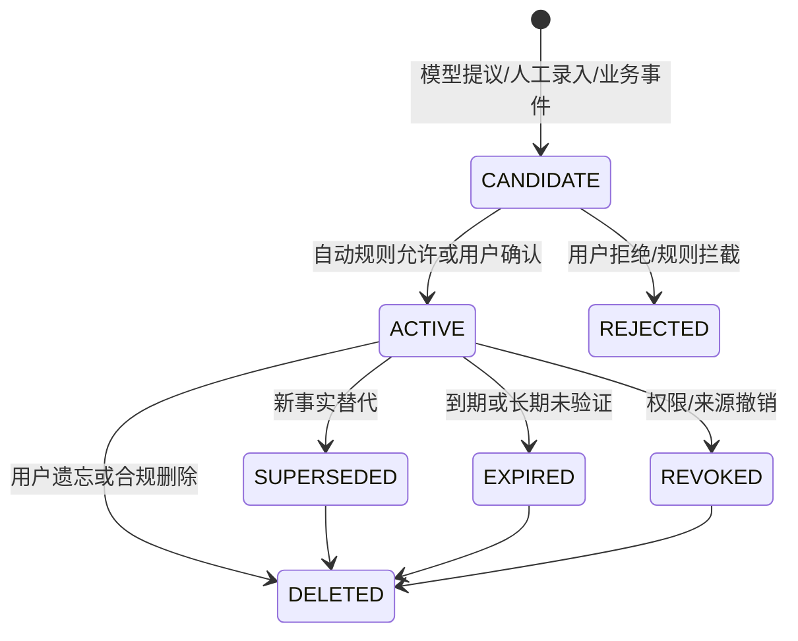

写入模式：

| 模式 | 适用场景 |
|---|---|
| EXPLICIT | 用户明确说“记住……” |
| CONFIRM_REQUIRED | 模型认为有长期价值，先展示候选让用户确认 |
| RULE_DERIVED | 由确定性业务事件生成，例如项目已验收 |
| ADMIN_IMPORT | 经授权批量导入企业规则和经验 |
| AUTO_LOW_RISK | 仅用于低敏、可撤回、稳定偏好，且企业策略允许 |

敏感个人信息、健康、财务、身份推断、跨成员关系推断不得自动写入长期记忆。

### 9.4 记忆核心数据模型

#### memory_item

| 字段 | 说明 |
|---|---|
| id / tenant_id | 主键与租户 |
| memory_type | EPISODIC / SEMANTIC / PROCEDURAL / PREFERENCE / RELATIONSHIP |
| scope_type / scope_id | USER_AGENT、GROUP_AGENT、PROJECT 等及对应 ID |
| agent_instance_id | 适用的数字员工实例，可为空表示租户通用 |
| subject_type / subject_id | 记忆主体，如用户、客户、项目 |
| predicate / object_json | 结构化事实，例如 `preferred_output_style -> table_first` |
| normalized_text | 用于检索和展示的规范化文本 |
| source_type / source_id | 来源会话、消息、任务、领域记录或人工导入 |
| evidence_json | 证据片段、业务事实版本和生成方式 |
| status | ACTIVE / SUPERSEDED / EXPIRED / REVOKED / DELETED |
| valid_from / valid_until | 有效时间 |
| sensitivity | PUBLIC_IN_TENANT / INTERNAL / PERSONAL / SENSITIVE |
| version | 乐观锁和修订版本 |
| created_by / confirmed_by | 创建者和确认者 |
| created_at / updated_at | 审计时间 |

#### memory_candidate

保存尚未成为长期记忆的提议，包括建议作用域、抽取内容、证据、冲突项、敏感级别、写入模式和确认状态。

#### memory_conflict

记录新旧记忆冲突、处理方式和最终生效版本。系统不能简单使用“最新向量相似项”覆盖旧事实。

#### memory_index_job

记录派生索引的写入、更新、删除、重试和校验状态，支持索引重建和删除传播。

### 9.5 记忆读取流程

1. 服务端构造访问上下文和允许作用域。
2. 根据数字员工岗位和当前意图决定要查询的记忆类型。
3. 先执行租户、作用域、状态、有效期和敏感级别过滤。
4. 组合结构化精确查询、关键词和向量召回。
5. 对冲突、时效和来源可靠性重排。
6. 只向模型提供本任务必要的最小记忆。
7. 在检索轨迹中记录使用的记忆 ID 和版本，不默认记录敏感正文。

### 9.6 记忆写入与纠错

- 模型只能创建 `memory_candidate`，不能直接绕过策略写入 `ACTIVE`。
- 业务事件可以通过确定性规则写入，但仍要保留来源和撤销路径。
- 用户可查看“这个员工记住了什么”、修改、转移作用域或遗忘。
- 删除后先修改权威状态并写删除墓碑，再通过 Outbox 清理全部副本；完整闭环遵循第 10.5 节。
- 检索阶段必须排除已删除状态，不能依赖异步索引删除完成后才停止召回。
- 对频繁变化的信息设置有效期；对稳定偏好设置定期复核，而不是永久生效。

---

## 10. 企业知识库设计

### 10.1 知识空间

| 空间 | 典型内容 | 权限 |
|---|---|---|
| PLATFORM | 平台通用能力和公开行业知识 | 平台统一维护，可按租户授权 |
| TENANT | 企业制度、品牌规范、供应商规则 | 企业成员按角色访问 |
| DEPARTMENT | 部门 SOP 和专属材料 | 部门范围 |
| PROJECT | 项目文件、沟通纪要、交付物 | 项目成员范围 |
| CASE | 已完成项目、交付结果和复盘 | 项目/管理权限 |
| AGENT | 某岗位专属操作手册和示例 | 已启用该员工且有权的成员 |

知识空间与数字员工不是一一绑定。企业可将多个空间授权给一个员工，也可让多个员工共享同一空间。

### 10.2 文档摄取链路

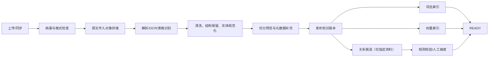

文档状态建议：

```text
UPLOADED -> SCANNING -> PARSING -> REVIEW_REQUIRED -> INDEXING -> READY
                                            \-> FAILED
READY -> UPDATING -> READY
READY -> DISABLED -> DELETING -> DELETED
```

### 10.3 解析与切分策略

| 内容类型 | V1 策略 |
|---|---|
| PDF / DOCX | 保留标题层级、页码、表格位置和段落关系 |
| XLSX | 按 Sheet、表头、业务行切分；保留单元格坐标和公式结果来源 |
| PPTX | 按页面和文本块处理；图片可选 OCR/视觉摘要 |
| 图片 | OCR + 视觉模型结构化抽取，保存原图区域引用 |
| 网页/Markdown | 保留标题、列表、链接和来源 URL |
| 领域单据 | 由能力包的专用解析器映射为结构化业务事实，文本块只作为辅助证据 |

切分不能只有固定字符长度。V1 至少按标题、表格、段落、页码和业务实体进行语义切分，并保存父子块关系。

### 10.4 版本与删除

- 原文件、解析结果、切分结果和索引均带 `document_version_id`。
- 新版本发布后，旧版本可保留审计但默认不参与普通检索。
- 回答必须引用实际使用的文档版本、页码或表格位置。
- 删除以关系数据库状态为准，并异步传播至向量、词法、图和缓存。
- 索引任务支持幂等、断点重试、死信和人工重放。
- 定期运行“权威记录—派生索引”数量及校验和对账。

### 10.5 删除、保留与防复活闭环

“立即停止访问”和“完成物理清理”是两个状态，必须分别记录：

```text
access_state     # ACTIVE / REVOKED / DELETED，权威事务提交后立即生效
purge_state      # PENDING / IN_PROGRESS / PARTIAL / COMPLETED / LEGAL_HOLD
```

删除或遗忘命令必须在同一事务更新权威 `access_state`、写入不可变删除墓碑和 Outbox。所有业务读取、检索请求和命中后二次鉴权首先检查权威状态，因此不等待异步清理即可停止召回。

删除任务至少覆盖：

- RDS 中的规范化正文、切分内容、OCR/解析中间结果和不再允许保留的记忆证据。
- OSS 中的原文件、解析产物、临时文件和受影响的临时成果。
- pgvector、全文、图索引、检索缓存和运行时缓存。
- 实际启用的百炼知识库、外部长期记忆或其他 Provider 副本。
- 允许删除的检索轨迹、调试样本和导出副本。

索引写入、更新和删除事件必须携带 `resource_version + event_sequence`。每个索引目标保存当前最大版本和删除墓碑；小于墓碑版本或序号的迟到任务必须被拒绝，不能让重试、重建或乱序消费重新写回已删除内容。

每个删除目标保存独立执行状态、尝试次数、下一次重试时间、最后错误和完成回执。超过删除 SLA、外部 Provider 无法确认删除或出现 `PARTIAL` 时必须告警并进入人工责任队列。

审计、法律保留和用户遗忘发生冲突时，由版本化数据保留策略决定：审计记录只保留必要标识、哈希、动作和账务事实，不继续保留可删除正文。处于 `LEGAL_HOLD` 的数据必须记录依据、范围和解除时间，不能用无限期保留作为默认值。

备份中的数据按保留窗口自然淘汰；从旧备份恢复后必须先重放恢复时点之后的删除墓碑，再开放业务流量，防止已删除数据重新出现。

---

## 11. Python AI Runtime：LlamaIndex + DeerFlow

### 11.1 V1 接入形态和拆分边界

V1 只维护一个 `dianlian-ai-runtime` Python 代码库和镜像版本，内部包含两个独立逻辑模块：

- `LlamaIndexContextModule`：知识摄取、索引、检索、记忆召回编排、重排和上下文组装，从 V1 默认启用。
- `DeerFlowAgentRuntime`：基于 DeerFlow Harness 的复杂长任务、Checkpoint、沙箱、浏览器/文件操作和步骤内部子 Agent，通过 PoC 后按能力启用。

点联不部署完整 DeerFlow App，也不把 DeerFlow Gateway、用户体系、Agent 管理页面或线程页面作为点联产品入口。`dianlian-ai-runtime` 始终对 Java 暴露自己的版本化 HTTP/SSE 防腐接口；内部可以复用经过审查并锁定版本的 DeerFlow Gateway runtime kernel，也可以在 Harness-only 模式下由点联实现等价 Run Supervisor。Java 不依赖 DeerFlow 原生 Gateway API 和内部对象，直接调用 `DeerFlowClient.stream/astream` 不能被视为完整的生产长任务系统。

两个模块可以共享服务身份规范、Trace 规范、配置中心接入、同一 RDS PostgreSQL 实例和 OSS 客户端规范，但必须使用独立进程角色、Worker 并发池、数据库账号、Schema 写权限和连接池。V1 可以同镜像部署 `runtime-api`、`context-worker` 和按需启用的 `agent-worker`，分别扩缩容和熔断；后续只有在发布频率、故障隔离或团队边界证明有必要时，才拆成独立代码仓库和服务。

### 11.2 LlamaIndex 上下文模块职责

LlamaIndex 服务承担：

- 文档解析结果到节点的转换。
- 文本和结构化元数据索引。
- 词法、向量、结构化和图检索路由。
- 多路召回融合和重排。
- 上下文预算控制、去重和证据打包。
- 条件启用的关系抽取候选和 GraphRAG Provider 同步。
- 检索轨迹、离线评估和回归对比。

不承担：

- 用户登录和最终权限计算。
- 记忆是否应该被写入或共享。
- 领域业务状态、审批状态和交付状态。
- 直接执行外部写入工具。
- 保存无法从权威数据恢复的唯一业务事实。

### 11.3 DeerFlow Harness复杂任务模块职责

DeerFlow Harness 模块只作为 `AgentRuntime` 的一个实现，承担：

- 分钟到小时级复杂任务的执行、Checkpoint、暂停、继续、取消和崩溃恢复。
- 当前数字员工步骤内部的任务拆分、上下文压缩和受控子 Agent 并发。
- Docker/Kubernetes沙箱内的文件、代码和浏览器操作。
- 运行事件、追问、检查点、工具轨迹和成果文件的标准化输出。

明确不承担：

- 企业、用户、群聊、数字员工、任务、审批、预算和费用的权威状态。
- 数字员工之间的业务分工与任务转交；这些由Java任务计划控制。
- 企业长期记忆写入决定；生产使用 `RuntimeFeatures(memory=False)` 关闭 DeerFlow 自动长期记忆，由点联 Memory Service 生成经过授权和版本冻结的 `ContextBundle` 注入当前运行。DeerFlow Checkpoint 仍保留用于执行恢复，但不得作为跨用户、跨群或跨项目长期记忆真相。
- 任意安装Skill/MCP、执行Host Bash、访问业务数据库或绕过Java直接调用供应商模型。
- 直接面向浏览器、点联群聊或钉钉/飞书提供入口；所有外部请求先进入Java平台。

#### Sandbox 生产隔离和工作区恢复

生产环境禁止 `LocalSandboxProvider`、Host Bash、宿主目录任意挂载和 privileged 容器。每个 Thread/Run 使用独立 Sandbox 身份，并限制 CPU、内存、进程数、磁盘、执行时长、网络出口和可访问域名。

```text
inputs       从 OSS 按授权清单只读物化
scratch      当前步骤临时文件，可丢弃
checkpoint   恢复所需中间文件，写 PVC/OSS 并保存 manifest
outputs      写 OSS 临时区，等待 Java 检查和 Artifact 登记
```

Checkpoint 不得只保存 Worker 本地文件路径。凡恢复仍需使用的文件，都必须保存内容哈希、对象存储引用和权限快照，或具备确定性重建方式。

多实例 Agent Worker 必须使用跨进程 Sandbox Ownership Store，保存 owner、lease、heartbeat 和 fencing token。Ownership Store 不可用时禁止把新 Sandbox 交给 Worker；回收器只有在原子确认 lease 已过期并成功接管后才能销毁孤儿容器。

Sandbox 使用非 root、只读基础文件系统、固定镜像 digest、最小 Linux capabilities 和默认拒绝的网络出口；停止、超时、取消及 Worker 崩溃后均有幂等清理和孤儿扫描。

### 11.4 Java-Python内部接口

Java 到 Python 使用版本化内部 API。V1 推荐 HTTP/JSON，便于调试、追踪和灰度；吞吐成为瓶颈后再评估 gRPC。

建议接口：

```text
POST /internal/v1/index/documents
POST /internal/v1/index/memories
POST /internal/v1/index/business-resources
POST /internal/v1/retrieval/search
POST /internal/v1/retrieval/relationships
POST /internal/v1/evaluation/run
DELETE /internal/v1/index/resources/{resourceType}/{resourceId}
GET  /internal/v1/jobs/{jobId}

POST /internal/v1/runtime-threads
POST /internal/v1/runtime-threads/{runtimeThreadId}/runs  # 幂等持久化QUEUED Run，返回202
POST /internal/v1/runs/{runtimeRunId}/pause
POST /internal/v1/runs/{runtimeRunId}/resume
POST /internal/v1/runs/{runtimeRunId}/cancel
POST /internal/v1/runs/{runtimeRunId}/authorize   # Java Gateway线性一致校验当前lease
GET  /internal/v1/runs/{runtimeRunId}
GET  /internal/v1/runs/{runtimeRunId}/events        # SSE
GET  /internal/v1/runs/{runtimeRunId}/artifacts
```

Python回调Java的内部端口：

```text
POST /internal/v1/model/invoke
POST /internal/v1/tools/{toolKey}/execute
POST /internal/v1/runtime/execution-token
POST /internal/v1/memory/search
POST /internal/v1/memory/candidates
POST /internal/v1/business/query
POST /internal/v1/artifacts/presign
```

内部请求必须使用双向服务身份或短期签名令牌、时间戳、防重放随机数和请求签名，并透传 `trace_id`、`tenant_id`、`task_run_id`、`task_step_id`、`agent_instance_id` 和 `budget_reservation_id`。接口不直接暴露给浏览器或渠道平台。

内部令牌拆成两类，禁止在 Run 尚未领取时预签发执行权限：

- `run_admission_token`：随 `CreateRuntimeThreadCommand / StartRunCommand` 使用，至少绑定 `issuer、audience、service_identity、expires_at、nonce、tenant_id、task_run_id、task_step_id、agent_instance_id、runtime_thread_id、runtime_run_id、task_execution_generation、operation_kind、runtime_type、runtime_agent_name、idempotency_key、request_hash`，只允许幂等创建/查询目标 Thread 与 `QUEUED` Run；不包含模型、工具、知识、记忆或企业事实访问权限。命令字段必须与令牌声明逐项一致；令牌过期、重放随机数已用、相同幂等键对应不同 `request_hash` 或任一绑定字段不一致时均失败关闭。
- `execution_access_token`：Worker 原子领取 Run 并取得真实 `runtime_run_lease_owner + runtime_run_lease_epoch` 后，通过 `POST /internal/v1/runtime/execution-token` 换取。Java 同时校验业务侧 `active_runtime_run_id + task_execution_generation`，并通过独立 `runtime-api` 状态查询确认当前 Runtime lease；校验器不可用或版本不明时失败关闭。

`execution_access_token` 限制有效期、租户、数字员工、任务步骤、知识范围、工具白名单和预算预占，并绑定 Python 服务身份、`runtime_run_id`、`task_execution_generation`、`runtime_run_lease_owner` 和 `runtime_run_lease_epoch`。每次 Java Model/Tool/Memory/Business Gateway 在准入上游调用前，都必须通过独立 `runtime-api` 的 `POST /internal/v1/runs/{runtimeRunId}/authorize` 对主库 `runtime_run` 执行线性一致校验：Run 仍为允许执行的 Active 状态、owner/epoch 完全相同且 lease 未过期。成功授权结果禁止正缓存；Authorizer 超时、不可用或状态不确定时失败关闭，并使用独立有界资源池避免与 Agent Worker 形成资源自锁。

接管事务递增 epoch 一旦提交，旧令牌的下一次 Gateway 准入必须被 Authorizer 拒绝，新 Worker 重新交换令牌后才能调用。接管前已经准入且无法撤回的供应商请求按真实 Attempt 记成本，旧 Worker 的后续事件、成果和副作用提交仍由 Runtime fencing 与业务执行代次拒绝，不能把它伪装成“未发生”。Java 的短期 `task_worker_lease_epoch` 不写入长 Run 身份。

成员/员工授权撤销、预算失效、租户停用或 Run 被接管时立即拒绝续期并撤销后续模型/工具权限；执行令牌续期失败时 Run 进入 `WAITING_AUTH` 或 `PAUSED`，不得继续调用。Java工具网关在每次调用时重新鉴权，不能因为请求来自内网Python服务就信任模型参数。

生产环境中的 DeerFlow 模型调用必须经过 `DianlianChatModel（实现 LangChain BaseChatModel） -> Java Model Gateway`，确保流式文本、Tool Call、多模态消息、取消/超时、供应商 Attempt、Token/图片用量、价格快照、智点和失败重试全部进入同一事实链。PoC 若临时直连模型，只能用于效果验证，不能作为商业试点验收结果。

V1 的 DeerFlow 工具默认实现为受控 LangChain `BaseTool` 代理，由 Python 使用短期运行令牌调用 Java Tool Gateway。工具数量和第三方接入规模达到门禁后，可由 Java Tool Gateway 增加内部 HTTP MCP Server，但鉴权、租户隔离、预算和审计仍在 Java；禁止租户或模型动态注册任意 stdio MCP、文件系统 MCP 或未经平台审核的远程 MCP。

`CreateRuntimeThreadCommand` 至少包含：

```text
runtimeThreadId / tenantId / userId / conversationId / sourceMessageId
taskRunId / taskStepId / agentInstanceId
capabilityVersionId / promptVersionId / runtimeType / runtimeAgentName
runAdmissionToken / modelPolicyId / budgetReservationId
inputArtifactIds / deadline / idempotencyKey / requestHash
```

`StartRunCommand` 至少包含：

```text
tenantId / taskRunId / taskStepId / agentInstanceId
runtimeThreadId / runtimeRunId / predecessorRuntimeRunId / sourceMessageId / inputType
operationKind(START|CONTINUE|RETRY|REPLAN|REPLACE) / multitaskStrategy
messageOrControlPayload / expectedCheckpointId
taskExecutionGeneration / runtimeType / runtimeAgentName
runAdmissionToken / budgetReservationId / idempotencyKey / requestHash
```

`RuntimeControlCommand` 与新 Run 准入必须分离，至少包含：

```text
runtimeThreadId / runtimeRunId
controlType(PAUSE|RESUME|CANCEL) / actorId / reasonCode
expectedRunVersion / idempotencyKey / requestHash
```

`RESUME` 不携带新用户输入、不携带 `run_admission_token`，只能恢复同一个 `PAUSED runtime_run_id`；需要消费新输入或从持久 Checkpoint 继续时必须提交 `operationKind=CONTINUE` 的后继 Run。`request_hash` 由规范化的业务请求生成，包含目标标识、操作类型、输入/成果引用、Checkpoint、预算与控制意图，排除 `trace_id`、时间戳、随机数等非业务字段，以保证等价请求稳定幂等。

Python向Java输出的 `RuntimeEvent` 使用稳定枚举，至少包括：

```text
RUN_QUEUED / RUN_STARTED / RUN_RESUMED / PLAN_CREATED / STEP_STARTED / STEP_PROGRESS
TOOL_CALLING / TOOL_COMPLETED / WAITING_USER_INPUT / WAITING_AUTH
CHECKPOINT_SAVED / ARTIFACT_CREATED
RUN_PAUSED / RUN_CANCEL_REQUESTED / RUN_CANCELLING
RUN_CANCELLED / RUN_FAILED / RUN_COMPLETED
```

事件只携带运行摘要和受控引用；完整Prompt、工具密钥、知识正文和敏感业务数据不得默认写入通用事件表或日志。重要事件先追加写入持久事件日志再广播，Java 按事件 ID 和序号幂等消费，并把用户可见事件转换为点联统一 SSE 协议。

每个 `RuntimeEvent` 必须携带 `runtime_thread_id`、`runtime_run_id`；产生或恢复检查点时还必须携带 `runtime_checkpoint_id`。Java 保存 DeerFlow Harness 版本、点联 Adapter 版本和 `runtime_agent_name`，以便历史任务恢复、灰度和问题回放。

Runtime 状态是执行事实，Java `TaskStep / Task` 是业务事实。两者的准入映射冻结为：

| Runtime Run 事实 | Java `TaskStep` 投影 | Java `Task` 投影与处理 |
|---|---|---|
| `QUEUED` | 首代且尚未开始的步骤为 `READY`；后继代保持 `RUNNING` | 首代为 `QUEUED`；后继代保持 `RUNNING`，不回退已展示进度 |
| `RUNNING` | `RUNNING` | `RUNNING` |
| `WAITING_USER_INPUT` | `WAITING_EXTERNAL`，必须关联已持久 Checkpoint | `WAITING_USER + INPUT_REQUIRED`，责任方为用户或任务负责人 |
| `WAITING_AUTH` | `WAITING_EXTERNAL` | `WAITING_USER + AUTH_REQUIRED`，责任方按缺失的授权类型确定为用户或企业管理员 |
| `PAUSED` | 保持 `RUNNING`，在当前执行绑定上标记控制状态 | `PAUSED`；`RESUME` 只恢复该 Run |
| `CANCEL_REQUESTED / CANCELLING` | 保持 `RUNNING`，标记取消处理中 | 保持非终态，不得提前展示“已取消” |
| `COMPLETED` | 通过事件、执行代次、Artifact 和 Usage 校验后置 `SUCCEEDED`；`terminal_reason=CHECKPOINT_HANDOFF` 时保持 `RUNNING`等待后继 Run | 由全部步骤聚合得出 `RUNNING / WAITING_CONFIRMATION / SUCCEEDED / PARTIAL_SUCCESS`，不由 Runtime 直接写任务成功 |
| `FAILED` | 可重试且剩余次数大于 0 时为 `RETRY_WAIT`，否则为 `FAILED_FINAL` | 依步骤依赖与是否仍有可执行步骤聚合为 `QUEUED / RUNNING / FAILED / PARTIAL_SUCCESS` |
| `CANCELLED` | `CANCELLED` | 全部必需步骤终止后才置 `CANCELLED` |
| `CANCEL_OUTCOME_UNKNOWN` | `BLOCKED_SIDE_EFFECT_RECONCILIATION` | `PAUSED + SIDE_EFFECT_RECONCILIATION`，启用写副作用屏障 |

Java 只接受同时匹配 `task_step_id + active_runtime_run_id + task_execution_generation` 的 Runtime 事件，事件的 `runtime_event_id` 在 Inbox 中幂等，并与 `TaskStep`、`Task`、Artifact/Usage 关联和业务 Outbox 在同一 Java 事务提交。过期执行代次、非当前 Run 或越权事件只记安全审计，不改变业务状态。

### 11.5 生产 Run Supervisor 与 Harness 边界

DeerFlow Harness 负责 Agent Graph、模型/工具循环、Checkpoint、子 Agent 和 Sandbox 能力；PostgreSQL Checkpointer 可以保存 Thread 图状态，但不自动解决 Run 排队、跨实例执行所有权、心跳、接管、取消、SSE 重放和外部副作用幂等。

`dianlian-ai-runtime` 必须提供持久化 Run Supervisor。ADR-042 已选择在点联防腐层后复用并锁定经过审查的 DeerFlow Gateway runtime kernel，不暴露 DeerFlow App、页面、用户体系和原生 API。Harness-only 自建 Supervisor 只作为上游兼容性或许可发生实质变化时的退出方案，不与 V1 主路径并行实现，生产环境也不得临时混用两套 RunStore、lease 或事件日志。

最小运行记录：

```text
runtime_thread
runtime_run
runtime_run_control
runtime_run_event
runtime_tool_effect
runtime_sandbox_lease
```

`runtime_run` 至少保存：

```text
runtime_run_id / runtime_thread_id / tenant_id / task_step_id
task_execution_generation
status / operation_kind / request_hash / idempotency_key
predecessor_runtime_run_id / run_version / terminal_reason
lease_owner / lease_until / lease_epoch / heartbeat_at
attempt / runtime_version / agent_name
checkpoint_id / cancel_requested_at
started_at / terminal_at / failure_code
```

Run 创建必须先在 PostgreSQL 中幂等提交为 `QUEUED`，再由 Worker 领取。HTTP 超时后，调用方使用原 `idempotency_key + request_hash` 查询第一次结果，不得创建新的 Run。

一个 Thread 同时只允许一个 Active Operation。`START / CONTINUE / RETRY / REPLAN / REPLACE` 创建新 Run，`PAUSE / RESUME / CANCEL` 只向原 Run 写入受版本保护的控制意图；Run 准入、控制变更与 Checkpoint 写入通过数据库唯一约束、行版本和原子事务串行化，不能只依赖进程锁。并发请求只能采用显式策略：

- `REJECT`：返回当前 Active Run。
- `SAFE_QUEUE`：保存输入，等待当前 Run 到达安全点后再创建新 Run。
- `INTERRUPT`：先持久化中断请求，当前 Run 完成安全终止后再准入替代 Run。

V1 默认由 Java 保存用户 Guidance 并使用 `SAFE_QUEUE`；事实纠正、取消和高风险操作不得静默合并。

数据库单 Active Operation 约束使用冻结状态集合：`QUEUED / RUNNING / WAITING_USER_INPUT / WAITING_AUTH / PAUSED / CANCEL_REQUESTED / CANCELLING` 属于 Active；`COMPLETED / FAILED / CANCELLED / CANCEL_OUTCOME_UNKNOWN` 属于 Runtime 终态。新增状态必须先更新唯一约束、恢复语义和契约测试，不能只加枚举。

Worker 使用 `lease_owner + lease_until + lease_epoch` 领取 Run，并周期性 heartbeat。每次续租、Checkpoint、终态、Artifact 和工具结果写入都必须携带当前 `lease_epoch`。发生接管后，旧 Worker 的写入必须被 fencing 条件拒绝，并停止后续模型、工具和成果提交。

首次领取在同一数据库条件更新中把 `lease_epoch` 初始化为 1；每次接管原子递增。领取成功后才能交换 `execution_access_token`，`QUEUED` Run 的 Admission 凭证不能调用任何模型、工具或业务数据接口。

Java 的 `task_worker_lease_owner / task_worker_lease_until / task_worker_lease_epoch / task_worker_heartbeat_at` 只保护短期调度和“创建或替换执行绑定”的提交临界区；Python `runtime_run` lease 保护 Agent 执行所有权。`task_step` 另存稳定的 `task_execution_generation + active_runtime_run_id`，并为每一代追加 `task_step_execution(task_step_id, execution_generation, runtime_run_id, status)`，至少建立 `unique(task_step_id, execution_generation)` 和 `unique(runtime_run_id)`。

创建 Python Run 时，持有 Java Worker lease 的 Worker 先在业务事务内生成新的 `task_execution_generation`、预分配 `runtime_run_id`、写入 `task_step_execution + active_runtime_run_id + Outbox`；提交后再用同一 `runtimeRunId + taskExecutionGeneration` 异步发送 `StartRunCommand`。Java Worker 崩溃或其短期 lease 被接管时，新 Worker 继续查询/观察已绑定的同一个 Run，不得仅因 `task_worker_lease_epoch` 变化创建第二个 Run。首次 `START`、新输入 `CONTINUE`、显式 `RETRY / REPLAN / REPLACE` 或取消后重建会创建新执行代次；`PAUSE / RESUME / CANCEL` 是对原 Run 的控制，不递增 execution generation。

Java 接受 RuntimeEvent、步骤终态、正式 Artifact/计费关联和业务 Outbox 时，校验 `task_step_id + active_runtime_run_id + task_execution_generation` 并按 Runtime event ID 幂等提交，不再要求原 Java Worker lease 仍存活；已被新 execution generation 替代的旧 Run 结果必须拒绝。Java 原生步骤的短期 Worker 提交仍以 `task_worker_lease_owner + task_worker_lease_epoch` fencing。

#### 持久事件日志与 SSE Replay

重要 `RuntimeEvent` 必须先追加写入 `runtime_run_event`，再发布到 SSE：

```text
unique(runtime_run_id, sequence_no)
unique(runtime_run_id, event_id)
```

必须持久化的事件至少包括：

```text
RUN_ACCEPTED / RUN_STARTED
CHECKPOINT_SAVED
TOOL_PREPARED / TOOL_COMPLETED / TOOL_OUTCOME_UNKNOWN
ARTIFACT_CREATED
CANCEL_REQUESTED / RUN_CANCELLED
RUN_FAILED / RUN_COMPLETED
```

Token delta、细粒度进度等高频事件可以只保存在有界滚动缓冲区，但必须定期生成可恢复的消息或进度快照。Java 保存每个 Run 的最后消费序号，并按至少一次语义幂等消费：

- 游标仍在保留窗口内：从下一事件继续。
- 游标早于保留水位：返回明确的 `REPLAY_GAP`。
- 收到 `REPLAY_GAP`：Java 重新读取 Run 终态、最新 Checkpoint、持久事件、Artifact 和用量事实，再从最新水位继续。
- Java 定时扫描长时间无事件的 Active Run，通过状态查询执行对账，避免连接静默断开后业务任务永久卡住。

Python 的事件日志是执行事实；Java 转换后的任务、消息、审批、成果和计费事件仍通过 Java Outbox 进入业务事实链。

Python Runtime 提交终态时，`runtime_run` 终态、对应的终态 `runtime_run_event`、必要的 `runtime_tool_effect` 运行投影和 Runtime Artifact receipt 必须在 `deer_runtime` 同一 PostgreSQL 事务提交，事务提交后才能发布 SSE。该事务不宣称能与 `dianlian_business` 的工具副作用权威记录跨 Schema 原子提交；两侧通过稳定 `effect_intent_id`、Java Outbox/Inbox 和对账闭环。定时对账任务扫描“终态无事件、事件有终态但 Run 未终结、Effect/Artifact receipt 缺失”等不变量并进入修复队列，禁止靠跨进程调用顺序假设一致。

#### 取消和外部副作用

取消接口返回成功只表示 `CANCEL_REQUESTED` 已持久化，不表示外部操作已经停止：

```text
CANCEL_REQUESTED -> CANCELLING -> CANCELLED
                               -> CANCEL_OUTCOME_UNKNOWN
```

Worker 收到取消或失去 lease 后，停止准入新的模型和工具调用，尝试取消支持取消的模型流、子 Agent 和 Sandbox 命令，禁止旧 lease 完成 Checkpoint、终态和成果登记，并对已经发出的远端副作用查询实际结果。只有确认不存在未决高风险副作用时才进入 `CANCELLED`。

`CANCEL_OUTCOME_UNKNOWN` 表示 Runtime 执行已停止，因此释放 Thread 的 Runtime Active Operation 槽位；但 Java 必须把对应 `TaskStep` 置为 `BLOCKED_SIDE_EFFECT_RECONCILIATION` 并设置写副作用屏障。屏障存在时只能执行查询回执、对账和人工处置，禁止创建具有写能力的 successor Run。只有远端确认未发生、确认已成功并登记回执、人工补偿完成，或有权限管理员明确确认风险并创建新的 `effect_revision` 后，才能解除屏障。

Checkpoint 保证状态恢复，不保证外部副作用只发生一次。`dianlian_business.tool_effect_intent` 是是否允许首次执行及远端结果的唯一权威记录，由 Java Tool Gateway 在实际调用前持久化：

```text
effect_intent_id / tenant_id / task_step_id
logical_effect_key / effect_revision / request_hash
status                         # PREPARED / EXECUTING / SUCCEEDED / FAILED / OUTCOME_UNKNOWN
remote_request_id / remote_receipt
unique(tenant_id, task_step_id, logical_effect_key, effect_revision)
```

Java Tool Gateway 收到相同唯一键和请求哈希时返回第一次的 `effect_intent_id` 与当前状态；键相同但请求哈希不同返回稳定冲突。`deer_runtime.runtime_tool_effect` 只是 Python 运行投影/轨迹，只引用 `effect_intent_id`，无权决定是否可再次执行。`tool_call_id` 只用于链路追踪，不参与业务幂等键；模型重试、Run 恢复和 Worker 接管必须复用原 `effect_intent_id`，不能因模型重新生成 Tool Call ID 而再次产生副作用。

只有幂等读操作、明确未发出的请求或供应商支持幂等键的写操作可以自动重试。网络超时后无法确认远端结果时进入 `OUTCOME_UNKNOWN`，先查询远端回执或人工处理，禁止直接重发。

非本地环境必须使用 PostgreSQL Checkpointer、持久 RunStore 和持久重要事件日志；检测到 memory、SQLite、JSONL 或仅本地 Thread 目录时启动失败。

### 11.6 DeerFlow依赖版本与防腐层

DeerFlow Harness 在 V1 设计期仍处于源码集成和公开分发演进阶段，不能直接跟随上游 `main` 构建生产环境。M0 必须选定经过 PoC 的官方源码 commit，通过内部制品或固定 Git commit 构建，并由 `uv.lock` 冻结完整 Python 依赖。

点联业务代码只能依赖 `dianlian_deer_runtime` 暴露的 `AgentRuntime` 契约，不得直接引用 DeerFlow 内部模块、Gateway DTO、配置文件路径或数据库表。升级 DeerFlow 时必须通过 Thread/Run/Checkpoint 映射、事件兼容、模型用量、工具授权、沙箱和恢复回归；升级失败时回滚点联 Adapter 与 DeerFlow 制品，不迁移或改写 Java 业务状态。

### 11.7 检索请求示例

```json
{
  "requestId": "req_01",
  "traceId": "trace_01",
  "intent": "HISTORICAL_EXPERIENCE_RECALL",
  "query": "查找与当前客户和需求相似的历史项目经验",
  "filters": {
    "tenantId": "t_1001",
    "allowedSpaceIds": ["ks_case", "ks_project_10"],
    "allowedScopeKeys": ["PROJECT:p_10", "TENANT:t_1001"],
    "agentInstanceId": "a_3001",
    "asOf": "2026-08-03T10:00:00+08:00"
  },
  "routes": ["STRUCTURED", "LEXICAL", "VECTOR", "GRAPH"],
  "topK": 20,
  "rerankTopN": 8,
  "contextBudgetTokens": 6000
}
```

### 11.8 检索响应示例

```json
{
  "requestId": "req_01",
  "evidences": [
    {
      "evidenceId": "ev_01",
      "resourceType": "BUSINESS_CASE",
      "resourceId": "case_2025_019",
      "versionId": "v_3",
      "title": "某客户 2025 华东项目复盘",
      "excerpt": "经脱敏且符合当前权限的证据摘要",
      "locator": {"documentId": "doc_12", "page": 8},
      "retrievalRoutes": ["GRAPH", "VECTOR"],
      "scores": {"fusion": 0.82, "rerank": 0.91},
      "validAt": "2026-08-03T10:00:00+08:00"
    }
  ],
  "sufficiency": "ENOUGH",
  "missingFields": [],
  "trace": {
    "strategyVersion": "historical-case-v1",
    "indexVersions": ["case-index-17", "graph-schema-3"],
    "latencyMs": 684
  }
}
```

分数只表示检索相关性，不能展示为“答案正确率”。

---

## 12. 混合检索与上下文组装

### 12.1 不同问题使用不同检索路线

| 场景 | 默认路线 |
|---|---|
| 企业制度/文档问答 | 词法 + 向量 + 元数据过滤 |
| 精确编号、名称、当前业务参数 | 结构化 SQL/API + 精确/词法检索 |
| 用户/共享作用域工作偏好 | 作用域过滤 + 结构化记忆 + 向量召回 |
| 需要多跳关系的历史经验 | 结构化过滤 + 按能力启用 GraphRAG + 向量召回 |
| 当前有效业务事实 | 权威 SQL/API，不使用历史文本猜测 |
| 广泛行业总结 | 普通知识 RAG；V1 不默认采用全局社区摘要 GraphRAG |

### 12.2 检索流水线

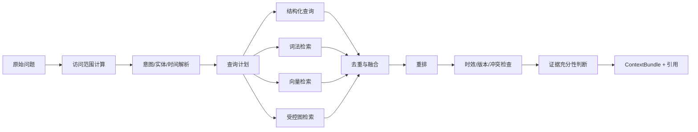

### 12.3 LangChain4j 与 LlamaIndex 的协作

LangChain4j 位于 Java 运行链路，负责：

- 模型适配和结构化输出。
- 工具声明与调用。
- 将 `ContextBundle` 注入当前数字员工请求。
- 文本、视觉和图像模型的统一调用。
- 流式响应和模型错误归一化。

LlamaIndex 位于 Python 数据链路，负责：

- 多源数据摄取和索引。
- 复杂检索、融合、重排和 GraphRAG。
- 形成带来源的证据集合。

Java 的 `ContextEngine` 是两者之间的业务控制层：它决定本次允许取哪些记忆、知识和案例，如何设置上下文预算，以及结果不足时是追问、拒答还是调用工具。

### 12.4 证据充分性

检索后必须返回以下状态之一：

| 状态 | 行为 |
|---|---|
| ENOUGH | 可基于证据回答并附引用 |
| PARTIAL | 明确说明缺失字段，给出有限结论或向用户追问 |
| CONFLICTED | 展示冲突来源，要求确认，不自行选一个当真相 |
| OUTDATED | 提示资料过期，优先查询当前结构化数据 |
| NONE | 拒绝编造，建议上传资料或选择知识范围 |

---

## 13. GraphRAG 作为按需能力

### 13.1 平台边界

GraphRAG 是 `RetrievalStrategy` 的一种实现，不是点联平台的默认数据结构，也不属于某一个固定角色。能力包只有同时满足以下条件时才应启用图检索：

1. 问题确实依赖两个以上实体之间的关系或历史路径。
2. 存在可追溯、可授权、可持续更新的数据来源。
3. 普通结构化查询、关键词和向量检索无法稳定完成任务。
4. 能定义受控图 Schema、查询模板和质量黄金集。
5. 图服务故障时存在可接受的降级路线。

不满足这些条件的能力继续使用结构化查询和普通混合 RAG，不为“技术先进”强行建图。

### 13.2 每个能力包拥有独立图 Schema

平台提供通用图基础设施，具体节点、关系和查询模板由能力包声明：

```text
GraphCapabilityManifest
├── graphSchemaVersion
├── allowedNodeTypes
├── allowedRelationTypes
├── entityNormalizationRules
├── extractionPolicy
├── queryTemplates
├── permissionProjection
├── fallbackRetrievers
└── evaluationDatasetVersion
```

不同能力包可以共用少量稳定实体，例如客户、项目、文档和人员，但不能把所有领域强塞进一张无边界的“万能企业图谱”。

| 能力包示例 | 可能的关系图 | 解决的问题 |
|---|---|---|
| 展览报价 | 客户—项目—需求—资源—成本—结果 | 找可比历史项目和影响因素 |
| 投标辅助 | 客户—招标—资质—案例—要求—结果 | 找满足资质和评分项的证据 |
| 客服辅助 | 客户—产品—故障—处理方案—结果 | 找相似故障及有效解决路径 |
| 合同审核 | 合同—条款—规则—案例—风险—处置结果 | 找标准条款、冲突依据和已确认历史处置 |
| 供应商管理 | 供应商—品类—项目—履约—质量—评价 | 发现历史合作、风险和替代关系 |

### 13.3 权威来源与派生关系

- 业务实体和结果的权威事实保存在领域数据库表中。
- 条件启用的 GraphRAG Provider 只保存检索所需属性、稳定业务 ID、来源版本和派生关系。
- 结构化事实通过确定性映射同步，不先转成文本再让模型猜测。
- 非结构化资料只使用能力包允许的严格 Schema 抽取；关系先进入候选，经规则或人工抽查后发布。
- 相似、关联、推荐等算法关系必须携带算法版本和生成时间，并可以全部重建。
- 命中图节点后回到 Java 领域服务重新鉴权并读取当前事实。

### 13.4 LlamaIndex 与 GraphRAG Provider

V1.0 默认只完成 Provider 契约、对照数据集和受控检索模板。评估通过并启用图能力后，LlamaIndex `PropertyGraphIndex` 或等价适配器负责编排图索引和图检索：

- 结构化数据使用确定性映射器。
- 非结构化关系使用严格 Schema 抽取器。
- 实体别名通过能力包的归一化规则处理。
- 图节点和关系必须携带 `tenant_id`、业务 ID、来源、版本、有效期和同步批次。
- 图同步支持增量更新、删除、租户级重建和 Schema 双版本迁移。

### 13.5 查询安全

生产查询优先使用参数化查询模板或自定义受控 Retriever；当 Provider 使用 Cypher 时，可采用 `CypherTemplateRetriever`：

- 模型只抽取模板参数，不提交完整 Cypher。
- 模板强制注入租户、授权范围、限定标签、路径深度、结果数和超时。
- GraphRAG Provider 使用最小权限只读查询身份；索引写入使用独立身份。
- 不向模型暴露无关 schema 和敏感属性。
- 任意 Text-to-Cypher 仅允许在脱敏、只读、非生产分析环境试验。

### 13.6 通用关系检索流程

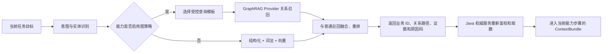

GraphRAG 的输出是证据、关系路径和候选业务 ID，不是最终业务决定。

---

## 14. 能力包与领域规则引擎

### 14.1 能力包组成

一个可发布能力包至少包含：

```text
manifest.yaml
├── packId / version / compatibility
├── capabilities[]
├── executionTemplates[]
├── inputSchemas[] / outputSchemas[]
├── tools[] / permissionRequirements[]
├── promptLayers[]
├── retrievalPolicies[]
├── optionalGraphManifest
├── artifactRenderers[]
├── riskAndApprovalPolicy
└── evaluationSuites[]
```

能力包不是任意代码上传。V1 由平台研发团队开发、测试、签名和发布；企业管理员只做受控配置。后续若开放生态，需要独立的沙箱、签名、依赖和安全审查机制。

### 14.2 执行器类型

| 类型 | 作用 |
|---|---|
| MODEL | 理解、抽取、生成、评审和说明 |
| RETRIEVAL | 从知识、记忆、结构化数据或关系图取证 |
| RULE_ENGINE | 精确计算、校验、评分、排期等确定性规则 |
| TOOL | 调用内部或第三方只读/写入能力 |
| HUMAN_CHECKPOINT | 补问、选择、确认、审批或人工修订 |
| SUBTASK | 将一个目标拆成可独立跟踪的子任务 |
| ARTIFACT_RENDERER | 输出 DOCX、XLSX、PPTX、PDF、图片或业务对象 |

同一能力的执行模板可以组合多种执行器，但最终步骤必须经过平台校验，不允许模型临时创造未注册的工具或高风险动作。

### 14.3 首批能力包与差异化技术链路

首批能力包用于验证平台能承载差异明显的岗位，不代表平台核心内置三套专用流程。三者统一复用 `ContextEngine`、`MemoryService`、任务/Run、Artifact、审批、智点和审计契约，只在输入输出 Schema、执行模板、模型/工具、规则与风险策略上形成差异。

| 能力包 | 复用的公共能力 | 特有扩展 |
|---|---|---|
| 平面出图 | 多模态输入、知识/记忆检索、任务引导、Artifact 版本、审批和智点 | 文生图/图生图与受控编辑、尺寸变体、品牌/文字/内容安全、版权边界、图片用量归一化 |
| 法务合同审核 | 文件安全、OCR、知识引用、任务引导、Artifact 差异和人工检查点 | 条款分段与原文定位、风险分级规则、红线建议、敏感 ACL、指定法务确认 |
| 报价 | 文件抽取、历史经验检索、引用、表格/PDF 成果和审批 | 可选关系检索、确定性计价、内外版字段隔离和金额版本冻结 |

#### 14.3.1 平面出图能力

```text
文本/参考图输入 -> 需求 Schema 确认 -> 素材 ACL/使用权检查
                 -> 多模态理解 -> 基础图生成或受控编辑
                 -> 尺寸/比例变体 -> 品牌、文字和内容安全检查
                 -> 人工选定 -> 高清导出与版本化 Artifact
```

- 输入快照至少固定用途/渠道、画布像素与比例、输出格式、文案与安全区、品牌色/字体/Logo、参考图及内容哈希、禁用元素、质量等级、变体数量、费用上限和素材使用权声明。客户端提交的文件 ID 或 URL 不能代替当前访问授权。
- Model Gateway 统一承载 `VISION_UNDERSTANDING / IMAGE_GENERATION / IMAGE_EDITING`。图生图、局部编辑或保留元素必须使用受控参数和输入资产引用，能力包不得绕过网关直连供应商，也不能把供应商原生对象写入业务模型。
- 基础图、编辑版和每个尺寸变体都是独立 `ArtifactVersion`，通过 `parentArtifactVersionId + derivationType` 建立 lineage，并保存输入资产/父版本哈希、能力与提示配置版本、模型与 Provider Attempt、参数摘要、确切尺寸/比例、内容哈希、质检及安全结果。单个变体失败允许任务部分成功，不能覆盖已成功版本。
- 输入侧校验参考图、Logo、字体等资产的授权范围和来源声明；输出侧执行供应商安全策略与平台内容安全、敏感元素、品牌规范、文字可读性和尺寸/安全区检查。系统只记录来源与检查证据，不得宣称自动取得版权、保证无侵权或替代人工品牌/版权确认；高风险或来源不清时阻断定稿。
- 图片计费按真实 `ProviderAttempt` 和标准化 meter 记录输入图、输出图、张数、宽高/分辨率、质量档、生成或编辑模式及供应商请求 ID；本地裁切/排版不能冒充一次模型生图。用户显式重新生成或重做某个变体创建新的收费意图，平台自动重试仍按统一重试承担策略处理。

#### 14.3.2 法务合同审核能力

```text
合同安全上传 -> 解析/OCR -> 条款分段与原文定位
             -> 企业规则/模板/依据检索 -> 风险识别与分级
             -> 修改建议和红线差异 -> 指定法务人工确认 -> 审核辅助成果
```

- 原合同先冻结 `DocumentVersion + contentHash`。解析/OCR 保存页码、段落、文本范围或坐标、识别置信度和异常页；无法稳定定位、关键页缺失或识别质量不足时暂停补件，不生成看似完整的审核结果。
- 每个条款使用稳定 `clause_id` 并保留到原文的定位；每个风险项绑定合同/条款版本、企业风险规则版本、已授权模板或知识 `Citation`、风险等级、影响、建议与置信说明。模型可发现候选风险和解释原因，但等级映射、必审项和高风险处置由版本化规则及人工决定，禁止虚构法律依据。
- 修改建议以结构化变更操作和独立修订成果表达，生成原文—建议稿红线差异；不得直接覆盖原合同。合同正文变化后，受影响风险项、修订稿和旧人工确认全部失效并按依赖局部重算。
- 合同原件、OCR 中间物、条款摘要、风险项、修订建议和对话继承同等或更严格的敏感 ACL；正文不默认写入长期记忆、普通日志或无权群聊。发送外部模型前按企业数据策略最小化，所有检索、预览、导出和成果访问重新鉴权。
- 高风险、适用口径不明、依据冲突、对外定稿等场景必须进入指定企业法务/审批人的 `HUMAN_CHECKPOINT`。系统成果固定标注“仅供合同审核辅助，不替代执业律师或企业法务的专业意见”，未经人工确认不得显示“审核完成”、自动签署、发送或作为法律结论。

#### 14.3.3 报价能力

```text
文本/图片/文件 -> 结构化需求抽取与缺项确认
               -> 历史项目/客户/工项/价格关联
               -> 差异与数据时点确认 -> 确定性计价和校验
               -> 内部分析版/客户版 Artifact -> 金额审批
```

- 当前需求按版本化 Schema 提取客户/项目、工项、数量、规格、地点、时间、币种、税费、利润、折扣、舍入和有效期；歧义与关键缺项必须追问或标记待询价，不能由模型补造单价和事实。
- 历史关联只在当前 ACL 内使用结构化条件、词法、向量及按门禁启用的关系检索，并保存候选案例、相似/差异字段、关联理由、数据版本和截止时间。历史报价是证据，不直接复制为当前金额。
- 数量、单价、成本、税费、利润、折扣和舍入由版本化 `BusinessRuleEngine` 生成 `CostCalculationSnapshot`；同一输入与规则版本必须可复算。LLM 负责抽取、候选关联、解释和草案编排，不能修改确定性计算结果或自行批准例外。
- 内部分析版保留成本、利润和供应策略，客户版只含获授权字段；二者分别保存为有 lineage 的 Artifact。人工调价必须记录前后值、原因和操作者，金额、规则或成果内容变化后原审批自动失效。正式报价只对绑定金额哈希和成果版本的有效审批成立，报价业务金额与 AI 智点消耗必须分开展示。

#### 14.3.4 公共知识、记忆与交付边界

- 知识与记忆是所有岗位的公共底座，不再由一个首批独立知识岗位占用。平面出图使用已授权品牌规范、素材和历史确认成图；合同审核使用已授权模板、条款库、企业规则和确认案例；报价使用已授权历史项目、成本、供应价、报价和确认结果。
- 所有召回先按当前 `AccessContext` 过滤并返回 `Citation`。视觉偏好、条款接受边界或报价习惯只能先形成 `MemoryCandidate`，经确认后写入明确的 `MemoryScope`；参考图、合同正文、客户成本和模型推测不得跨用户、群、项目或租户沉淀。
- 公众号和其他内容平台发布保留为独立、可复用的 `Delivery` 适配器，继续执行授权、预览、审批、幂等和远端回执，但不嵌入三个首批能力包，也不作为它们完成验收的前置条件。

后续新增投标、客服、招聘、会议、销售或项目复盘角色时，应优先复用公共能力，仅把真正的领域差异放进新能力包。

### 14.4 确定性规则的通用模式

凡是金额、日期、评分、资格、库存、审批条件、发布条件等可确定验证的结果，都通过版本化 `BusinessRuleEngine` 计算或校验：

- 输入绑定已确认的结构化事实版本。
- 输出保存规则版本、输入快照、计算/校验明细和错误码。
- LLM 可以解释规则结果，不能偷偷修改结果。
- 人工调整必须记录前后值、原因、操作者，并按策略触发重新审批。
- 历史经验可以帮助选择参考方案，但不能覆盖当前有效规则。

报价计价只是该模式的一个实现；资质校验、项目排期、内容合规评分等同样适用。

### 14.5 发布、升级和回滚

```text
DRAFT -> TESTING -> PUBLISHED -> DEPRECATED -> RETIRED
```

- 能力包发布前必须通过契约、安全和黄金集评估。
- 任务创建时冻结能力包版本，运行中不热切版本。
- 新版本可按租户、员工实例灰度。
- 回滚只影响新任务；进行中任务继续使用原版本，除非管理员明确迁移并重新确认。
- 能力包退役后保留历史解释所需的元数据和渲染能力。

---

## 15. 模型网关与路由

### 15.1 Model Gateway

Java 平台通过统一模型网关调用不同供应商。LangChain4j 作为实现适配层，但业务模块只认点联内部协议。

能力类型：

```text
TEXT_CHAT
TEXT_REASONING
VISION_UNDERSTANDING
IMAGE_GENERATION
IMAGE_EDITING
EMBEDDING
RERANK
OCR
```

### 15.2 路由依据

- 数字员工与当前能力要求。
- 输入模态和输出格式。
- 租户允许的数据外发区域和供应商。
- 模型可用性、延迟、质量、上下文长度和成本。
- 是否要求结构化输出或工具调用。
- 数据敏感级别和企业专属模型策略。

路由结果必须记录“为什么选择该模型”，但不记录模型隐藏推理过程。

### 15.3 降级

| 故障 | 降级策略 |
|---|---|
| 主文本模型不可用 | 切换同能力备用模型；结构化契约必须重新校验 |
| 视觉模型不可用 | 提示用户补充文字或进入异步重试 |
| 图像模型不可用 | 保存任务并延迟执行，不以低质量占位图冒充成功 |
| Rerank 不可用 | 使用融合排序并明确降低质量等级 |
| LlamaIndex 不可用 | 可对少量结构化事实走 Java 直查；知识型回答不静默编造 |
| GraphRAG Provider 不可用 | 启用图策略的能力退化为结构化条件 + 词法 + 向量召回；其他角色不受影响 |

### 15.4 提示词版本

提示词必须版本化并分层保存：平台安全、岗位模板、企业补充、能力步骤、输出契约。每次模型调用记录最终使用的各层版本 ID，不把完整敏感上下文直接写入普通日志。

---

## 16. 商业计量、智点与经营统计

### 16.1 三套事实必须分开

点联的商业系统不能只记录“调用次数”和一个模糊的 `cost` 字段。V1 必须拆分：

| 事实 | 含义 | 主要可见角色 |
|---|---|---|
| Provider Usage | 上游实际返回的 Token、图片、页数、秒数等用量 | 平台运营与技术人员 |
| Provider Cost | 平台根据上游费率实际承担或预计承担的成本 | 平台财务/运营 |
| Tenant Charge | 按点联价格与倍率应从智点扣除的金额 | 企业管理员、平台运营 |
| Credit Ledger | 智点发放、预占、实扣、释放、智点退回、过期和调账事实 | 企业管理员可查本企业；平台可查全部 |
| Platform Absorbed Cost | 自动重试、平台故障、系统迁移等由平台承担的成本 | 仅平台 |
| Direct Contribution | 企业扣费按冻结换算率折为同币种等值金额后，减供应商成本和其他直接第三方成本 | 仅平台 |

`Tenant Charge` 是智点消耗，不天然等于现金收入；如果 V1 尚未接入充值订单、支付和开票，平台看板必须使用“计费消耗”而不是“实收收入”。`Direct Contribution` 在产品中统一显示为“直接贡献额（非财务利润）”，不得冒充扣除人员、服务器和税费后的毛利或净利润。

### 16.2 统一计量单位

企业看到统一“智点”，底层可以来自文本 Token、缓存 Token、图片、OCR 页数、音频秒数、Rerank 次数和第三方工具调用。

建议内部使用整数最小单位 `micro_credit`：

```text
1 智点 = 1,000,000 micro_credit
1 CNY = 100 智点 = 100,000,000 micro_credit
```

- 企业账户和账本只使用整数最小单位。
- 上游价格、倍率、汇率和统计计算使用 Java `BigDecimal` 与数据库高精度 `DECIMAL`。
- 禁止使用 `float`、`double` 计算价格、余额和直接贡献额。
- 舍入只在价格规则规定的步骤执行，并将 `rounding_mode`、精度和公式版本写入价格快照。
- 如果上游以外币计费，必须冻结汇率、汇率日期和汇率版本。
- V1 冻结 `platform_reporting_currency = CNY`。供应商原币金额继续保留，但所有平台总览、成本和直接贡献额先按调用快照汇率转换为 CNY；不得跨币种直接求和。

### 16.3 官方模型、计费资源与双层费率

V1 由平台管理员维护官方模型。模型身份、展示名、供应商成本费率和企业销售费率必须分开建模。OCR、Rerank、Embedding、图片和第三方工具也可能收费，因此底层费率归属于通用计费资源，模型只是其中一种资源；官方模型配置页负责维护与该模型绑定的资源费率和倍率。

#### model_definition

```text
id
provider_code
provider_model_code
display_name
model_type
capabilities_json
context_window
max_output_tokens
supports_streaming
supports_tool_call
supports_prompt_cache
credential_owner              # V1 为 PLATFORM，TENANT_BYOK 仅预留
status
config_version
```

模型统计始终使用稳定 `model_definition_id`，不能因展示名称调整而改变历史调用数、Token 或费用汇总。

#### billable_resource_definition

```text
id
resource_type                 # MODEL / OCR / RERANK / EMBEDDING / IMAGE / TOOL
resource_ref_id               # 模型或工具的稳定业务 ID
provider_code
display_name
status
```

#### provider_rate_card_version / provider_rate_item

```text
id / billable_resource_id
source_currency
billing_currency
fx_rate
fx_rate_version
effective_from
effective_to
status                        # DRAFT / ACTIVE / RETIRED
version
created_by
approved_by

meter_code
unit_size
upstream_unit_price
provider_minimum_charge
provider_rounding_scale / provider_rounding_mode
dimension_json
```

#### sell_rate_card_version / sell_rate_item

```text
id / billable_resource_id
pricing_mode                  # COST_PLUS / FIXED_CREDIT / CONTRACT_OVERRIDE
provider_rate_card_version_id
micro_credit_per_billing_currency_unit
billing_multiplier
effective_from / effective_to
status / version / created_by / approved_by

meter_code
unit_size
sell_unit_price_micro_credit  # 发布时冻结的企业销售单价
sell_meter_minimum_charge_micro_credit
sell_rounding_scale / sell_rounding_mode
dimension_json
```

`micro_credit_per_billing_currency_unit` 表示一单位平台报告币种折算多少最小记账单位，是货币与智点之间的量纲转换；V1 固定为 `1 CNY = 100,000,000 micro_credit`，公式不得再乘或漏乘一百万。`billing_multiplier` 只表达成本加成，不能兼任换算率。`COST_PLUS` 是官方模型默认模式，`FIXED_CREDIT` 是内部兼容枚举，产品界面统一显示“固定智点单价”；后续合同覆盖走版本化 `CONTRACT_OVERRIDE`，不能在查询报表时临时改价。

一个资源费率版本包含多条计量项，不能假设所有模型只有输入和输出 Token：

V1 预置计量项枚举：

```text
INPUT_TOKEN
OUTPUT_TOKEN
CACHE_READ_TOKEN
CACHE_WRITE_TOKEN
REASONING_TOKEN
IMAGE_INPUT_TOKEN
IMAGE_OUTPUT_TOKEN
IMAGE_GENERATION
EMBEDDING_TOKEN
RERANK_QUERY
OCR_PAGE
AUDIO_SECOND
TOOL_CALL
```

图像生成与编辑必须把供应商差异归一到稳定计量维度。`IMAGE_GENERATION` 的 `dimension_json` 至少冻结 `operation_mode（GENERATE / EDIT / VARIANT）、image_count、width、height、quality_tier`；供应商按视觉 Token 计费时同时记录 `IMAGE_INPUT_TOKEN / IMAGE_OUTPUT_TOKEN`，不能再把同一用量重复计入张数费用。每个真实生成、编辑或供应商侧尺寸变体都关联独立 `ProviderAttempt`；纯本地裁切、缩放或排版只记录实际渲染工具用量，不伪造图像模型 Usage。

官方模型配置页允许平台管理员维护供应商单价、智点换算率和 `billing_multiplier`。V1 的成本加成只使用一个可见倍率，不叠加隐藏倍率。`COST_PLUS` 发布销售费率时计算并冻结：

```text
providerUnitPriceInBillingCurrency
  = upstreamUnitPrice × fxRate

sellUnitPriceMicroCredit
  = providerUnitPriceInBillingCurrency
  × microCreditPerBillingCurrencyUnit
  × billingMultiplier
```

倍率和智点换算率必须大于零，建议以固定精度 `DECIMAL` 或整数 PPM 保存。修改供应商价格、销售价格、换算率或倍率只能创建新版本并设置生效时间，不能编辑已生效历史版本。价格生效、提前终止和超过配置阈值的调整必须二次确认、maker-checker 双人审批并记录审计。

#### 费率生效区间唯一性

价格版本的缺失或重叠必须在激活事务中阻断，不能只依赖每日异常检测：

- 生效区间统一使用 UTC，并采用 `[effective_from, effective_to)` 左闭右开语义。
- 费率发布前生成规范化 `dimension_hash`；区间排斥键冻结为 `rate_type + billable_resource_id + (provider_code/provider_account_id 或 tenant_billing_policy_id) + meter_code + dimension_hash + currency + effective_range`，同一键的 ACTIVE `effective_range` 不得重叠。M0 必须冻结供应商成本费率与企业销售费率各字段的空值和互斥规则，不能用含糊的“同一资源/策略”由应用自行解释。
- PostgreSQL 优先使用时间范围排斥约束；若目标数据库不支持，则在激活事务中锁定对应资源价格命名空间并执行区间冲突查询。
- 审批通过与 ACTIVE 切换在同一事务完成。任何时点只能命中一个适用供应商费率和一个企业销售费率。
- 调用前费率缺失、命中多条或量纲不匹配时默认失败关闭，不创建收费供应商请求，异常进入定价责任队列。

### 16.4 不可变供应商成本快照与企业销售快照

价格快照拆成两个事实，不能让备用模型的真实成本和企业可感知售价共用一行：

- 每个 `ProviderAttempt` 在请求供应商前生成 `attempt_provider_cost_snapshot`，冻结实际供应商、资源、原币费率、CNY 报告汇率和成本规则。
- 每个 `LogicalInvocation` 的收费修订在预占智点前生成 `tenant_sell_pricing_snapshot`，冻结 billable 模型、销售费率、最终 `micro_credit` 单价、换算率、倍率、折扣和企业费用上限。

两类快照合计至少冻结：

- 模型定义和配置版本。
- 计费资源、供应商费率卡、销售费率卡版本及各计量项单价。
- 计价模式、模型计费倍率和智点换算率。
- 上游币种、结算币种、结算单位、汇率和汇率版本。
- 最低计费、舍入规则和公式版本。
- 调用最大输出、最大图片数等成本上限。
- 快照哈希和生成时间。

价格更新只影响新调用。已经预占、正在运行、已结算或需要智点退回的记录始终使用原快照，禁止使用当前模型价格反算历史账单。

备用模型可能提高企业最大应扣额度。调用备用供应商之前必须先生成新的 `tenant_sell_pricing_snapshot` 修订，比较现有 Reservation，必要时展示费用影响并取得用户确认，然后追加预占；只有任务费用上限允许且追加预占成功后，才可发送备用模型请求。供应商请求已经发生后不能用“补扣”代替这一前置检查。

单项成本和企业扣费按同一 `billing_formula_version` 计算：

```text
rawProviderMeterCost(meter)
  = quantity / unitSize × upstreamUnitPrice × fxRate

providerMeterCost(meter)
  = providerRound(max(rawProviderMeterCost, providerMinimumCharge))

rawTenantMeterChargeMicro(meter)
  = quantity / unitSize × sellUnitPriceMicroCredit

standardInvocationChargeMicro
  = sum(max(rawTenantMeterChargeMicro, sellMeterMinimumChargeMicroCredit))

finalInvocationChargeMicro
  = sellRound(max(0, standardInvocationChargeMicro - invocationDiscountMicro))
```

Provider Adapter 必须先将供应商返回的用量归一化，明确缓存 Token 是否已包含在输入 Token 中，避免重复计价。`providerMinimumCharge` 与 `sellMeterMinimumChargeMicroCredit` 均为计量项级；`invocationDiscountMicro` 只在所有计量项汇总后扣一次，禁止对每个 meter 重复应用。最低计费、折扣和舍入顺序由公式版本唯一规定并用黄金数据集验证。

一笔调用必须分别保存：

```text
provider_cost_currency
metered_provider_cost_amount
provider_cost_status             # PROVISIONAL / ACTUAL
standard_invocation_charge_micro
invocation_discount_micro
final_tenant_charge_micro
platform_absorbed_cost_amount
```

V1 如果没有合同折扣，`invocation_discount_micro = 0`。供应商账单确认成本由原 `provider_attempt_cost` 加 `provider_cost_adjustment` 计算；差异通过追加成本调整记录表达，不能覆盖原 Usage 或原成本事实。供应商货币成本不得写入企业 Credit 账本，也不能与 `micro_credit` 直接相加、相减或相除。

### 16.5 调用和用量层级

```text
MessageTarget ───────────────┐
TaskRun / TaskStep ──────────┴──> BillingGroup        # 任务关联可空
                                  └── LogicalInvocation
                                      ├── ProviderAttempt 1
                                      ├── ProviderAttempt 2  # 自动重试
                                      └── ProviderAttempt 3  # 备用模型
```

- `BillingGroup` 必须关联稳定的业务来源，但不强制关联 `TaskRun`。简单问答直接以 `MessageTarget` 为来源；只有创建任务或引导既有任务后，才同时关联 `task_run_id / task_step_id`。
- 每个真实 `ProviderAttempt` 都记录供应商成本，即使最终没有向企业收费。
- 企业扣费基于 `LogicalInvocation` 的交付与计费政策，不能把每次自动重试简单累加给企业。
- 用户主动点击“重新生成”属于新的收费意图，创建新的 `BillingGroup` 和 `LogicalInvocation`，可以再次计费；平台自动重试只在原逻辑调用下新增 `ProviderAttempt`。
- 路由到备用模型后，每个 Attempt 使用实际模型的价格快照；企业扣费仍受本次业务调用允许的最大费用控制。

点联群聊中的普通成员消息不创建 `LogicalInvocation`，因此不预占智点、不产生模型费用。每个明确触发数字员工的调用必须冻结来源与归属快照：

```text
source_conversation_id / conversation_type
source_message_id / message_target_id
initiator_user_id
initiator_department_snapshot_id
source_project_id
agent_instance_id
task_run_id / task_step_id             # 可空，仅任务模式存在
billing_intent_no                       # 同一业务来源下的显式收费意图序号
billing_scope_type / billing_scope_id
billing_policy_version
```

企业主智点账户始终是最终扣款账户，群聊和项目在 V1 是业务/统计维度，不是独立付款主体或硬预算桶。费用在适用的用户、部门和任务预算之间的归属优先级由版本化企业策略决定，并在请求上游前冻结；简单问答没有任务预算。后续其他成员触发新的收费步骤时继续记录实际触发人，不能只归到建群人。若 V1 允许一条消息触发多位数字员工，每个明确目标分别鉴权、估价、预占并形成独立 `LogicalInvocation`，同时展示合计费用上限；数字员工不得自动触发另一位数字员工形成开放循环。

#### provider_attempt

```text
logical_invocation_id
attempt_no
task_run_id / task_step_id             # 可空；普通问答不创建任务
provider_code / provider_account_id
model_definition_id
provider_request_id
route_reason
attempt_provider_cost_snapshot_id
status / error_category
is_retry / is_fallback
usage_source                  # PROVIDER_REPORTED / ESTIMATED / RECONCILED
raw_usage_hash
started_at / completed_at
```

原始供应商 Usage 可以加密或短期保留，但普通账务和统计表只保存规范化数量及哈希，不保存 Prompt、回答正文和企业知识内容。

供应商事实和企业扣费事实不得混在同一行：

```text
provider_attempt_usage              # 粒度：provider_attempt_id + meter_code
provider_attempt_cost               # 粒度：provider_attempt_id + 成本币种
tenant_invocation_charge            # 粒度：logical_invocation_id
tenant_charge_capture_link          # 企业扣费事实与额度 CAPTURE 分录的勾稽关系
```

`tenant_invocation_charge` 至少保存：

```text
logical_invocation_id
charge_revision
billable_attempt_id / billable_model_id
tenant_sell_pricing_snapshot_id
calculated_tenant_charge_micro
captured_tenant_charge_micro
uncollected_charge_micro
refunded_charge_micro
charge_status                       # USAGE_PENDING / CALCULATED / CAPTURED /
                                    # PARTIALLY_CAPTURED / UNCOLLECTED /
                                    # PLATFORM_ABSORB / WRITTEN_OFF
delivery_status / charge_disposition
```

企业侧“调用次数”是 `LogicalInvocation` 数，模型扣费归属最终可交付的 `billable_model_id`；平台侧“上游请求次数”和成本按所有 `ProviderAttempt` 统计。这样自动重试既不会重复扣智点，也不会丢失平台真实成本。

### 16.6 智点账户和批次

智点由 `quota_account` 管理，每次外部购买引用、套餐发放、赠送、智点退回或人工调整形成 `quota_lot`。批次设计用于处理不同有效期。

#### quota_account

```text
id / tenant_id
account_type                  # MAIN_CREDIT
unit_code                     # MICRO_CREDIT
status                        # ACTIVE / FROZEN / CLOSED
available_amount_snapshot
reserved_amount_snapshot
gross_captured_amount_snapshot
returned_amount_snapshot
net_consumed_amount_snapshot
version
```

#### quota_lot

```text
account_id
source_type                   # PURCHASE_REF / SUBSCRIPTION / GRANT / CREDIT_RETURN / ADJUSTMENT
source_id
total_amount
available_amount_snapshot
reserved_amount_snapshot
expires_at
priority
status                        # ACTIVE / EXHAUSTED / EXPIRED
```

扣款默认采用“最早到期优先”。预占必须记录具体使用了哪些智点批次，释放时原路返回，避免购买智点、套餐额度和赠送智点混算。智点退回优先回到原批次并继承原有效期；原批次已过期时按企业合同策略立即转入过期对手账户或进入单独的退回批次，禁止默认延长赠送/套餐额度有效期。跨到期日的活动预占在结算或释放时也按原批次规则处理。

### 16.7 不可变双分录智点账本

余额快照用于快速读取，不可变账本才是审计真相。建议使用双分录智点账本：

```text
TENANT_AVAILABLE
TENANT_RESERVED
TENANT_CONSUMED
PLATFORM_ISSUANCE
PLATFORM_EXPIRATION
```

典型分录：

```text
发放：PLATFORM_ISSUANCE -> TENANT_AVAILABLE
预占：TENANT_AVAILABLE -> TENANT_RESERVED
实扣：TENANT_RESERVED -> TENANT_CONSUMED
释放：TENANT_RESERVED -> TENANT_AVAILABLE
智点退回（REFUND）：TENANT_CONSUMED -> TENANT_AVAILABLE
过期：TENANT_AVAILABLE -> PLATFORM_EXPIRATION
```

#### quota_ledger_account

```text
id / tenant_id / ledger_scope_id
owner_type / owner_id         # PLATFORM / TENANT 及稳定业务 ID
bucket_code                   # AVAILABLE / RESERVED / CONSUMED / ISSUANCE / EXPIRATION
unit_code                     # MICRO_CREDIT
status
```

智点账本只记录 `MICRO_CREDIT`。供应商成本和平台吸收成本属于货币成本事实，不得进入该账本。

#### quota_ledger_transaction

```text
id / tenant_id / ledger_scope_id
transaction_type              # GRANT / RESERVE / CAPTURE / RELEASE / REFUND / EXPIRE / ADJUST
idempotency_key
business_type / business_id
original_transaction_id
reason_code
operator_id
status                        # POSTED
created_at
posted_at                     # 账务期间归属时间；审批/补记不得用 created_at 冒充
```

正式 `quota_ledger_transaction.status` 仅允许 `POSTED`。待校验、待审批和失败重试属于过账工作流，使用独立暂存记录：

```text
quota_posting_request
id / tenant_id / ledger_scope_id
idempotency_key / request_hash
posting_payload_ref
status                        # PENDING / PROCESSING / COMPLETED / FAILED
completed_transaction_id
failure_code
created_at / updated_at
```

#### quota_ledger_entry

```text
tenant_id / ledger_scope_id
transaction_id
ledger_account_id
unit_code                     # MICRO_CREDIT
direction                     # DEBIT / CREDIT
amount                        # 正整数 micro_credit
quota_lot_id
sequence_no
posting_sequence
balance_after                 # 仅在全局过账序列成立时作为审计快照，不是余额真相
created_at
```

分录继承所属事务的 `posted_at`；`created_at` 只表示记录创建时间。月度账务、智点退回和跨账期调整统一按 `posted_at` 归集。

正式账本 Transaction/Entry 只能插入，禁止更新和删除；`quota_posting_request` 是可受控流转的工作流暂存记录，不是账本事实。纠错通过冲正与补记实现。所有正式事务必须满足同一单位借贷相等；同一幂等键只能成功入账一次；累计智点退回不能超过原实扣。

#### 数据库级过账约束

账本平衡和租户隔离不能只依赖 Java 代码或每日对账。每个智点账本事务必须归属一个 `ledger_scope_id`；V1 默认一个企业对应一个独立额度子账本，企业可用、预占、消费以及对应的平台发放、过期对手账户均在同一子账本内建立，禁止多个企业通过一个无租户边界的对手账户混账。

数据库至少建立以下约束：

- `quota_ledger_account`、`quota_ledger_transaction` 和 `quota_ledger_entry` 均保存 `tenant_id / ledger_scope_id`。
- Entry 通过复合外键同时关联同一 `tenant_id / ledger_scope_id` 下的 Transaction 和 Account，不能只通过全局 ID 关联。
- 同一 Transaction 中所有 Entry 的 `unit_code` 一致、`amount > 0`，且借方合计等于贷方合计。
- Posting 请求先幂等写入 `quota_posting_request(PENDING)`。受控 Posting 服务确认租户、单位、借贷平衡、幂等键和原交易限制全部成立后，在同一数据库事务一次性插入正式 `POSTED` Transaction 与全部 Entry，并把 PostingRequest 标记为 `COMPLETED`；正式账本中不存在 `PENDING` 事务，也不存在 `PENDING -> POSTED` 更新窗口。
- 普通应用账号不得直接写 Entry，也不得更新或删除已 `POSTED` 的 Transaction/Entry；数据库角色撤销相应 `UPDATE / DELETE` 权限。
- 冲正、智点退回和调账通过新的反向事务表达；累计智点退回校验必须锁定原 CAPTURE 及其退回集合，防止并发超退。
- 每个过账事务至少两条分录；不平衡或跨子账本事务必须在提交前失败，不能等每日对账后再发现。

实现可采用受控 Posting Repository 配合延迟约束/数据库触发器，或受限存储过程；无论采用何种方式，都必须用数据库集成测试证明应用缺陷不能提交跨租户或不平衡账本。

账户不变量必须定时和按需校验：

```text
sum(active_lot.available) = account.available
sum(active_lot.reserved) = account.reserved
sum(reservation_allocation.amount) = reservation.amount
gross_captured - returned = net_consumed
ledger_rebuild_balance = account_snapshot
```

平台后台不得提供“直接修改余额”接口。智点发放、退回和人工调账都必须生成原因明确、可审批、可追溯的账务事务。超过配置阈值的发放/退回/调账、跨账期退回和重大价格调整必须执行创建人与审批人分离；低额自动处理也必须完整审计。

### 16.8 预占、实扣和释放

模型或收费工具调用前先做额度预占：

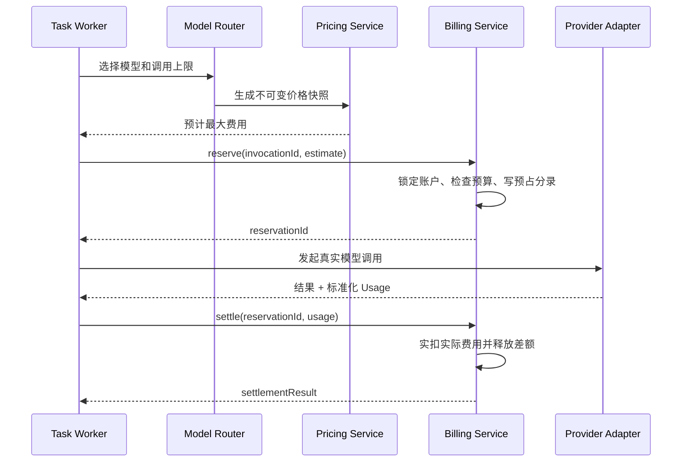

`quota_reservation` 只表达额度锁定生命周期：

```text
ACTIVE -> PARTIALLY_CAPTURED -> CAPTURED
   \----> RELEASED
   \----> EXPIRED
```

`tenant_invocation_charge` 独立表达计价与收取状态：

```text
USAGE_PENDING -> CALCULATED -> CAPTURED
                         \-> PARTIALLY_CAPTURED -> UNCOLLECTED
                         \-> PLATFORM_ABSORB
                         \-> WRITTEN_OFF
```

关键规则：

- 多步骤任务按收费步骤逐笔预占，不一次锁住整个任务的最大理论费用。
- 预估必须使用实际 Prompt Token、最大输出 Token、图片数量/规格和工具次数。
- 所有模型调用配置明确成本上限，Agent 同时限制轮次、总 Token、工具次数、总费用和运行时间。
- 实际费用小于预占时，实扣实际值并在同一事务释放差额。
- 实际应扣大于预占时必须先创建有版本的追加预占，再结算，不能绕过预占直接改余额。余额不足时保存 `calculated_tenant_charge_micro`、`captured_tenant_charge_micro` 和 `uncollected_charge_micro`，进入 `PARTIALLY_CAPTURED / UNCOLLECTED`，停止后续收费步骤并告警；企业“已消费”只统计已入账 CAPTURE 减智点退回，未收智点单独展示，也不能计入贡献额的企业扣费侧。
- V1 默认不允许透支。

企业账户使用数据库行锁或带余额条件的 CAS 更新。一次结算必须在同一数据库事务原子提交：

```text
quota_account / quota_lot
quota_reservation / quota_reservation_allocation
quota_posting_request / quota_ledger_transaction / quota_ledger_entry
tenant_invocation_charge / tenant_charge_capture_link
budget_bucket / budget_reservation
outbox_event
```

至少建立以下唯一约束：

```text
unique(tenant_id, logical_invocation_id, charge_revision)
unique(capture_ledger_entry_id)
unique(tenant_id, ledger_scope_id, idempotency_key)
unique(provider_attempt_id, meter_code, usage_version)
```

任何一项失败都回滚整个结算；不能出现额度已扣但扣费关联、预算或 Outbox 未落库的半完成状态。

#### 并发锁顺序

预占、追加预占、结算、释放、批次过期、智点退回和人工调账采用同一确定性锁顺序：

1. 按 `quota_account.id` 锁定企业账户。
2. 仅智点退回/冲正路径按 ID 锁定原 `CAPTURE` Transaction 及其既有退回聚合/集合，先完成累计可退上限校验。
3. 按“有效期、优先级、lot_id”排序锁定涉及的 `quota_lot`。
4. 按 `scope_type、scope_id、period_start、bucket_id` 排序锁定全部 `budget_bucket`。
5. 锁定 `quota_reservation` 及其 Allocation。
6. 写入 Charge、正式 Ledger、预算结果和 Outbox。

不得在持有上述锁时调用模型、工具或其他外部服务。数据库死锁、序列化冲突和瞬时连接故障只能使用原幂等键进行有界重试并采用退避抖动；达到上限后进入可见失败状态，不能改用新幂等键再次扣款。

### 16.9 失败、重试、缓存和后台任务计费

| 场景 | 供应商成本 | 智点 |
|---|---|---|
| 请求发给供应商前失败 | 0 | 全额释放 |
| 供应商明确拒绝且无 Usage | 0 | 全额释放 |
| 正常完成并交付 | 按实际记录 | 按实际 Usage 实扣 |
| 用户在生成过程中取消 | 按实际记录 | 对已经产生且可确认的 Usage 实扣 |
| 用户主动重新生成 | 新 BillingGroup 下的新 Attempt 成本 | 新收费意图及逻辑调用独立计费 |
| 平台自动重试 | 每次真实 Attempt 都记成本 | 默认只对成功交付的逻辑调用计一次 |
| 平台故障导致未交付 | 真实成本照记 | 平台吸收，不重复扣企业 |
| 自动降级到更贵模型 | 每个 Attempt 单独记成本 | 不得超出任务费用上限；超出前请求确认 |
| 上游结果未知 | 进入待对账成本 | 进入有截止时间的 `USAGE_PENDING`，优先按请求 ID 查询，不得盲目重试 |
| 供应商 Prompt Cache | 按缓存费率记录 | 按价格快照计费 |
| 平台结果缓存命中 | 无模型成本 | 默认不冒充 Token 费用；如收费需独立 meter |

知识入库也可能产生 OCR、Embedding、摘要和图抽取费用，必须记录 `charge_reason`：

```text
USER_UPLOAD
DOCUMENT_UPDATE
TENANT_REINDEX
PLATFORM_MODEL_MIGRATION
GRAPH_REBUILD
FAILED_RETRY
```

用户主动上传或更新导致的首次处理可以按企业策略计费；平台升级模型引发的全量重建、平台故障重试默认由平台承担。

任何 `USAGE_PENDING` 都必须保存 `usage_pending_deadline`、查询次数、责任队列和升级状态，不能永久豁免预占 TTL：

- 已交付且本地能验证用量：在 SLA 内按本地标准化用量完成一次智点最终 CAPTURE；供应商成本标记 `PROVISIONAL`。供应商后续确认差异只追加 `provider_cost_adjustment`，不得对企业再次 CAPTURE 或自动智点退回。
- 未交付且到期仍无法确认：释放智点，潜在供应商成本转为平台待对账成本。
- 已确认供应商用量：使用原价格快照结算；相同供应商请求不得因恢复任务再次调用。

### 16.10 余额不足、预算和告警

调用前同时检查：

- 企业账户状态和可用智点。
- 企业日/月预算。
- 数字员工、能力和模型预算。
- 单任务、单步骤最大费用。
- 模型是否在企业允许范围内。

预算不能直接读取延迟 1～5 分钟的统计聚合做强制拦截。V1 增加：

```text
budget_policy_version
budget_bucket              # scope、period、limit、reserved、captured、version
budget_reservation         # 与 quota_reservation 关联
budget_alert
```

企业、部门、员工、数字员工、能力、模型和任务预算按策略优先级同时生效。预占智点时在同一事务对相关 `budget_bucket` 做行锁/CAS，并满足 `captured + active_reserved + current_request <= limit`；取消释放预算预占。智点退回是否恢复当期预算由版本化策略决定，默认只冲减退回入账当期，不重写已关闭历史期间。周期边界使用租户账单时区，跨期任务以实际 CAPTURE 的入账期间归集。

点联群聊和项目在 V1 进入调用来源、费用下钻和统计聚合，但不新增 `GROUP / PROJECT` 硬预算桶。若后续商业策略要求群/项目硬预算，必须作为新预算作用域补齐并发预占、转交、智点退回和历史期间口径，不能只在页面增加一个限额字段。

余额不足时模型请求不得发出：简单问答返回明确的智点不足状态且不生成回复费用；任务模式进入 `WAITING_QUOTA` 并保留已完成步骤，管理员追加额度后从未执行步骤继续。

企业可配置 70%、85%、95%、100% 等通知阈值，但阈值本身要版本化并可调整。达到软限额时提示企业管理员；达到硬限额时暂停新的收费调用。只有企业提前开启“自动选择低成本模型”策略时才允许自动降级，并明确告诉用户发生了模型切换。

### 16.11 企业管理端统计

企业管理员只查看本企业的计费额度和业务用量，不展示平台供应商底价、内部倍率、直接贡献额和其他租户数据。

#### 企业概览

- 当前可用智点、预占智点、累计实扣、累计智点退回、净消费和即将到期额度。
- 今日、本月和自定义时间范围按账本 `posted_at` 统计的实扣、退回和净消费。
- 任务数、完成数、失败数、平均每个有效任务消耗；“有效任务”固定为 `SUCCEEDED` 以及产生可用成果的 `PARTIAL_SUCCESS`。
- 额度趋势和预算使用率。
- 低余额、异常消耗和即将到期提醒。

#### 多维分析

| 维度 | 主要指标 |
|---|---|
| 数字员工实例/模板 | 逻辑调用次数、任务数、成功率、Token/图片量、企业扣费、单任务均费 |
| 逻辑/交付模型 | 输入/输出/缓存 Token、图片等用量、逻辑调用次数、失败率、企业扣费 |
| 能力包/能力 | 执行次数、成功率、企业扣费、平均耗时 |
| 用户/部门 | 发起任务数、企业扣费、预算占比 |
| 点联内部群聊 | 明确触发次数、任务数、成功率、企业扣费和预算归属；费用页面不展示消息正文 |
| 时间 | 小时/日/周/月趋势、环比 |
| 任务状态 | 成功、失败、取消、等待额度、平台吸收重试次数 |

企业可从一笔扣费下钻到：

```text
来源会话 / MessageTarget ─┐
任务 / 步骤 ──────────────┴─> LogicalInvocation -> 用量明细
                              -> 企业计费价格版本 -> 最终额度流水
```

企业侧的价格详情只展示生效的企业计费单价、计量单位和版本标识，不返回供应商底价、内部倍率或平台成本字段。费用页面默认不能展示成员 Prompt、回答正文和私人记忆。费用导出设置独立权限；部门负责人、数字员工负责人和普通成员只能查看各自授权范围。

### 16.12 平台管理端统计

平台管理端在企业视角基础上增加经营和供应商视角：

- 全平台和分企业的智点发放、购买批次、套餐/赠送、消耗、智点退回、过期和剩余；V1 的购买批次只关联外部业务单据，不冒充站内支付或现金实收。
- 企业计费消耗、供应商计量成本/实际成本、其他第三方直接成本。
- 直接贡献额和贡献率，按企业、供应商、实际 Attempt 模型、能力包、员工模板和时间分析；企业扣费先按各调用冻结的智点换算率转换为同币种等值金额。
- 模型倍率、价格版本和生效时间对成本及直接贡献额的影响。
- 平台吸收的自动重试、降级失败、系统迁移和故障成本。
- 未定价 Usage、`USAGE_PENDING`、`UNCOLLECTED` 和异常高消耗。
- 供应商账单对账差异、币种/汇率差异和调整记录。
- 按供应商账号、区域、模型和计量项分析成本及调用质量。

配置倍率不能跨多个价格版本做简单算术平均。平台可展示倍率分布、主版本，以及在同一结算币种下按供应商成本加权的有效收费倍数：

```text
effectiveBillingMultiple
  = sum(tenant_charge_equivalent_amount) / sum(direct_provider_cost)
```

当供应商成本分母为 0 或币种尚未统一时返回 `N/A`，不得产生除零或跨量纲倍率。`Platform Absorbed Cost ⊆ Provider Cost`，它是成本承担分类，不是贡献额公式中需要再次扣除的一笔成本。

平台“看得更详细”指账务与运行维度更多，不代表平台运营人员可以默认查看企业私有内容。平台费用明细只保存业务来源、可选任务/步骤、调用 ID、用量、价格和状态；查看租户内容仍走单独的受控支持流程。

### 16.13 统计事实与聚合

统计页面不是账务事实来源：

```text
provider_attempt                          技术调用事实
provider_attempt_usage / cost             Attempt 粒度的规范化用量与供应商成本事实
tenant_invocation_charge                  LogicalInvocation 粒度的企业应扣/实扣/未收事实
tenant_charge_capture_link                企业扣费与账本 CAPTURE 的勾稽关系
quota_ledger_transaction / entry          智点账务事实
                    ↓
tenant_usage_daily
agent_usage_daily
model_usage_daily
capability_usage_daily
conversation_usage_daily
platform_billing_daily                    可重建统计聚合
```

实时余额从智点账户与账本查询；大盘趋势使用小时/日聚合。聚合任务通过 Outbox/MQ 增量更新，并提供按账本重算和对账入口。

统一统计口径：

```text
企业净消费额度
  = 已入账 CAPTURE - 当期已入账智点退回

企业净扣费同币种等值金额
  = sum(CAPTURE_micro / 原调用 micro_credit_per_billing_currency_unit)
    - sum(CREDIT_RETURN_micro / 原 CAPTURE micro_credit_per_billing_currency_unit)

供应商计量成本
  = 所有 ProviderAttempt 的 metered_provider_cost

供应商确认成本
  = 对账后 ProviderAttempt 成本 + 追加成本调整

平台吸收成本
  = charge_disposition = PLATFORM_ABSORB 的供应商成本子集

直接贡献额（结算币种）
  = 企业净扣费同币种等值金额
    - 同口径供应商成本 - 其他直接第三方成本

贡献率
  = 直接贡献额 / 企业扣费同币种等值金额
```

- `RESERVED` 只展示为预占，不计入已消费。
- `USAGE_PENDING` 单独展示，不提前归为 0 或已结算。
- 成本尚未与供应商账单核对时标记 `PROVISIONAL` 并展示“暂估直接贡献额”；对账后转为 `ACTUAL`，展示“确认直接贡献额”。
- 调用发生时间使用 `occurred_at`，额度流水使用 `posted_at`，供应商确认成本使用 `reconciled_at`。时间均以 UTC 保存并按租户/账单时区展示。
- 智点退回在退回 `posted_at` 所属期间冲减净消费，不重写已关闭历史月；业务钻取仍通过原 CAPTURE 回到原始业务来源、可选任务和其他维度。
- 内部保留全精度，展示层统一舍入。
- 维度聚合使用发生时的稳定 ID 和部门快照；员工、模型改名或用户换部门不得污染历史。
- 日聚合、月聚合、列表、导出和钻取必须使用同一过滤状态与口径。
- 不建立包含所有维度组合的超宽 Cube；高频看板使用有限聚合，复杂钻取查询事实表。

若 ADR-001 采用 PostgreSQL，V1 使用同一主库完成交易与统计；若采用 MySQL，保持相同账务模型。余额实时可见；企业用量聚合目标延迟 1～5 分钟；平台成本与直接贡献额目标延迟 5～15 分钟；供应商实际成本按账单到达时间 T+1 或更晚确认。数据规模和分析并发影响交易库后，再将可重建事实与聚合复制到 ClickHouse/Doris，商业账本仍留在业务主库。

### 16.14 核心计费数据模型

| 领域 | 核心表 |
|---|---|
| 计费资源 | model_provider、model_definition、billable_resource_definition |
| 供应商费率 | provider_rate_card_version、provider_rate_item |
| 企业销售费率 | sell_rate_card_version、sell_rate_item、tenant_billing_policy、billing_formula_version、attempt_provider_cost_snapshot、tenant_sell_pricing_snapshot |
| 调用 | billing_group、logical_invocation、provider_attempt |
| 供应商用量与成本 | provider_attempt_usage、provider_attempt_cost、provider_cost_adjustment |
| 企业扣费 | tenant_invocation_charge、tenant_charge_capture_link |
| 智点 | quota_account、quota_lot、quota_reservation、quota_reservation_allocation |
| 预算 | budget_policy_version、budget_bucket、budget_reservation、budget_alert |
| 账本 | quota_posting_request、quota_ledger_account、quota_ledger_transaction、quota_ledger_entry |
| 对账 | provider_statement、provider_statement_line、reconciliation_batch、reconciliation_match、reconciliation_difference |
| 聚合 | tenant_usage_daily、agent_usage_daily、model_usage_daily、capability_usage_daily、conversation_usage_daily、platform_billing_daily |

`billing_group` 必须保存 `business_source_type / business_source_id / billing_intent_no`；`logical_invocation` 可选保存 `task_run_id / task_step_id`。普通问答以 `message_target_id` 作为稳定业务来源，不能为满足计费外键而创建空壳任务。同一来源的首次意图编号为 1，用户显式重新生成时创建下一编号；平台自动重试不创建新意图。

供应商用量/成本、企业扣费和智点账本记录均为追加事实。修订通过新版本、冲正或调整记录完成，不能覆盖旧金额。第 20 章若列出商业数据对象，名称必须引用本节，禁止维护第二套同义表名。

### 16.15 权限与审计

建议权限：

```text
billing.account.read
billing.ledger.read
billing.usage.read
billing.usage.export
billing.budget.manage
platform.model.manage
platform.model.rate.create
platform.model.rate.approve
platform.model.rate.activate
platform.billing.read
platform.billing.export
platform.credit.grant.create
platform.credit.grant.approve
platform.credit.return.create
platform.credit.return.approve
platform.billing.adjust.create
platform.billing.adjust.approve
platform.reconciliation.manage
```

- 企业 Owner/财务管理员可看本企业全部余额和流水；部门负责人、员工负责人和普通成员按数据范围查看。
- 企业管理员不能查看平台供应商底价、内部倍率与直接贡献额。
- 平台财务、定价、运营、客户成功、技术支持和审计角色应分权，不能都依赖一个超级管理员。
- 定价创建者不能审批自己创建的价格版本。
- 平台价格倍率变更、智点发放、智点退回和调账必须记录前后值、原因、生效时间和操作者。
- 超过配置阈值的发放、智点退回、调账、跨账期操作和重大倍率调整必须执行 maker-checker 双人审批。
- 价格、倍率、额度和账本权限不能只依靠菜单隐藏，后端必须独立校验。
- 账务导出与账务查看使用不同权限，导出保存筛选条件、文件哈希和下载审计。

### 16.16 建议 API

企业端：

```text
GET  /api/v1/billing/account
GET  /api/v1/billing/quota-lots
GET  /api/v1/billing/ledger
GET  /api/v1/billing/usage/summary
GET  /api/v1/billing/usage/breakdown
GET  /api/v1/billing/usage/details
PUT  /api/v1/billing/budgets
```

平台端：

```text
GET  /api/v1/platform/models
POST /api/v1/platform/models/{modelId}/provider-rate-versions
POST /api/v1/platform/models/{modelId}/sell-rate-versions
POST /api/v1/platform/models/{modelId}/sell-rate-versions/{versionId}/approve
POST /api/v1/platform/models/{modelId}/sell-rate-versions/{versionId}/activate
GET  /api/v1/platform/billing/overview
GET  /api/v1/platform/billing/breakdown
GET  /api/v1/platform/billing/reconciliation
POST /api/v1/platform/billing/provider-statements/import
POST /api/v1/platform/tenants/{tenantId}/credit-grants
POST /api/v1/platform/billing/credit-returns
POST /api/v1/platform/billing/adjustments
POST /api/v1/platform/billing/operations/{operationId}/approve
```

内部计费接口：

```text
POST /internal/v1/billing/reservations
POST /internal/v1/billing/reservations/{id}/settle
POST /internal/v1/billing/reservations/{id}/release
POST /internal/v1/billing/usage-events
```

所有写接口必须接受幂等键。相同幂等键但请求金额、模型或业务对象不同，应返回稳定的幂等冲突错误。

### 16.17 对账、降级和故障边界

每日自动对账：

1. 账户快照与账本重算余额一致。
2. 账本每个事务借贷相等。
3. 所有活动预占均未超过 TTL；`USAGE_PENDING` 在自己的截止时间内进入“智点最终结算 + 供应商成本暂估”、释放或平台承担。
4. 每个已完成调用都有结算、部分实扣/未收、平台承担或有界待对账状态。
5. 每笔企业扣费可追溯到原始业务来源、逻辑调用、billable Attempt/模型、Usage、企业销售价格快照和 CAPTURE 分录；任务模式额外追溯到任务与步骤。
6. 智点退回累计不超过原实扣，且批次有效期处理符合原批次规则。
7. 企业/员工/模型聚合通过 `tenant_invocation_charge -> tenant_charge_capture_link -> quota_ledger_entry` 与账本总额勾稽。
8. 账户快照、智点批次合计、Reservation Allocation 和账本重算差异均为 0。
9. 本地供应商计量成本与供应商账单确认成本在允许容差内，差异只产生供应商成本追加调整事实，不二次改变智点。

计费服务无法完成预占时，收费模型调用默认失败关闭，不能“先调用以后再扣”。已经完成模型调用但结算暂时失败时保存 Usage、价格快照和有截止时间的待结算状态，阻止重复扣费并持续重试；到期后必须依据本地可验证 Usage 完成一次智点最终结算、释放智点并由平台暂挂成本，或人工处置之一，不能永久冻结。供应商后续对账只调整平台成本事实。业务成果可以保存，但企业新的收费任务是否继续由风险策略决定。

供应商不提供请求级账单时，按供应商账号、模型、计量项和账期聚合对账。差异只能通过调整记录处理，不能修改历史 Usage 和原账本。

至少自动检测：价格版本缺失/重叠、调用无 Usage、Usage 未计价、计价无账本、余额为负、账本不平衡、直接成本高于企业扣费、重试成本异常、供应商账单无法匹配和聚合金额不一致。

### 16.18 V1 商业验收门槛

- 同一预占、结算或智点退回请求重复执行 100 次，智点只变化一次；相同幂等键但请求体不同必须冲突。
- 并发预占时账户可用智点不得小于零，企业/部门/用户/数字员工/能力/模型/任务强制预算均不得突破。
- 任意账务事务借贷差异为 0，账户快照与账本重算差异为 0。
- 账户快照、批次合计、Reservation Allocation 和账本四层差异均为 0。
- 正常结算满足 `实扣 + 释放 = 原预占`；智点退回累计不超过原实扣，原批次已过期时不会无规则延长有效期。
- 修改模型单价或倍率后，历史调用、已预占任务和历史统计不变化。
- 供应商成本币种、智点和换算率量纲测试通过；任何公式不存在跨量纲直接运算或除零。
- 同一逻辑调用发生两次平台自动重试时形成三组 Attempt 用量/成本，企业最多形成一次扣费；备用模型场景的企业扣费归属 billable 模型，所有 Attempt 成本均保留。
- 每笔企业扣费 100% 可追溯到企业、数字员工、用户、原始业务来源、能力、billable 模型、销售价格快照、Usage 和 CAPTURE 分录；存在任务时还必须追溯到任务与步骤。
- 企业统计按数字员工、逻辑模型、能力、用户/部门、点联内部群聊和时间的汇总通过扣费—账本关联与逐笔账本一致。
- 平台统计中的供应商计量/确认成本、企业扣费同币种等值金额、平台吸收成本子集和直接贡献额可相互勾稽。
- 最低计费、缓存 Token、折扣、换算率、汇率、倍率和舍入顺序黄金集 100% 精确。
- 供应商成本从 `PROVISIONAL` 转为 `ACTUAL` 时只追加差异事实，不修改原 Usage、价格快照或历史账本。
- `USAGE_PENDING` 在 SLA 内全部进入“智点最终结算 + 供应商成本暂估”、释放或平台承担；`UNCOLLECTED` 的计算应扣、已扣和未收差额可勾稽。
- 账本记录禁止修改和删除；所有智点退回与人工调整有原因、操作者和审批记录。
- 企业 A 无法查询或操作企业 B 的额度、用量和账本。
- 余额不足时不会向上游发出新的收费请求；多步骤任务能够在补充智点后继续。
- `USAGE_PENDING`、过期预占、未定价用量、未收智点和对账差异均有告警、截止时间、责任人和处理状态。

---

## 17. 对话引导与可干预执行

### 17.1 对话是工作入口和任务控制面

一个会话可以产生多个任务，一个任务在 V1 数字员工办公室的员工个人会话或协作房间群聊中持续多轮；后续外部协同渠道接入时复用同一任务协议。每条新消息先由 `InteractionRouter` 判断：

- 创建新任务。
- 回答数字员工刚提出的问题。
- 为正在执行的任务补充材料。
- 修改目标、约束或输出格式。
- 纠正系统已经理解错的事实。
- 暂停、继续、取消、重试或批准任务。
- 只进行普通对话，不改变任何任务。

当会话中存在多个进行中任务且无法确定指向时，系统必须展示任务卡片让用户选择，不能把消息随意塞给最近一个任务。

### 17.2 引导指令类型

所有执行中输入统一保存为 `TaskGuidance`，至少区分：

| 类型 | 示例 | 平台行为 |
|---|---|---|
| ADD_CONTEXT | “再参考我刚上传的品牌手册” | 增加上下文，重做依赖该资料的未完成步骤 |
| CORRECT_FACT | “面积不是 300，是 260” | 更新已确认事实版本，失效下游计算或内容 |
| CHANGE_CONSTRAINT | “不要生成图片，只给文案” | 修改约束并裁剪后续计划 |
| CHANGE_GOAL | “改成做一份投标摘要” | 生成新计划版本，必要时建议新建任务 |
| STYLE_GUIDANCE | “语气再专业一点” | 只重做受影响的表达和成果版本 |
| ANSWER_CHECKPOINT | 回答数字员工的澄清问题 | 关闭检查点并继续 |
| APPROVE / REJECT | 批准发布或驳回草稿 | 推进或退回受控步骤 |
| PAUSE / RESUME | “先停一下”“继续做” | 在安全点暂停或恢复 |
| CANCEL | “这个任务不要了” | 取消未执行步骤并说明已有副作用 |
| RETRY_FROM_STEP | “从资料整理那一步重新做” | 创建新计划版本并重跑指定依赖链 |

引导类型可以由模型辅助识别，但任务 ID、权限、影响范围和最终状态转换必须由 Java 平台校验。

引导默认只作用于当前任务，不自动成为长期记忆。只有用户明确表达“以后都这样”，或任务结束后确认这是稳定偏好时，才创建对应作用域的记忆候选。

### 17.3 可引导执行循环

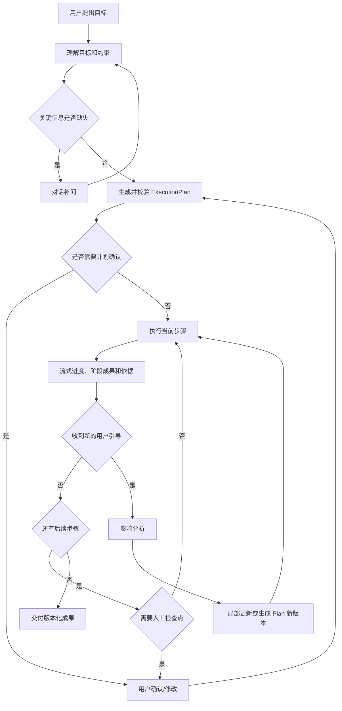

数字员工执行中应主动引导用户，而不只是被动等待纠错。例如：

- 在开始前复述目标和关键约束。
- 信息不足时一次只追问最影响结果的问题。
- 到达关键分支时给出 2～3 个可选方向及影响。
- 长任务中持续报告当前步骤、已完成内容和下一步。
- 发现资料冲突、过期或权限不足时立即暂停并解释。
- 在高风险工具执行前展示输入、目标、影响和可撤销性。
- 交付前允许用户基于阶段成果继续打磨，而不是另开一个完全失联的任务。

### 17.4 任务与步骤状态

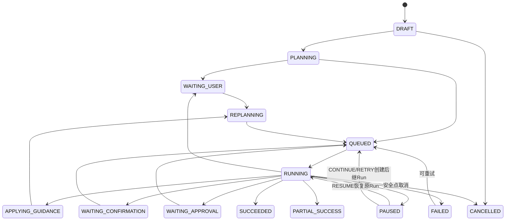

任务总状态与步骤状态必须分离。`TaskStep` 还需支持 `PENDING / READY / RUNNING / WAITING_EXTERNAL / RETRY_WAIT / SUCCEEDED / FAILED_FINAL / SKIPPED / CANCELLED / BLOCKED_SIDE_EFFECT_RECONCILIATION`，以避免一次模型、工具或交付失败就把所有已生成成果标成失败。

### 17.5 计划版本、依赖与局部重算

`ExecutionPlan` 不是一段自然语言，而是受平台校验的有向步骤图：

```text
plan_version
step_key
executor_type
capability_version
input_refs[]
depends_on[]
output_contract
guidance_policy
risk_level
checkpoint_policy
```

每个步骤产物保存输入引用和内容哈希。收到引导后，`GuidanceImpactAnalyzer` 计算：

1. 只影响未执行步骤：更新后续输入即可。
2. 影响已生成成果：将依赖成果标为 `STALE`，生成新版本。
3. 影响已审批成果：原审批立即失效，必须重新审批。
4. 影响已对外执行动作：不能假装回滚，明确展示已产生副作用并创建补偿动作。
5. 本质上变成另一个目标：建议创建新任务，并允许复用已有材料。

LLM 可以提出影响判断，但依赖关系、审批失效和外部副作用由确定性规则处理。

### 17.6 并发和安全点

- Worker 执行外部模型或工具时不长时间持有数据库事务。
- Worker 通过条件更新领取 `task_step`，保存 `task_worker_lease_owner`、`task_worker_lease_until`、`task_worker_lease_epoch`、`task_worker_heartbeat_at`、`attempt` 和 `input_hash`；进程异常后由扫描任务回收过期 lease。Java 原生步骤的提交和 Python Run 的创建/替换绑定使用该短期 lease fencing；已绑定 Python Run 的回调与终态改用 `active_runtime_run_id + task_execution_generation` 校验，不能因 Java Worker lease 接管而重复启动 Run。
- 只有超时、限流和临时服务故障可自动重试；权限拒绝、输入缺失和 Schema 校验失败必须进入人工处理或终止。
- 用户发出暂停/取消后设置 `control_requested`，Worker 在步骤边界或工具支持的取消点响应。
- 同一任务通过乐观锁和 `plan_version` 防止两条引导覆盖。
- 多条连续风格修改可以在短窗口内合并；事实纠正和取消不能被合并丢失。
- 共享任务必须记录发起人和责任归属；`owner`、`collaborators`、`approvers` 按企业策略和任务风险启用。普通群成员不能随意改目标、取消任务或批准高风险步骤。V1 点联内部群聊直接执行该规则，后续外部群入口继续复用。
- 每次引导记录操作者、来源消息、前后计划版本、受影响步骤和结果。

### 17.7 核心记录

```text
task_run
execution_plan
execution_plan_version
task_step
task_step_execution
task_guidance
task_checkpoint
task_transition
task_input_snapshot
task_artifact_link
```

`TaskRun` 保存业务任务总状态；`ExecutionPlanVersion` 保存当时的步骤图；`TaskGuidance` 保存对话中的控制指令；`TaskCheckpoint` 保存补问、确认和审批。这样才能回答“任务为什么改了、从哪一步重做、是谁让它继续的”。

### 17.8 事务与事件

业务状态更新和 `outbox_event` 在同一数据库事务提交。试点基线由数据库驱动 Worker 按事件 ID 幂等消费；启用托管消息队列后，独立发布器再将事件投递到队列，消费者语义保持不变。

典型事件：

```text
TaskCreated
ExecutionPlanRevised
TaskGuidanceReceived
TaskPauseRequested
TaskStepCompleted
TaskCheckpointOpened
ArtifactVersionCreated
DeliveryRequested
KnowledgeDocumentPublished
MemoryItemActivated
```

失败事件进入死信队列，管理端必须支持查看原因、修复后重放和审计。

### 17.9 V1 点联内部群聊运行规则

本节冻结群聊的领域语义和安全边界，不提前固定用户页导航、栏位、气泡、成员面板和任务卡布局。

#### 会话和触发语义

- `Conversation.type` 至少区分 `DIRECT / GROUP`。点联内部群聊是 `WEB + GROUP` 的核心业务事实，不通过 `InboundChannelAdapter` 模拟。
- 群成员通过结构化 `@`、明确选择或回复目标数字员工触发 AI。三种入口都必须先归一化并落库为稳定 `MessageTarget`，其中 `trigger_type = MENTION / SELECTION / REPLY`；前端提交稳定 `agent_instance_id` 和必要来源引用，服务端不能仅靠显示名文本解析目标。
- 普通人类消息只落群消息事实，不调用模型、不预占智点。目标员工、目标任务或影响范围不明确时，必须让用户选择。
- V1 至少保证一条消息可以明确触发一位已授权数字员工。是否允许同一消息触发多位员工在 M0 冻结；如果允许，每个目标分别鉴权并生成独立调用，数字员工之间不得自动互相 Mention 或形成自主循环。
- 数字员工回复必须关联 `source_message_id`、`message_target_id`、`agent_instance_id`、`logical_invocation_id`，产生任务时同时关联 `task_run_id`。

#### 成员、数字员工和历史权限

- `conversation_participant` 保存成员角色、状态、加入/离开时间和版本；建群、邀请、移除、停用、群负责人转交和历史查看由独立权限与企业策略控制，不能用一个“群管理员”前端标识替代后端鉴权。
- 绑定到群的数字员工还需同时满足企业成员对该员工的使用权限。成员资格、员工授权、知识范围和预算校验任何一项不通过，都不能触发模型调用。
- V1 的版本化 `ConversationAccessPolicy` 默认且必须支持 `NO_PREJOIN_HISTORY`：新成员不能查看加入前的消息、引用、附件和成果。若后续增加 `ALLOW_WITH_REAUTH`，不能只打开前端开关，必须对每条历史消息的 `MessageAccessSnapshot`、当前成员资格、当前资源权限和引用证据重新鉴权。
- 退出、被移除、企业成员停用或群停用后，所有新旧消息、附件、任务、成果和群记忆访问立即撤销。历史事实可以按保留策略留存，但不等于原成员仍可读取；历史访问不能只依赖“发送时曾经是成员”。
- 群治理权限不自动包含业务审批、费用导出、全部正文查看或私人记忆查看权限。平台和企业管理员的受控查看继续遵守最小授权、时限和审计。

#### 群知识、记忆和任务

- 群回答可检索范围为：数字员工授权范围、会话/项目显式授权范围、当前消息全部可见接收者权限的交集。禁止按提问者个人权限回答后把结果广播给无权成员。
- 群消息、附件、引用摘要和成果采用同一受众边界；群附件不得自动发布为项目或企业知识。每条消息/回复必须保存 `MessageAccessSnapshot`，冻结当时的访问策略版本、成员受众版本以及允许的知识空间/资源版本和证据引用摘要，作为后续审计与重新鉴权依据；快照不是永久授权。
- 群回答禁止加载任何成员的 `USER_AGENT` 私人记忆，只允许使用当前 `GROUP_AGENT`、经授权项目记忆和企业范围记忆。
- 群消息只能产生群记忆候选。候选确认人、低风险自动规则和遗忘权限由企业策略决定；从私人范围提升到群范围必须显式确认并记录操作者、来源和目标作用域。
- 群任务使用独立 `TaskParticipant` 权限，至少记录发起人和责任归属状态，并在适用时记录负责人、协作者、审批人和查看者。同一时刻如存在负责人则最多一位；默认负责人、无负责人是否允许、离群后的转交或暂停策略需在 M0 冻结，普通群成员不能因能看群就改变任务。

#### 消息一致性和实时分发

```text
REST 提交群消息
  -> 校验 ACTIVE 成员、目标员工和附件权限
  -> 同一事务写 message、message_target、message_access_snapshot、outbox_event
  -> 分配 conversation 内单调递增 sequence_no
  -> 提交后广播 conversation.message.created
  -> 已授权在线成员通过 SSE 接收
  -> 断线成员按 sequence_no 补拉
  -> 明确触发员工时幂等创建 LogicalInvocation
```

PostgreSQL 消息表是历史真相；Redis Pub/Sub 可以承担低延迟多实例广播，但丢失广播不得丢失消息。SSE 事件只按 `Last-Event-ID` 重放；消息历史通过 `GET /api/v1/conversations/{conversationId}/messages?afterSequenceNo=...` 按 `sequence_no` 补拉。出现 SSE gap 时，客户端先按消息序号恢复权威消息，再取得新的事件游标续订，不能把事件游标和消息序号混用。每次 SSE 建连、重连和事件下发都重新校验成员资格，不能依赖建立连接时的一次性权限缓存。

关键唯一约束至少包括：

```text
message: unique(conversation_id, sequence_no)
message: unique(conversation_id, sender_id, client_message_id)
message_target: unique(message_id, target_type, target_id)
conversation_agent_binding: unique(conversation_id, agent_instance_id)
billing_group: unique(tenant_id, business_source_type, business_source_id, billing_intent_no)
logical_invocation: unique(billing_group_id, logical_invocation_no)
```

首次触发固定使用 `billing_intent_no = 1`；用户显式“重新生成”递增收费意图并创建新 BillingGroup。`logical_invocation_no` 只在一个 BillingGroup 内编号；平台自动重试只新增 `ProviderAttempt`，不得创建新 BillingGroup 或重复扣费。

消息编辑、撤回和删除只能改变消息可见状态，不能反向抹除已经产生的任务、成果、模型费用或外部副作用；必须显示影响并保留审计。

---

## 18. 点联内部群聊与外部协同渠道边界

### 18.1 点联内部群聊是 V1 主功能

V1 在点联数字员工办公室真实交付员工个人会话与协作房间群聊，内部群聊按第 17.9 节使用点联自己的会话、成员、消息、权限、任务、记忆和计费事实，不是一个渠道适配器，也不依赖钉钉/飞书才能成立。

内部群聊必须以办公室协作房间进入 V1 页面、研发里程碑、演示承诺、安全测试和上线验收，不能再把它描述为模拟作用域或未来入口。

### 18.2 钉钉/飞书外部渠道交付边界

钉钉与飞书不进入 V1 页面、研发里程碑、演示承诺和上线验收；V1 不实现其 OAuth、组织同步、机器人回调、外部单聊/群聊 `@`、互动卡片、渠道 H5 或渠道文件下载。

V1 只为外部厂商保留与厂商无关的扩展点，避免未来接入时改写会话、任务、记忆和权限内核。产品页面不得把“预留接口”展示成“已经支持钉钉/飞书”。

### 18.3 最小外部扩展端口

```java
public interface InboundChannelAdapter {
    InboundMessage normalize(VerifiedChannelRequest request);
}

public interface OutboundChannelAdapter {
    ChannelDeliveryReceipt deliver(ChannelDeliveryCommand command);
}

public interface ChannelIdentityResolver {
    AccessContext resolve(ChannelIdentityRef identityRef);
}

public interface ChannelCapabilityProvider {
    ChannelCapabilities capabilities(ChannelType channelType);
}

public interface ChannelMessageMapper {
    ChannelPayload map(InteractionEvent event, ChannelCapabilities capabilities);
}
```

内部 `InboundMessage` 只定义平台真正需要的稳定字段，例如来源类型、外部消息引用、文本、附件引用和接收时间；`tenant_id`、`actor_id`、部门、角色和知识权限必须由服务端身份映射计算，不能信任外部消息直接声明。

### 18.4 后续外部接入约束

- 外部企业、用户、群和消息 ID 只保存在映射表，内部任务、记忆和权限始终使用点联稳定 ID。
- 私人、群、项目和企业记忆作用域由内部 `AccessContext` 决定，不能由渠道适配器自行放宽。
- 渠道适配器只负责验签、去重、身份映射、消息转换和回传，不直接执行数字员工业务。
- 点联内部群聊必须做真实模块、安全和 E2E 测试；钉钉/飞书在 V1 只做端口编译测试和模拟适配器契约测试，真实厂商认证、回调安全、限流、卡片能力与组织同步在接入版本单独设计和验收。

---

## 19. 成果物与交付

### 19.1 通用成果物模型

所有角色的输出统一建模为版本化 `Artifact`，而不是把内容、图片、表格、报价单等各自塞回会话消息：

```text
Artifact
├── artifactType
├── capabilityPackId / capabilityVersion
├── version / status
├── sourceTaskId / sourceStepId
├── inputSnapshotRefs[]
├── evidenceRefs[]
├── storageObjectRef / structuredPayloadRef
├── contentHash
├── parentArtifactVersionId / derivationType
└── generationTraceRef / qualityAndSafetyAssessmentRef
```

成果类型可包括文章、图片、DOCX、XLSX、PPTX、PDF、结构化报告、业务草稿和领域单据。用户在对话中要求修改时生成新版本，并保留差异、来源和审批关系。

### 19.2 派生成果

同一个主成果可派生多个目标版本，例如：

- 一份基础图派生不同尺寸、比例、格式或局部编辑版本，每个变体保留父版本、确切规格和独立质检结果。
- 一份合同原文派生带定位审核报告、结构化风险清单和红线修订稿，但原合同版本保持不变。
- 一份结构化报价派生内部成本分析版、客户版、Excel 明细和 PDF。
- 通用内容成果可按需派生公众号、小红书或内部邮件版本；这是独立交付适配能力，不绑定某个首批角色。

派生不是简单复制文本，能力包需要声明目标格式规则、敏感字段、渲染器和校验器。

### 19.3 Delivery 独立于 Task

```text
PENDING -> SENDING -> ACCEPTED -> DELIVERED
   |          |         \-> UNKNOWN
   |          \-> RETRY_WAIT -> SENDING
   |          \-> FAILED
   \-> CANCELLED

RETRY_WAIT -> CANCELLED
SENDING -- 取消/超时且远端结果不明 --> UNKNOWN
```

任务成功、成果生成成功和外部交付成功是三种不同事实。外部发布、发送客户、写入 ERP/CRM 等动作必须绑定不可变成果版本和内容哈希，并在执行前确认目标账号、接收方、影响范围和审批状态。

产品层的发布进度是多个权威事实的只读投影，不再维护第二套可写状态：

| 产品显示 | 权威来源 |
|---|---|
| `DRAFT / READY` | `ArtifactVersion.status` |
| `PENDING_APPROVAL` | `Approval.status` |
| `SUBMITTED` | `Delivery.status = ACCEPTED` 且已取得远端请求/草稿 ID |
| `REVIEWING` | 远端规范化状态 `REMOTE_REVIEWING` |
| `PUBLISHED` | 已通过查询或回调确认的远端公开状态和回执 |
| `PARTIAL_SUCCESS` | 同一发布批次多个 Delivery 的聚合结果，不是单个 Delivery 状态 |
| `AUTH_EXPIRED / MANUAL_CONFIRMATION_REQUIRED` | Delivery 的可操作原因码，不冒充已发布 |
| `FAILED / CANCELLED / UNKNOWN` | Delivery 权威状态或规范化异常状态 |

`ACCEPTED` 只表示远端已接受请求，不等于公开发布。`DELIVERED` 表示该 destination 契约定义的终点已被远端确认，终点可能只是草稿入库、文件送达或内容公开；只有 `RemoteReceipt` 明确证明公开状态时，产品层才映射为 `PUBLISHED`。`PENDING / RETRY_WAIT` 可以安全取消；`SENDING` 取消或超时后只要远端结果不明就进入 `UNKNOWN`，不得冒充 `CANCELLED`。超时或结果不明由对账任务查询远端结果；只有适配器证明远端具备幂等键，或查询确认未产生目标记录时，才允许自动重试，否则进入人工处置。

每次回调、轮询和重试保存远端事件 ID/请求 ID、结果摘要、内容哈希和幂等键，重复回调不得创建第二次发布。外部状态变化只更新 Delivery/远端回执，不能反向篡改 Artifact、Approval 或 Task 历史。

---

## 20. 核心数据模型

### 20.1 业务表清单

| 领域 | 核心表 |
|---|---|
| 身份 | tenant、user_account、tenant_member、role、permission、channel_identity_mapping（后续渠道使用） |
| 数字员工 | agent_template、agent_template_version、agent_instance、agent_capability_grant、agent_tool_grant、prompt_layer_version |
| 能力 | capability_pack、capability_pack_version、capability_definition、execution_template、tool_definition、schema_definition |
| 会话 | conversation、conversation_access_policy_version、conversation_participant、conversation_agent_binding、conversation_member_event、message、message_target、message_access_snapshot、message_attachment、message_read_cursor、conversation_task_link |
| 任务 | task_run、task_participant、execution_plan_version、task_step、task_step_execution、task_guidance、task_checkpoint、task_transition、task_input_snapshot |
| AI Runtime（`deer_runtime`） | runtime_thread、runtime_run、runtime_run_control、runtime_run_event、runtime_tool_effect（运行投影）、runtime_sandbox_lease、runtime_checkpoint_ref |
| 成果与交付 | artifact、artifact_version、artifact_dependency、delivery、delivery_attempt、delivery_result |
| 记忆 | memory_item、memory_candidate、memory_conflict、memory_policy、memory_index_job |
| 知识 | knowledge_space、knowledge_acl、knowledge_document、document_version、document_chunk_ref、index_job |
| 商业计量 | 模型、费率、调用、额度、预算、账本和对账统一引用第 16.14 节数据字典，不在本节维护第二套表名 |
| 经营统计 | tenant_usage_daily、agent_usage_daily、model_usage_daily、capability_usage_daily、conversation_usage_daily、platform_billing_daily |
| 治理 | approval_instance、approval_action、tool_effect_intent、tool_invocation、audit_event、outbox_event、inbox_event |
| 领域能力包 | 每个能力包拥有独立领域表，例如平面出图、合同审核、报价、投标等；平台核心不依赖其表结构 |

平台不使用一张无限扩展的 EAV 表承载所有角色业务数据。真正需要事务、唯一约束和精确规则的领域事实应有明确模型；能力包通过公开 API、事件和扩展点与核心平台协作。

### 20.2 通用字段

除不可变日志外，业务表统一考虑：

```text
id
tenant_id
version
status
created_by
created_at
updated_by
updated_at
deleted_at（仅在确需软删除时）
```

不要把状态、删除标记、发布状态和索引状态混为一个字段。知识文档的业务发布状态与各派生索引的同步状态应分别保存。

### 20.3 点联内部群聊最小数据模型

V1 不新建一张与 `conversation` 重复的群主表，使用 `conversation.type = GROUP` 表达点联内部群聊，并以 `conversation_id` 作为群记忆、消息、任务和统计的稳定作用域。

```text
conversation
  type                         # DIRECT / GROUP
  name / status
  access_policy_version_id
  next_message_sequence

conversation_participant
  conversation_id / user_id
  member_role / status
  joined_at / left_at
  membership_version

conversation_agent_binding
  conversation_id / agent_instance_id
  response_policy / status
  added_by / added_at

message
  conversation_id / sequence_no
  sender_type / sender_id
  client_message_id
  reply_to_message_id
  content_type / content_ref
  visibility_status / created_at

message_target
  message_id
  target_type / target_id
  trigger_type                  # MENTION / SELECTION / REPLY
  source_ref_id                 # 可选：回复消息或 UI 选择来源
  resolution_status

message_access_snapshot
  message_id
  access_policy_version_id
  audience_membership_version_hash
  allowed_knowledge_scope_version_hash
  evidence_access_ref_hash
  created_at

message_read_cursor
  conversation_id / user_id
  last_read_sequence / updated_at

task_participant
  task_run_id / user_id
  participant_role            # OWNER / COLLABORATOR / APPROVER / VIEWER
  status / granted_by
```

`message_access_snapshot` 保存发送/生成当时的安全依据和不可变哈希；具体资源引用可放在受控明细表或加密对象中，但必须能审计到知识空间、资源和版本。读取历史消息仍要校验当前成员资格与当前资源权限，不能把快照当成永久访问令牌。

成员角色、响应策略、会话状态和任务参与角色都是归属模块维护的稳定枚举，不能由前端展示文案驱动。具体建群/移除/历史策略和一条消息最多触发几位数字员工，在 M0 以版本化权限策略和 ADR 冻结；数据模型不应因此绑定某一种页面布局。

### 20.4 派生索引最小载荷

向量和图索引只保存检索需要的数据：

- 业务资源 ID 和版本 ID。
- 租户、知识空间、作用域和访问标签。
- 有效期、状态和来源类型。
- 必要的文本、向量或关系属性。

命中后需要展示或执行敏感操作时，必须回到 Java 业务服务重新鉴权并读取当前权威数据。

---

## 21. 存储选型与容量策略

### 21.1 托管 RDS PostgreSQL + pgvector

V1.0 推荐使用阿里云托管 RDS PostgreSQL 作为业务主库并启用 pgvector，原因是：

- 高可用、备份、监控和基础运维交给云服务，团队不自建数据库集群。
- 新项目可以减少一套独立向量数据库的运维成本，V1.0 只有一个权威数据库。
- 业务事实、元数据过滤和向量索引可以保持清晰的一致性边界。
- JSONB 适合保存结构化抽取结果和版本快照。
- 后续仍可通过 `VectorStoreAdapter` 迁移到 Qdrant 或其他向量系统。

#### 同库工作负载隔离

同一 RDS 实例不等于共享无限资源。V1 至少划分：

- 交易池：身份、权限、消息、任务、审批、额度和账本。
- 交互查询池：业务读取、检索元数据和用户端查询。
- 后台池：解析、Embedding、索引、重建、聚合和对账。

三类工作负载使用独立数据库账号、连接池、连接数配额、`statement_timeout`、`lock_timeout` 和队列并发限制。交易池必须预留独立连接及资源余量；后台任务不得占满实例连接、执行无界批次或在交易高峰执行全量向量重建。索引 Worker 在交易延迟、锁等待、IO、连接或复制延迟超过阈值时自动降并发或暂停。

M0 根据试点容量冻结具体阈值。若在目标峰值至少两倍的压测下，知识摄取或向量查询导致额度预占、消息提交、权限校验超过 SLO，或经限流和索引调优仍持续出现锁/IO 饱和，则在进入生产前将检索与索引负载迁移到独立托管检索后端或独立数据库实例，不能依靠继续增加同一连接池掩盖资源争用。

但 pgvector 不等于完整搜索引擎。V1.0 词法检索先采用规范化字段、中文全文检索和 trigram，并在真实中文数据集上做门禁评估；若专有名词、编号和中文关键词 Recall@K 不达标，先检查数据清洗、切分、Query Rewrite、Embedding 和 Rerank，再按第 21.5 节选择一个托管增强后端，而不是用提示词弥补检索缺陷。

### 21.2 百炼知识库与长期记忆的使用边界

百炼知识库可以作为快速试点或托管检索增强实现，承担通用文档解析、切分、Embedding、混合召回和 Rerank；百炼长期记忆可以用于低风险的用户偏好和表达习惯。两者均通过 Provider 端口接入，并遵守以下边界：

- Java/RDS 始终保存租户归属、知识空间、文档登记、权限、版本、发布/删除状态、外部资源 ID、审计和计费事实。
- 企业、项目、群聊、数字员工的权威记忆继续由点联 Memory Service 管理；外部长期记忆不决定共享范围和最终事实。
- 调用外部知识检索前先在 Java 计算授权范围，命中结果返回后再次按当前权限和资源状态校验。
- 原始文件优先保存在企业受控 OSS，保证可以重建索引或更换供应商。
- 外部服务的区域、数据保留、限流、计费、删除传播、可用性和供应商退出方案必须形成 ADR 和契约测试。

### 21.3 如果团队主库必须使用 MySQL

业务主库可改为 MySQL，但必须保持以下边界：

- 长期记忆和业务事实仍以 MySQL 为权威。
- 向量检索改用 Qdrant/OpenSearch 等独立索引。
- 不因引入 LlamaIndex 就复制出第二套业务真相。
- 删除、权限、版本和索引同步仍通过 Outbox 管理。

### 21.4 条件启用 GraphRAG

V1.0 默认不部署 Neo4j。关系事实和已确认实体先保存在 PostgreSQL，由 LlamaIndex 通过受控模板完成结构化关系召回。只有在多跳关系黄金集上证明基础方案不足、GraphRAG 有稳定增益时，才选择 PolarDB PostgreSQL GraphRAG、托管图服务或其他 `GraphRetrievalPort` 实现。任何实现都只承载可重建派生关系，不保存权限、领域主记录、审批、任务和记忆权威记录。

### 21.5 Redis、消息队列与非权威运行组件

用于：

- 短期会话窗口缓存。
- 限流、幂等短锁和临时任务进度。
- 模型路由健康状态和非敏感检索缓存。

Redis 不保存唯一任务状态、唯一记忆或唯一领域事实。缓存 key 必须包含环境和租户维度，敏感正文应避免长时间驻留。

RabbitMQ 同样不是 V1.0 必须自建的权威组件。试点规模下允许 Outbox + 数据库驱动 Worker；当异步任务量、隔离、重试、积压或多实例消费达到容量门禁后，可在 V1.0 内启用托管消息队列。切换前后事件 ID、幂等、补偿和任务状态语义保持不变。

### 21.6 V1.0 效果与容量升级门禁

正式资源规格需在 M0 阶段根据以下参数计算：

- 租户数、活跃用户数和峰值并发会话。
- 文档数、平均页数、切分块数和每日增量。
- 每个用户/群/项目的长期记忆数量和增长率。
- 历史案例数、关系数和图查询并发。
- 图片生成和文档解析任务量。
- 模型上下文、输出 token 和重试率。
- 峰值 Active Run、Sandbox 数、Worker 队列深度和最老任务等待时间。
- 办公室快照大小/构建并发、SSE 活跃连接/重连风暴和热点群消息率。
- 模型供应商 TPM/RPM、第三方工具限流和 Java→Python→Java 回调并发。

升级还必须对应一种已量化问题：

| 问题 | 优先处理顺序 | 可选升级 |
|---|---|---|
| 知识召回不准 | 数据质量 → 切分 → Query Rewrite → Embedding/Rerank → 混合权重 | 百炼知识库、OpenSearch 或 DashVector 三选一验证 |
| 关联记忆和历史经验不足 | 作用域/权限 → 结构化事实 → 关系字段 → 受控多跳查询 | 在单一能力包启用 GraphRAG Provider |
| 向量规模或延迟不达标 | 索引、SQL、过滤条件和容量调优 | 专用托管向量检索实现 |
| 异步任务积压或多实例竞争 | Worker 并发、幂等和 Outbox 调优 | 托管消息队列 |
| 外部服务质量或成本不稳定 | 超时、重试、缓存、降级和成本分析 | 切换 Provider 或回退 RDS/LlamaIndex 基线 |

任何升级都必须满足：同一脱敏黄金集对照、跨租户/群聊安全回归、成本测算、可观测性、索引重建、灰度、回滚和供应商退出验证。不得仅因为某项技术流行就增加生产组件。

方案中的组件拓扑是功能架构，不等于可以跳过压测直接确定生产实例规格。

---

## 22. API 与前端交互

### 22.1 外部 API 风格

- REST API 统一使用 `/api/v1` 前缀。
- 长任务创建返回 `taskRunId`，进度通过 SSE 或任务查询获取。
- 创建类接口接受 `Idempotency-Key`。
- 错误响应包含稳定业务错误码、用户可读消息和 `traceId`。
- 分页、时间、金额、枚举和多语言格式统一，不以模型自由文本替代字段。

建议资源：

```text
/api/v1/agents
/api/v1/office
/api/v1/office/events
/api/v1/capability-packs
/api/v1/conversations
/api/v1/conversations/{conversationId}/participants
/api/v1/conversations/{conversationId}/agents
/api/v1/conversations/{conversationId}/messages
/api/v1/conversations/{conversationId}/read-position
/api/v1/conversations/{conversationId}/events
/api/v1/tasks
/api/v1/tasks/{taskId}/events
/api/v1/tasks/{taskId}/guidance
/api/v1/tasks/{taskId}/guidance/{guidanceId}/confirm
/api/v1/tasks/{taskId}/control
/api/v1/tasks/{taskId}/plans
/api/v1/tasks/{taskId}/checkpoints
/api/v1/memories
/api/v1/knowledge-spaces
/api/v1/documents
/api/v1/artifacts
/api/v1/deliveries
/api/v1/approvals
/api/v1/billing/quota
/api/v1/billing/ledger
/api/v1/admin/usage-statistics
/api/v1/platform/model-rates
/api/v1/platform/billing-statistics
```

### 22.2 点联内部群消息 API

群消息通过 REST 创建，目标数字员工必须以结构化 Target 提交；`@`、员工选择器和回复只是三种前端触发方式：

```http
POST /api/v1/conversations/{conversationId}/messages
Idempotency-Key: client-msg-001
If-Membership-Match: "membership-v17"
Content-Type: application/json
```

```json
{
  "clientMessageId": "client-msg-001",
  "text": "请基于本群共享的品牌规范和参考图生成三套展会主视觉方向",
  "targets": [
    {
      "targetType": "AGENT",
      "targetId": "agent-instance-01",
      "triggerType": "MENTION"
    }
  ],
  "replyToMessageId": null,
  "attachmentIds": ["asset-ref-01"]
}
```

服务端先确认发送者仍是有效成员，再验证 `triggerType` 与文本标记、选择来源或 `replyToMessageId` 一致，并校验目标员工已绑定且发送者可使用、附件对群可见、知识与预算范围有效。所有群写命令捕获客户端看到的 `expectedMembershipVersion`；提交前在同一事务通过权威成员行 `ACTIVE + membershipVersion` 条件更新或加锁复核，版本变化则整笔回滚并返回稳定的 `CONVERSATION_MEMBERSHIP_CHANGED`，防止“先鉴权、后被移除、最后仍落库”。重复 `clientMessageId` 只能返回第一次结果；相同幂等键但正文、附件或 Target 不同必须返回冲突。无数字员工 Target 的普通消息只广播给群成员，不创建 AI 调用。

### 22.3 执行中引导 API

```http
POST /api/v1/tasks/{taskId}/guidance
Idempotency-Key: guidance-message-001
If-Match: "plan-v3"
Content-Type: application/json
```

```json
{
  "sourceMessageId": "msg_1008",
  "guidanceType": "AUTO",
  "text": "刚才的面积改为 260 平米，并且先不要生成图片",
  "attachmentIds": [],
  "targetStepKey": null
}
```

响应不能只返回“收到”，还要说明解释和影响：

```json
{
  "guidanceId": "gd_01",
  "interpretedAs": ["CORRECT_FACT", "CHANGE_CONSTRAINT"],
  "applyMode": "PREVIEW_REQUIRED",
  "currentPlanVersion": 3,
  "proposedPlanVersion": 4,
  "affectedSteps": ["extract-requirement", "generate-draft"],
  "staleArtifactVersionIds": ["artifact-v2"],
  "irreversibleEffects": [],
  "confirmationToken": "short-lived-token"
}
```

低风险表达修改可以按策略直接应用；事实修订、目标变化、审批失效或可能产生额外费用时先返回影响预览，用户确认后再切换计划版本。`If-Match` 用于防止用户基于旧计划提交的引导覆盖新计划。

确认使用独立命令端点：

```http
POST /api/v1/tasks/{taskId}/guidance/{guidanceId}/confirm
Idempotency-Key: guidance-confirm-001
If-Match: "plan-v3"
Content-Type: application/json
```

```json
{
  "confirmationToken": "short-lived-token"
}
```

过期、已消费、计划变化和相同幂等键请求体变化分别返回稳定错误码 `CONFIRMATION_TOKEN_EXPIRED`、`CONFIRMATION_TOKEN_CONSUMED`、`PLAN_VERSION_CONFLICT`、`CONFIRMATION_REQUEST_CONFLICT`，客户端不能通过重提原引导绕过确认。

`confirmationToken` 是一次性授权意图，不是登录或权限令牌。服务端只保存其摘要，并绑定 `tenantId、actorId、taskId、guidanceId、currentPlanVersion、requestHash、affectedSteps、riskLevel、irreversibleEffects、maxAdditionalCharge` 和过期时间；不得出现在 URL、普通日志或 SSE 载荷中。

确认请求同时携带 `Idempotency-Key、If-Match` 和令牌。服务端在同一事务中重新校验当前权限、计划版本、审批状态、预算/额度和外部副作用，再原子消费令牌并推进状态。令牌单次使用、短时有效；计划、权限、预算、成果或审批事实变化后立即失效。相同幂等请求返回第一次结果，使用同一令牌提交不同请求体必须返回稳定冲突错误；令牌不能绕过发布、计费或工具的二次鉴权。

### 22.4 SSE 事件

```text
task.started
task.plan.created
task.plan.revised
task.progress
assistant.delta
guidance.accepted
guidance.applied
tool.started
tool.completed
checkpoint.required
checkpoint.resolved
task.paused
task.resumed
artifact.ready
artifact.stale
delivery.updated
task.completed
task.failed
conversation.message.created
conversation.message.visibility.changed
conversation.participant.added
conversation.participant.removed
conversation.agent.added
conversation.agent.removed
conversation.read-position.updated
agent.invocation.started
agent.invocation.failed
office.snapshot.invalidated
```

SSE 断线重连使用事件序号恢复，客户端不得因为重复事件重复渲染消息、创建调用、提交确认或交付。群事件下发前再次校验成员资格；成员被移除后必须关闭或拒绝该群后续事件流。

#### SSE 交付与重放契约

SSE 是只读通知通道，不承担业务命令，也不提供“恰好一次”承诺。服务端采用至少一次投递，所有写操作仍通过带 `Idempotency-Key` 的 REST API 完成；客户端必须按 `eventId` 幂等消费，收到重复事件不得重复创建消息、确认、调用、扣费或交付。

事件游标按流独立递增，至少区分 `OFFICE_USER / CONVERSATION / TASK`。`eventId` 只在所属 `streamType + streamId` 内有序，不能把群消息 `sequence_no`、任务版本号和办公室事件号混成一个全局序号。事件记录至少保存：

```text
tenant_id / stream_type / stream_id / event_id
event_type / aggregate_version / occurred_at
payload_hash_or_ref / visibility_version
```

客户端重连携带 `Last-Event-ID`：游标仍在保留窗口内时按序重放；游标过期、出现不可修复缺口或权限版本变化时，服务端发送稳定的 `stream.reset_required`，客户端必须重新获取 `OfficeSnapshot`、群消息游标或任务快照后再订阅，不能从本地状态猜测。保留窗口、心跳间隔、最大单用户/租户连接数、单连接发送队列和重连退避均为版本化配置，并在 M0 按最长容忍离线时间和压测结果冻结。

Reset 恢复必须消除“读取快照—重新订阅”之间的漏事件窗口。服务端在同一个数据库一致性快照中读取权威状态与该流事件高水位，并在恢复响应返回 `resumeEventId`：

```text
OFFICE_USER  -> OfficeSnapshot.resumeEventId（与 lastOfficeEventId 同一值）
CONVERSATION -> messages[] / upToSequenceNo / resumeEventId / membershipVersion
TASK         -> TaskSnapshot / planVersion / resumeEventId
```

客户端完成快照/消息恢复后，使用 `GET .../events?afterEventId={resumeEventId}` 或等价的 `Last-Event-ID` 语义订阅该水位之后的持久事件；快照生成后到订阅建立前发生的事件必须从事件日志重放。分页恢复使用服务端签发的同一 `snapshotToken` 固定 `upToSequenceNo + resumeEventId`，不能每页重新读取水位。恢复期间权限或成员版本再次变化时返回新的 `stream.reset_required`，不得继续使用旧水位。

服务端定期发送心跳；负载均衡和反向代理关闭 SSE 缓冲，空闲超时大于心跳间隔。慢客户端超过有界发送队列后主动断开并要求快照/游标重建，禁止无限占用内存。每次建连、重连和事件下发都重新校验登录状态及资源权限；令牌过期后必须重新认证再续订。

### 22.5 数字员工办公室与多端前端

V1 用户端以数字员工办公室为唯一主信息架构，不再维护与办公室平行的传统工作台首页。办公室至少包含员工工位、协作房间、任务看板和成果区；点击后分别进入真实员工工作空间、点联内部群聊、任务详情和成果详情。

`GET /api/v1/office` 返回当前用户经过鉴权的 `OfficeSnapshot`，只包含可见员工、房间、任务摘要、成果摘要、待办和稳定对象 ID。`OfficeSnapshot` 是从员工、会话、任务、审批和成果事实计算出的可重建读模型，不是新的业务事实来源。`office.snapshot.invalidated` 只提示客户端重新拉取或增量刷新，不能携带越权正文，也不能直接改变任务状态。

`OfficeSnapshot` 响应至少包含 `snapshotVersion、generatedAt、mappingVersion、lastOfficeEventId、resumeEventId、etag`，其中 `lastOfficeEventId = resumeEventId`。ETag 绑定当前用户、租户、权限版本和快照版本；客户端使用 `If-None-Match`，未变化时返回 `304`。员工、房间、任务、成果和待办都只返回有明确上限的摘要集合，并提供 `hasMore/nextCursor`；快照不得全量携带历史消息、任务步骤、成果正文或附件。

`office.snapshot.invalidated` 只携带 `minimumSnapshotVersion` 和可选 `affectedRegions`，同一用户短窗口内的连续失效事件应合并，避免任务进度高频变化触发全量回拉风暴。权限、成员、员工授权或历史策略变化必须提升权限版本并使旧 ETag 失效。

SSE 不可用时前端采用带抖动的指数退避轮询 `GET /office`；办公室 API 暂时不可用时，只显示最后一次成功快照并明确标记“数据可能已过期”。所有写操作继续调用权威业务 API，缓存快照不得直接驱动确认、审批、发布或权限判断。

员工办公室状态使用版本化的确定性映射，例如 `IDLE / WORKING / WAITING_USER / WAITING_APPROVAL / NEEDS_ATTENTION`。同一员工存在多个并发任务时返回活动任务数量、待办数量和最高优先级可操作状态；前端不得依据动画、最近一条消息或本地计时器自行推断员工状态。刷新、断线重连或 SSE 序号缺口后，以重新获取的 `OfficeSnapshot` 为准。

办公室渲染层只消费受控 ViewModel 和稳定操作命令，不直接读取领域表，也不因“走到某个房间”自动获得权限。SVG/DOM、Canvas/PixiJS 或 3D 引擎通过统一 `OfficeRenderer` 边界接入；V1 在原型与性能验证后选择实现，但路由、对象 ID、状态映射和业务操作契约保持一致。低性能设备、减少动态效果和无障碍需求在同一办公室信息架构内提供简化渲染，不形成第二套产品流程。

- 企业工作平台与同应用内企业管理域使用共享设计 token、组件库、鉴权 SDK、API Client、登录态和活动租户；企业管理入口由服务端权限决定，普通员工不显示。
- 点联平台运营后台可以共享前端组件包，但使用独立平台路由壳和平台会话上下文；平台权限与企业权限不得合并进同一个 `AccessContext`，也不得通过切换前端菜单模拟上下文隔离。
- 用户从办公室任务看板或员工工作空间进入任务页；任务页必须展示当前目标、计划版本、当前步骤、阶段成果和“补充/纠正/暂停/继续”入口。
- 用户从办公室协作房间进入点联内部群聊；必须覆盖列表/未读、成员与可用数字员工、结构化选择/`@`/回复、消息补拉与实时消息、普通问答、群任务来源和群记忆作用域提示。
- V1 不建设渠道 H5；未来渠道适配器复用同一任务、确认、审批和附件 API，不复制业务内核。
- 所有端对任务状态使用同一枚举和显示映射，禁止各端自行推断成功状态。

---

## 23. 安全设计

### 23.1 模型数据安全

- 企业可配置允许使用的模型供应商和数据敏感等级。
- 向外部模型发送前进行最小化、必要时脱敏。
- 参考图、Logo、字体和品牌素材必须同时校验当前 ACL、素材版本和使用权声明；来源不明或被撤权的资产不得进入图像模型请求，生成结果不得被标注为平台已确认无版权风险。
- 合同原件、OCR 中间物、条款摘要、风险项和红线稿使用同等或更严格的敏感 ACL，不默认进入长期记忆、普通日志或无权群聊；法务成果对外发送前重新校验合同版本、接收方与人工确认状态。
- 密钥只通过密钥管理服务或环境注入，不写数据库明文、配置文件和日志。
- 模型请求日志默认记录元数据、token、延迟、版本和错误，不保存完整敏感正文。
- 明确模型供应商的数据留存、训练使用和地域策略。

### 23.2 Prompt Injection 与知识污染

- 检索到的文档一律视为数据，不视为系统指令。
- 文档中的“忽略前述规则”“调用某工具”等内容不能提升权限。
- 工具调用由服务端白名单、Schema、风险等级和权限二次校验。
- 对上传文件进行类型检测、病毒扫描、宏/脚本隔离和解析超时限制。
- 知识发布、覆盖高权重规则或形成图关系时需权限和审计。

### 23.3 图查询安全

- 参数化模板、只读账号、查询超时、最大路径深度和结果上限。
- 所有模板在执行前注入租户和授权范围，不接受模型覆盖。
- 图查询返回业务 ID 后，回业务服务重新鉴权。

### 23.4 外部发布安全

- OAuth/token 加密保存并支持撤销、轮换和到期提示。
- 发布前校验账号归属、操作者权限和审批状态。
- 防止因重试造成重复发布；若平台无幂等 API，维护远端结果和业务去重策略。

### 23.5 点联内部群聊安全

- 消息读取、附件下载、历史搜索、SSE 订阅、任务/成果查看和群记忆读取分别校验当前成员资格、加入边界、`MessageAccessSnapshot` 与资源当前权限，不能因知道 `conversation_id` 或对象存储地址而访问。
- V1 的 `NO_PREJOIN_HISTORY` 在服务端按成员加入序号/时间强制执行。未来即使启用 `ALLOW_WITH_REAUTH`，也必须逐条按原始受众与知识依据重新鉴权，不能批量给新成员补发全部历史。
- 群回答、引用和成果必须使用当前消息受众的安全知识交集，严禁把提问者个人可见资料广播给其他成员。
- 成员变更在权威事务提交后立即使本地/Redis 权限缓存失效，并主动终止该用户对目标群的实时订阅；缓存失效失败需要告警和补偿扫描。
- 群历史导出、企业支持查看和消息内容检索使用独立高权限、受控工单、脱敏与审计，不由普通群管理权限隐式获得。
- 富文本、Markdown、`@` 标记、MessageTarget、附件预览和成果链接都按不可信输入处理，防止脚本注入、伪造目标员工和越权下载。

成员退出、被移除、企业成员停用或群停用的事务提交后，所有新 HTTP 读写立即失败关闭，任何新的群消息、附件、任务、成果或记忆正文不得再向该主体投递。事务同时递增 `membershipVersion` 并写入 Outbox；多实例订阅网关维护可定位到 `userId + conversationId + membershipVersion` 的连接索引，收到失效事件后主动关闭残留连接。事件分发器在失效事件延迟、Redis 不可用或缓存版本不明时必须回源权威成员状态或拒绝下发，不能容错放行。

撤权不只约束新请求的鉴权入口，还必须 fence 已进入执行中的写命令。群消息、附件、任务、成果和群记忆写入都携带 `expectedMembershipVersion`，并在提交事务内重新验证权威成员状态为 `ACTIVE` 且版本未变化；发送事务与移除事务交叉时，只有满足当前成员版本的一方能提交，失效写命令整体回滚。并发安全测试必须覆盖“消息已鉴权但尚未提交时成员被移除”的时序。

V1 试点默认以“残留订阅主动关闭 P99 不超过 5 秒、绝对不超过 30 秒，事务提交后越权正文投递为 0”为准入目标。M0 可按部署拓扑收紧或调整时间值，但“越权投递为 0”不可放宽。监控 `membership_revocation_propagation_seconds、revoked_subscription_open、revoked_event_blocked_total`；任一越权投递为 P0 安全事件，并覆盖多实例、并发发消息/移除、缓存失效失败、SSE 重连和 Outbox 延迟攻击测试。

### 23.6 审计

必须审计：

- 数字员工和提示词版本变更。
- 知识空间权限和文档发布/删除。
- 记忆确认、修改、作用域提升和遗忘。
- 点联群创建/停用、成员加入/退出/移除、可用数字员工变更、历史访问策略变更、消息可见状态变更、MessageTarget 解析/拒绝、群历史查看与导出。
- 模型、工具、执行计划变更、用户引导、领域规则结果、人工调整、审批和外部交付。
- 模型费率与倍率版本、智点发放/退回/调账、账本冲正和供应商对账。
- 平台支持人员的受控访问。

---

## 24. 一致性、幂等和故障恢复

### 24.1 一致性模型

| 数据 | 一致性要求 |
|---|---|
| 权限、领域事实、审批、任务/计划/成果状态 | 关系数据库事务内强一致 |
| Java TaskStep 执行绑定 | `task_execution_generation + active_runtime_run_id` 为稳定业务执行身份；Java Worker lease 只保护短期创建/替换临界区 |
| 点联群成员、消息、MessageTarget、MessageAccessSnapshot、消息序号和成员事件 | 消息事实、访问快照与 Outbox 同事务提交；群内序号单调递增，实时广播可补拉 |
| 额度预占、结算、释放、智点退回和账本分录 | 关系数据库事务内强一致；同一账务事务借贷平衡 |
| 用量事实和供应商调用尝试 | 追加写入；允许从 `USAGE_PENDING` 对账为最终状态，不覆盖历史价格快照 |
| 向量、词法和图索引 | 基于 Outbox 的最终一致 |
| 企业/平台统计聚合 | 基于账本和用量事实的最终一致，可重建、可对账 |
| 任务进度缓存 | 可丢失，可从主库恢复 |
| 模型回复流 | 可中断，最终任务结果需落库 |
| Python Runtime Run/Checkpoint | Run 准入、lease、控制和终态持久化；Checkpoint 使用 PostgreSQL，运行所有权由 lease epoch/fencing 保证 |
| Python Runtime 重要事件 | 先追加持久事件日志再广播；Java 至少一次幂等消费，游标缺口时按持久状态对账 |
| 外部工具副作用 | `dianlian_business.tool_effect_intent` 是幂等权威；`runtime_tool_effect` 只作运行投影，结果未知先查询、不盲目重试 |
| 外部交付 | 本地状态 + 远端回执对账 |

### 24.2 幂等键

- 点联内部消息：`tenant_id + conversation_id + sender_id + client_message_id`。
- 群内数字员工触发：`conversation_id + source_message_id + message_target_id + agent_instance_id`。
- 群成员/员工绑定变更：`conversation_id + membership_or_binding_command_id`。
- 任务创建：调用方提供的 `Idempotency-Key + actor_id`。
- 任务引导：`task_id + source_message_id`，同一消息不得重复改变计划。
- Runtime Thread：`tenant_id + task_step_id + runtime_thread_revision`。
- Runtime Run：`runtime_thread_id + idempotency_key`，同时保存规范化 `request_hash`。
- 工具副作用：`tenant_id + task_step_id + logical_effect_key + effect_revision`；`effect_intent_id` 在首次执行前持久化并跨模型重试、Run 恢复和接管复用，`tool_call_id` 仅用于追踪。
- 索引任务：`resource_type + resource_id + version_id + operation`。
- 收费意图：`tenant_id + business_source_type + business_source_id + billing_intent_no`；普通问答的业务来源是 `message_target_id`，任务模式的业务来源是 `task_step_id`。
- 逻辑模型调用：`billing_group_id + logical_invocation_no`；供应商尝试使用独立 `provider_attempt_id`。
- 额度预占：`tenant_id + logical_invocation_id + reservation_revision`。
- 分段结算：`reservation_id + usage_version + capture_sequence`。
- 释放：`reservation_id + release_reason + release_sequence`。
- 智点退回：`capture_transaction_id + credit_return_request_id`。
- 外部交付：`artifact_version_id + destination_id + delivery_intent_version`。
- 后续渠道入站：`channel_type + external_tenant_id + external_message_id`，仅在真实渠道版本启用。

所有写操作同时保存规范化 `request_hash`；相同幂等键但参数不同必须返回冲突，不能复用第一次结果掩盖错误请求。

### 24.3 恢复

- 关系库是恢复源，支持重建 pgvector、全文和条件启用的 GraphRAG 派生索引。
- 账本是额度恢复源，余额快照和统计聚合均可重算；不得用报表结果反写账户余额。
- 定时扫描过期预占、`USAGE_PENDING`、未定价用量和不平衡事务，并以幂等补偿或人工调账处理。
- 文档解析中间产物可以保存在对象存储，避免每次故障都重做 OCR。
- 死信任务必须有错误分类、重试次数、下一步建议和人工重放入口。
- 定期演练：删除传播、图索引重建、模型供应商切换、MQ 堆积和对象存储暂时不可用。
- 定期扫描超期 Run lease、孤儿 Sandbox、长时间无事件的 Active Run 和 Runtime/Java 终态差异，按 fencing 和幂等规则唯一接管或人工处置。

### 24.4 备份、容灾与恢复目标

V1 生产试点最低恢复目标：

| 数据 | RPO | RTO |
|---|---:|---:|
| RDS 权威业务、权限、消息、任务、额度和账本 | 不超过 5 分钟 | 不超过 4 小时 |
| OSS 原始知识文件与正式 Artifact | 不超过 15 分钟 | 不超过 4 小时 |
| pgvector、全文、GraphRAG 等派生索引 | 不作为唯一恢复源 | 关键租户 24 小时内重建 |
| Redis、实时广播和临时进度 | 不承诺恢复 | 从权威库重新建立 |

生产 RDS 使用多可用区高可用、自动备份和 PITR；PITR 窗口不少于 7 天，完整备份不少于 14 天。OSS 启用版本化或等价误删保护，对正式知识原件和 Artifact 配置符合合同的数据冗余及生命周期策略。备份账号、运行账号和删除权限分离，不能由一个应用凭证同时删除在线数据和全部恢复副本。

仅靠恢复后的同一 RDS 不能证明恢复点之后发生过哪些删除、扣款和外部交付。生产必须在独立故障域/账号保存连续 WAL/CDC 归档或等价的追加写 Recovery Journal，覆盖删除墓碑、Posting/账务回执、Delivery/Provider Attempt 和关键 Outbox 游标；MQ 只有在保留期、顺序、可重复读取和灾备故障域均满足要求时才可作为其中一份证据，不能成为唯一恢复源。模型/发布供应商的请求 ID、回执和账单继续通过供应商查询或账单文件独立核对。

恢复后先进入隔离只读窗口，围绕恢复点扫描删除、`CAPTURE/REFUND`、Provider Attempt、Delivery 和外部回执。独立证据不完整或结果仍为 `UNKNOWN` 时保持相关租户/能力只读或人工处置，不能直接开放写流量。

恢复顺序固定为：

1. 恢复 RDS 到选定一致性时间点。
2. 恢复并核对 OSS 对象版本和数据库引用。
3. 从独立 WAL/CDC 归档或 Recovery Journal 提取并重放恢复时间点之后已确认的删除墓碑、账务/外部回执和可重放 Outbox，同时以供应商查询/账单补证。
4. 从权威事实重建全文、向量、GraphRAG 和统计聚合。
5. 校验租户隔离、账本平衡、账户/批次/Reservation 勾稽、文件哈希、索引数量及删除状态。
6. 完成业务负责人和财务负责人签字后才开放写流量。

至少每季度执行一次隔离环境真实恢复演练；重大数据库、对象存储或索引架构变更前后增加专项演练。仅看到“备份任务成功”不算验收，必须证明备份可恢复，并记录实际 RPO、RTO、丢失范围、校验差异和整改责任人。

---

## 25. 可观测性

### 25.1 统一链路

浏览器、Java、Python、RDS、对象存储、模型调用及实际启用的缓存、消息队列和 GraphRAG Provider 统一透传 `trace_id`、`conversation_id`、`source_message_id`、`task_run_id`、`logical_invocation_id` 和必要的 `tenant_id` 哈希标识。后续渠道接入时沿用同一链路字段。

推荐 OpenTelemetry + Micrometer，日志、指标和链路进入企业现有可观测平台。

### 25.2 核心指标

#### 平台

- API P50/P95/P99、错误率和租户限流。
- SSE 首字延迟、断线率和任务完成率。
- 点联群消息持久化与广播延迟、乱序/补拉率、重复消息抑制数、MessageTarget 解析失败率和每条触发消息产生的 `LogicalInvocation` 数。
- 非成员读写/订阅拦截数、被移除成员残留订阅数、成员变更后权限缓存失效延迟，以及私人/跨群记忆泄漏告警。
- 用户引导接受率、重规划率、局部重算率、等待用户时长和计划版本数。
- 被标记 `STALE` 的成果数量、审批失效率和取消响应时间。
- MQ 堆积、重试、死信和 Outbox 延迟。
- OfficeSnapshot 构建耗时/大小/cache hit、失效事件合并率、轮询降级次数、SSE 活跃连接/重连/gap/慢消费者断开及单连接队列水位。
- Runtime Run 排队时间、运行年龄、lease 续约失败、takeover/orphan 数、Checkpoint 时延/失败、事件消费延迟/`REPLAY_GAP`、取消结果和 Sandbox 创建/孤儿回收。

#### 模型

- 按租户/员工/能力/模型的调用量、Token、供应商成本、企业计费消耗、延迟和失败率。
- 结构化输出校验失败率、工具选择失败率和备用模型切换率。

#### 商业计量

- 额度余额、预占成功率、余额不足拦截数、过期预占和待结算用量。
- 企业计费消耗、供应商成本、平台吸收成本、直接贡献额及其口径版本。
- 按模型价格版本和倍率版本统计调用量、成本影响和生效范围。
- 账本不平衡、聚合差异、供应商账单差异和人工调账数量。

#### 知识与记忆

- 文档解析成功率、索引延迟、删除传播延迟。
- 各检索路线召回量、无结果率、重排延迟、证据充分性分布。
- 记忆候选确认率、拒绝率、纠错率、过期率和作用域分布。
- 权威数据与派生索引对账差异。

#### GraphRAG 与能力包

- 按能力包统计图同步延迟、孤立节点、实体合并冲突和模板查询超时。
- 关系候选命中率、人工替换率、无合适证据率和降级次数。
- 每个能力包自行上报结构化抽取、规则校验、人工修改和业务结果指标，不能混成一个平台总分。

### 25.3 检索追踪

每次回答至少记录：

- 查询意图和策略版本。
- 实际执行的检索路线。
- 使用的资源 ID、版本、分数和重排结果。
- 被权限、过期、冲突规则过滤的数量。
- 最终进入上下文的证据 ID。
- 模型、提示词和输出契约版本。

敏感正文不默认进入通用日志；需要诊断时采用受控采样、脱敏和限时访问。

### 25.4 SLO、告警和 Runbook

M0 必须为办公室、群聊、SSE、任务控制、Python Runtime、计费和发布分别冻结 SLI/SLO、统计窗口、错误预算和负责人。现有 P95/P99 指标只作为候选值；没有真实容量压测、告警阈值和故障处置手册，不得将组件标记为生产就绪。

告警至少分级：

- P0：跨租户或撤权后越权投递、重复发布、重复扣款、账本不平衡、旧 lease 成功写入。
- P1：办公室不可用、SSE 重放缺口持续升高、群广播积压、Run 无唯一 owner、任务控制失败、Delivery 长时间 `UNKNOWN`。
- P2：延迟、断线、重试、成本、检索质量和资源水位趋势异常。

告警关联 `owner、dashboard、runbook、影响租户、traceId/streamId/runtimeRunId、止损开关、恢复验证和关闭条件`。每份 Runbook 至少包含触发条件、影响判断、立即止损、数据查询、恢复/补偿、回滚、验证、用户沟通和事后复盘。

V1 至少具备按平台/租户/员工/Provider 控制的审计化开关：关闭收费 AI 调用但保留人工群聊；关闭指定发布 Provider；关闭 DeerFlow 能力并回退 LangChain4j 可承载的路径；SSE 回退轮询/办公室只读；暂停索引消费但保留权威上传记录。开关默认安全、变更有权限和审计，并明确自动恢复或人工解除条件。

---

## 26. 测试与评估

### 26.1 测试分层

| 层级 | 重点 |
|---|---|
| 单元测试 | 领域规则、状态机、引导影响分析、作用域计算、计价公式、账本平衡和批次扣减 |
| 模块测试 | Spring Modulith 边界、模块 API、事务和领域事件 |
| 集成测试 | RDS PostgreSQL、pgvector、OSS、`dianlian-ai-runtime`；Redis、消息队列、百炼知识库、DeerFlow沙箱和GraphRAG Provider仅在实际启用时纳入 |
| 契约测试 | Java-Python HTTP/SSE、AgentRuntime、Thread/Run/Checkpoint映射、Run Supervisor准入/单活/lease/fencing、RuntimeEvent持久化与Replay Gap、BaseChatModel流式/Tool Call/取消、模型用量与重试、模型结构化输出、计费端口、工具网关、发布平台适配器和外部协同渠道模拟端口 |
| E2E | 数字员工办公室、员工个人会话、协作房间群聊、群成员与 `@` 路由、任务看板、成果区、企业管理端、平台管理端、额度预占—调用—结算—统计完整链路 |
| 安全测试 | 跨租户、非群成员/已移除成员访问、私人或跨群记忆泄漏、群知识越权、Prompt Injection、越权工具、费用导出越权和账务重放 |
| 故障注入 | Run 接收后 HTTP 超时、Worker kill、heartbeat 中断、唯一接管、旧 Worker 恢复写入、SSE gap、取消时工具仍执行、工作文件丢失、滚动升级、RDS/OSS 恢复和 Sandbox 孤儿回收 |
| AI 评估 | RAG、记忆、引导识别、按能力 GraphRAG、结构化抽取和成果质量黄金集 |

### 26.1.1 小节点最小验证与大阶段统一验收

V1 不以“每完成一个小功能就执行全量单元测试、全量 E2E 和完整回归”为默认研发节奏。测试采用风险分级和阶段门禁：

| 节点 | 默认验证范围 | 不在该节点默认执行 |
|---|---|---|
| 小开发节点 | 编译/类型与静态检查、受影响模块最小测试、接口/Schema 兼容检查、至少一条变更主链路冒烟 | 全量 E2E、全部黄金集、全量跨端回归、压测和故障演练 |
| 高风险小节点 | 在上述基础上，增加对应的数据库集成或安全用例 | 与本次风险无关的全系统回归 |
| M0～M4 大里程碑结束 | 安排统一测试窗口，完成该阶段完整业务闭环、跨模块集成、核心权限/费用/异常场景和既有主链路回归 | 与后续未交付能力有关的测试 |
| M5 稳定性与试点 | 全量回归、AI 黄金集、容量压测、安全攻击、故障注入、备份恢复和真实企业小流量试点 | 无 |

单元测试投入优先覆盖可长期复用且错误代价高的确定性内核：权限与作用域、状态机、计价公式、智点账本、幂等、成员撤权、lease/fencing、删除防复活和外部副作用。简单 CRUD、展示层编排和低风险胶水代码不以覆盖率数字为目标，可以由编译、静态检查、契约检查和阶段 E2E 覆盖。

以下变更即使处于小节点，也必须执行最小定向验证，不能全部推迟到大阶段末：租户/群权限、额度与账本、价格和倍率、幂等键、数据库迁移、成员撤权、Runtime 接管、数据删除以及外部发布/工具副作用。原因是这些问题若到阶段末才发现，通常会污染测试数据或迫使业务链路返工。

小节点未执行的集成、E2E、AI 评估和非阻断回归统一登记到当前里程碑的验收清单，记录范围、责任人和最晚清理时间；进入下一个大里程碑前必须完成或由负责人明确接受风险，不能无限累积为 M5 的一次性测试债务。

### 26.2 黄金数据集

V1 上线前建立四类脱敏黄金集：

1. 企业知识问答集：问题、允许知识范围、期望证据和拒答样例。
2. 记忆集：用户偏好、真实点联群 `GROUP_AGENT` 偏好、跨群隔离、成员变更、冲突、过期、纠错和严禁泄漏样例。
3. 可引导执行集：补充、纠正、改目标、暂停、继续、并发修改和已产生副作用等场景。
4. 能力包评估集：每个首批能力包定义自己的输入、成果、风险和费用断言：
   - 平面出图覆盖文字/参考图理解、生成与编辑、尺寸变体、单变体失败、版权/内容/品牌/文字检查、Artifact lineage 和图片 Usage。
   - 法务合同审核覆盖解析/OCR、条款原文定位、引用依据、风险分级、红线差异、敏感 ACL、依据不足拒绝和人工法务确认。
   - 报价覆盖结构化抽取、缺项处理、历史关联与差异解释、确定性复算、内外版字段隔离、人工调价和审批失效。

小节点修改切分、Embedding、提示词、模型、检索权重、任务编排、能力版本、图 schema 或领域规则时，只运行受影响能力的最小样本和关键拒答/越权样本；M2、M3、M4 等大里程碑结束时再统一运行该阶段完整黄金集和既有核心回归，M5 执行全量评估。涉及作用域扩大、权限过滤或确定性领域规则的变更仍需在合并前运行对应安全/精确性样本。

### 26.3 V1 试点准入指标

以下为建议工程门禁，需在 M0 用真实数据校准：

| 指标 | 建议门槛 |
|---|---|
| 跨租户知识泄漏 | 自动化攻击集为 0 |
| 私人记忆进入共享作用域 | 自动化场景为 0 |
| 跨群记忆或群知识越权泄漏 | 自动化场景为 0 |
| 非成员、已退出或被移除成员访问群资源 | 消息、附件、任务、成果、记忆、搜索和 SSE 全部为 0 |
| 新成员读取加入前历史 | V1 `NO_PREJOIN_HISTORY` 下消息、引用、附件和成果全部为 0；未来开放策略时逐条重新鉴权越权为 0 |
| 普通群消息误触发模型或扣费 | 0 |
| 群消息与 MessageTarget 幂等 | `MENTION / SELECTION / REPLY` 三种触发分别重放时，同一请求只产生一条消息、每个明确目标一次调用和一次企业结算 |
| 同一消息多目标员工隔离 | 每个 `InvocationAccessContext` 只含一位员工；跨员工知识、`GROUP_AGENT` 记忆、工具或预算策略串用为 0 |
| 确定性规则引擎 | 各能力包黄金集 100% 精确一致 |
| 平面出图成果追溯 | 基础图及尺寸变体 100% 可回溯到输入资产/父版本、模型与 Provider Attempt、生成参数摘要、安全检查和智点分录；无权素材进入模型为 0 |
| 合同审核依据与人工边界 | 风险项 100% 定位到合同原文并标识依据状态；无权合同正文/风险摘要泄漏为 0，未经指定人工确认显示审核完成或法律结论为 0 |
| 报价可复算与审批 | 同一需求、数据版本和规则版本结果 100% 一致；未经审批标记有效报价、向客户版泄漏内部成本/利润均为 0 |
| 知识检索 Recall@10 | 不低于 85% |
| 已启用图能力的关系检索 Recall@5 | 不低于 80% |
| 已引用事实可追溯率 | 不低于 95% |
| 引导消息路由到正确任务 | 不低于 99%，不确定场景必须询问 |
| 事实纠正后的依赖失效正确率 | 100% |
| 暂停/取消后新增高风险副作用 | 0 |
| 文档删除后检索阻断 | 权威状态提交后立即阻断；派生删除在约定窗口内完成 |
| 记忆候选准确率 | 确认样本中不低于 90%，且敏感记忆不自动写入 |
| 关键任务状态恢复 | 服务重启后可从数据库恢复，无重复外部交付或重复领域写入 |
| Runtime Run 幂等与单活 | 同一请求重放只返回原 Run；同一 Thread 同时最多一个 Active Operation |
| Worker 故障接管 | lease 过期后仅一个新 Worker 接管；旧 Worker 的 Checkpoint、终态、Artifact 和副作用写入全部被 fencing 拒绝 |
| Runtime 事件恢复 | Java/Python 任一侧重启、SSE 断线或游标过期后，终态、成果、Usage 和计费可按事件日志与快照对账，无永久卡住任务 |
| 群成员撤权 | 事务提交后越权正文投递为 0；残留订阅关闭达到 M0 冻结的 P99/绝对上限 |
| 外部副作用未知结果 | `OUTCOME_UNKNOWN / Delivery.UNKNOWN` 不被盲目重发，远端回执对账或人工处置可闭环 |
| 额度并发与幂等 | 可用智点不为负；预占、结算、释放和智点退回重复执行只生效一次 |
| 历史价格稳定性 | 费率或倍率变更后，历史调用、既有预占和历史统计金额不变化 |
| 商业统计勾稽 | 企业汇总与逐笔账本一致；平台成本、计费消耗、吸收成本和直接贡献额可勾稽 |

这些指标不是模型宣传指标，而是试点前的内部工程门槛。

升级判断必须比较“当前基线”和“候选增强”两套结果，至少记录质量、延迟、单次有效任务成本、权限误召回、人工修改率和失败降级。候选增强只改善离线分数但没有改善真实任务结果，或明显增加越权、成本和排障复杂度时，不进入 V1.0 生产链路。

### 26.4 性能目标

在模型供应商正常、试点容量已定义的前提下，建议目标：

- 普通 API（不含模型）P95 小于 500ms。
- 混合检索 P95 小于 1.5s。
- 受控图检索 P95 小于 2.5s。
- 用户发起对话至首个可见进度事件 P95 小于 1s。
- 点联群消息提交成功至在线成员收到事件 P95 小于 1s；断线后按序补拉不得丢消息或重复创建 AI 调用。
- 额度可用余额查询 P95 小于 300ms；统计聚合延迟遵循第 16.13 节口径。
- 文本模型首字延迟目标小于 4s，受外部供应商影响需单独统计。
- 索引、OCR、图同步使用异步任务，不阻塞上传请求。

最终指标应以真实数据规模和选定模型压测结果为准。

### 26.5 生产容量门禁

M0 按试点企业上限冻结容量模型：租户/活跃用户、峰值登录、办公室快照大小与构建并发、SSE 活跃/重连连接数、群消息每秒峰值、单群成员与消息上限、同时运行任务/步骤、Active Run、Sandbox、Worker 队列深度、附件/文档大小与日增量、OCR/生图并发、模型 TPM/RPM 和外部 Provider 限流。每项给出正常值、峰值、至少一档安全余量、限流策略和扩容触发点。

压测覆盖稳定负载、突发重连、慢客户端、办公室失效风暴、热点大群、Worker/MQ 积压、Provider 限流、Java→Python→Java 回调闭环和成员撤权并发。通过条件不仅看平均延迟，还要验证：无消息/重要事件丢失，无重复 AI 调用/扣费/发布，内存和连接队列有界，降级开关有效，恢复后可补拉和对账。

压测数据、拓扑、配置和结论形成可复现报告；未达到门禁时必须缩小试点上限或关闭对应能力，不能只提高实例规格后直接上线。

---

## 27. 部署方案

### 27.1 V1 运行单元

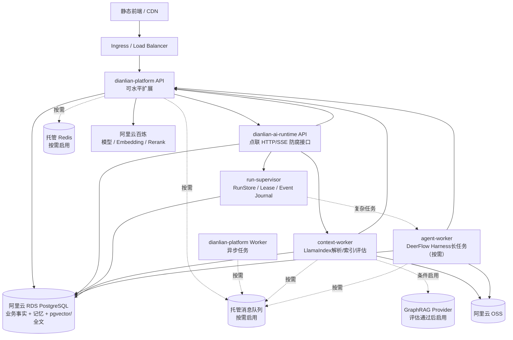

V1使用同一个RDS PostgreSQL实例，但按数据所有权分离 Schema、数据库账号、连接池和迁移生命周期：

```text
dianlian_business   Java权威业务、任务、审批、额度和审计
dianlian_context    知识片段、记忆检索索引、向量和评估数据
deer_runtime      DeerFlow Thread、Run、Checkpoint和可重建运行元数据
```

Java 业务应用只通过最小权限账号写 `dianlian_business`；其中 Tool Gateway 对 `tool_effect_intent` 的写权限单独收敛。`context-worker` 账号只能写 `dianlian_context`。`deer_runtime` 至少拆分：`runtime-api` 角色负责 Thread/Run 准入、Control 与状态查询，`run-supervisor` 角色负责 lease/heartbeat/接管和事件水位，`agent-worker` 角色负责当前 lease 下的 Checkpoint、运行事件、Effect 投影和 Artifact receipt；三个角色只获得各自所需表/操作权限，均不能写 `dianlian_business`。DDL 迁移账号与运行账号分离，各进程不得复用 Java 或彼此的连接池。读取企业事实和执行工具必须经过 Java 内部 API。DeerFlow运行成果写入OSS临时区，只有Java完成权限检查、病毒/内容检查和成果登记后，才成为点联正式Artifact。

非本地环境必须使用 PostgreSQL Checkpointer、持久 RunStore 和持久重要事件日志。迁移所有权固定为：

- `dianlian_business`：Flyway。
- `dianlian_context`：Python 唯一迁移作业。
- `deer_runtime`：锁定版本对应的 Alembic 或内部唯一迁移作业。

禁止多个应用 Pod 在启动时并发执行迁移。同一 RDS 实例只是 V1 试点的成本选择；Schema/账号隔离不等于 CPU、IO 和故障域隔离，达到交易延迟、连接、IO、Checkpoint 写入或后台任务门禁时，优先将 `deer_runtime` 或 `dianlian_context` 迁出业务实例。

#### 27.1.1 Java-Python 舱壁、背压与熔断

Java 至少隔离公共 API、Runtime 命令/状态查询、Python Runtime 事件消费、内部 Model Gateway、内部 Tool Gateway、用户端 SSE 和外部 Provider 资源池。Python 至少隔离 `runtime-api`、`agent-worker`、`context-worker`、Sandbox Provisioner 和模型/工具回调客户端。

Java 提交 Run 后不得占用公共请求线程或数据库事务等待 Python 完成。Python 回调 Java Model/Tool Gateway 时使用独立有界连接池，避免反馈式资源自锁。按租户、能力、模型供应商和 Sandbox 类型设置：

- 最大排队量和最大并发。
- 连接、首字、空闲和总执行超时。
- 指数退避、随机抖动和重试预算。
- 限流、熔断、半开探测及队列满时的明确拒绝/延迟状态。
- 最大任务 Token、工具次数、费用和运行时间。

自动扩缩容优先观察队列深度、最老任务等待时间、Active Run、Sandbox 数和供应商配额，不只观察 CPU。

V1 不因存在 Java-Python 调用就引入完整 Spring Cloud。推荐 Spring Boot + Spring Modulith、Resilience4j 或等价机制、版本化 HTTP/JSON + SSE、OpenTelemetry/Micrometer 和托管基础设施。未来拆出多个 Java 服务，或企业已有统一 Nacos、Gateway、配置与服务发现平台后，再选择性引入 Spring Cloud Alibaba。OpenFeign 只适合短时、幂等的控制和查询接口，不承载小时级 Run 生命周期。

### 27.2 环境

```text
local     开发者本地，Docker Compose，使用隔离命名空间
dev       团队集成环境
test      自动化和业务验收环境，使用脱敏数据
staging   与生产拓扑接近的发布验证环境
prod      生产环境
```

每个环境必须独立配置数据库、对象存储 bucket/prefix、模型密钥和价格版本测试数据；实际启用 Redis、消息队列、百炼知识库或 GraphRAG Provider 时，其 namespace、vhost、workspace/knowledge-base 和 graph space 也必须按环境与租户策略隔离。不能通过同一缓存 key、账本账户或索引集合混用环境。后续真实渠道接入时，回调地址和渠道应用也必须按环境隔离。

### 27.3 发布

- 数据库迁移按 27.1 的 Schema 所有权分别使用唯一迁移作业；`dianlian_business` 使用 Flyway，Python Schema 不得由 Java Flyway 或多个 Pod 竞争迁移。所有迁移向前兼容至少一个应用版本。
- Java 和 Python 内部接口做契约测试和版本兼容。
- 模型、提示词、检索策略、Embedding 和图 schema 都按配置版本灰度。
- 索引格式变化采用新索引并行构建、验证后切换别名，不直接原地破坏。
- 回滚应用时不能假装撤销已经完成的外部发布、发送或业务写入，应按领域补偿处理。
- 长任务采用版本亲和和 drain：新 Worker 通过 startup/readiness 后接新 Run；旧 Worker 停止接单但继续 heartbeat，在原版本完成或到达安全 Checkpoint。只有兼容性通过的 Run 才允许新版本接管。
- `runtime_run` 保存镜像 digest、Harness commit、Adapter、能力包、模型策略和 Checkpoint schema 版本；不兼容时路由旧 Worker 池或进入人工恢复，不能由新版本强行恢复。
- 探针区分 startup（配置和迁移完成）、readiness（可准入新请求）、liveness（控制循环仍可推进）和 dependency health。外部模型、OSS 或工具短暂故障不得直接使整个 API Pod liveness 失败。
- 超过 drain 时限的 Run 进入可追踪恢复状态；Pod 终止前停止准入、继续续租、持久化安全 Checkpoint，不能直接杀死并把未知副作用冒充失败。

---

## 28. 阶段交付与并行工作流

### 28.1 并行原则

本章只定义依赖、交付物和准入条件，不维护按周排期。产品、交互/视觉、Java 业务控制面、Python/AI Runtime、数据与计费、安全/运维和验收可以由多个角色并行推进，但必须遵守以下顺序约束：

- 页面和交互可以与技术 PoC 并行，但状态、权限、计费和外部副作用必须先引用同一权威契约。
- Java 与 Python 可以并行实现各自内部结构，跨进程命令、事件、幂等、Run Supervisor 和错误码在联调前冻结。
- 三端壳、公共组件和 ViewModel 可以并行，Golden Flow 中的前一步权威事实未定义时，不用静态演示数据伪装完成后一步。
- 小节点执行最小验证；达到一个可串联的大阶段结果后统一做跨模块验收。高风险边界仍按第 26.1.1 节即时定向验证。
- 每个阶段可以同时开展多个工作流，完成条件以证据和验收断言为准，不以投入人数、日历时长或页面数量代替完成度。

### 28.2 里程碑

每个里程碑内部允许按功能拆成小节点，但小节点只执行第 26.1.1 节规定的最小验证，不重复组织完整验收。M0～M4 在阶段成果可串成业务闭环后各安排一次统一验收；M5 再完成跨阶段全量回归、压测、安全、故障和恢复验收。阶段验收发现的问题优先在当前里程碑收口，不把所有集成风险集中到最终稳定性阶段。

#### M0：架构、运行监督与数据基线

- 完成 ADR、领域模型、租户/权限模型和仓库结构。
- 冻结点联内部群聊的建群/成员/历史访问权限矩阵、数字员工绑定与响应策略、群任务参与角色、群记忆确认策略和费用归属策略。
- 确定文本/视觉/生图/图片编辑模型供应商、Embedding、Rerank、OCR、内容安全服务和对象存储，并冻结图片与合同敏感数据的外发策略。
- 确认额度单位、模型计量项、供应商成本口径、企业计费公式、倍率审批和自动重试承担策略。
- 定义账本平衡、不重复扣款、历史价格不可变和企业/平台统计勾稽的测试样例。
- 收集脱敏知识、记忆、执行引导和首批能力包黄金集；分别覆盖平面出图的多模态/变体/安全/计费、合同审核的 OCR/条款/风险/红线/人工确认，以及报价的抽取/历史关联/确定性计价/审批。
- 对 RDS PostgreSQL 词法 + pgvector 做中文检索基准，并与候选百炼知识库方案做小样本对照；默认保持单库，只有指标不达标才进入增强评估。
- 完成 Java-Python 接口草案、Trace 和本地开发环境。
- 冻结 `AgentRuntimePort`、`task_step_execution(task_execution_generation, active_runtime_run_id) -> runtime_thread -> runtime_run -> checkpoint` 状态映射、HTTP/SSE事件和 `run_admission_token -> 领取 Runtime lease -> execution_access_token -> 逐次线性 authorize` 契约；明确 Java Worker lease 只保护短期绑定，不能替代稳定执行代次。
- 按 ADR-042 冻结 Run Supervisor 主路径：内部复用锁定的 DeerFlow Gateway runtime kernel；Harness-only 自建 Supervisor 仅作为退出方案，不并行实现；不允许直接以 `DeerFlowClient.astream()` 承担生产 Run 生命周期。
- 冻结 Run、Control、Event、ToolEffect、SandboxLease 数据模型，以及 Thread 单活、幂等准入、lease/heartbeat/fencing、唯一接管和 replay-gap 契约。
- 明确不部署完整 DeerFlow App/Gateway 作为产品入口；选定并锁定 PoC 使用的官方源码 commit、点联 Adapter 版本和 `uv.lock`。
- 非本地环境验证 PostgreSQL Checkpointer、持久 RunStore、持久重要事件日志和可恢复工作区。
- 定义试点容量：租户、并发会话、Active Run、SSE 连接、Sandbox、文档增量、模型 TPM/RPM、队列等待和 RDS 余量。
- 冻结 SLO/错误预算、分级告警、止损开关、RPO/RTO、备份保留、恢复顺序和责任人。
- 用一个复杂能力完成 DeerFlow 隔离 PoC：除多轮 Run、暂停/继续、Checkpoint、成果、Tool Call、费用和零越权外，增加 Run 接收后 HTTP 超时、Worker kill、heartbeat 中断、唯一接管、旧 Worker 恢复写入、SSE 游标过期、取消时工具仍执行、工作文件丢失、滚动升级和 Sandbox 孤儿回收。PoC 不通过时保持 LangChain4j 默认运行时，不阻塞知识与记忆主线。

验收：关键技术选型有可重复基准数据，不仅是口头判断。

#### M1：平台骨架、数字员工与内部群聊

- 多租户、成员、角色和 Web 登录身份。
- 数字员工模板、企业实例、能力包、工具和提示词版本。
- 个人/群会话、成员生命周期、`NO_PREJOIN_HISTORY`、MessageAccessSnapshot、可用数字员工绑定、`MENTION / SELECTION / REPLY` 统一 MessageTarget、消息顺序、附件、未读位置、SSE 广播/补拉、计划版本和可干预任务状态机。
- 完成补充、纠正、暂停、继续、局部重算和重新规划主链路。
- LangChain4j Model Gateway、官方模型、费率/倍率版本、价格快照和调用用量事实。
- 智点账户、智点批次、预占、实扣、释放、智点退回、不可变账本和余额不足拦截。
- 企业/部门/用户/数字员工/能力/模型/任务预算桶、并发强一致预算预占、硬拦截和告警。
- 数字员工办公室主入口、员工工位与个人工作空间、协作房间群聊、任务看板、成果区、企业群治理能力，以及企业管理端和平台管理端基础框架。

验收：三个端能完成“平台建模板与模型价格—企业获得额度并启用员工—用户在个人会话或点联群聊中找员工做事—执行中引导—按实际用量结算—版本化交付”的闭环；普通群消息不触发模型或扣费。

#### M2：知识与记忆核心

- 知识空间、ACL、上传、解析、版本、索引和引用。
- 在 `dianlian-ai-runtime` 中完成LlamaIndex混合检索、融合、重排、充分性和检索轨迹。
- Memory Service、候选确认、作用域隔离、冲突、遗忘和删除传播。
- 完成三类首批员工共用的 Context/Memory 链路和黄金集：品牌规范/设计资产、合同模板/条款/企业规则、历史项目/价格/报价事实均从同一授权底座进入能力步骤，岗位差异不复制检索和记忆实现。

验收：通过真实点联内部群聊 E2E 验证跨租户、私人到群、跨群和成员变更后的隔离为 0 泄漏；品牌/参考图、合同正文/风险摘要、客户成本/历史报价均只在当前授权范围内召回且引用可追溯，合同正文和模型推测不被默认写入长期记忆。该验收证明内部群聊交付，但不代表已交付钉钉/飞书外部群入口。

#### M3：首批能力包与按需 GraphRAG

- 完成能力包注册、发布、灰度、冻结版本和回滚机制。
- 平面出图、法务合同审核、报价三个样例角色复用公共检索、记忆、任务、Artifact、审批和智点能力，不在平台内核复制三套流程。
- 平面出图完成文字/参考图多模态输入、文生图/图生图与受控编辑、至少两种尺寸变体、版权/内容/品牌/文字检查、Artifact lineage、人工定稿和图片计量闭环。
- 法务合同审核完成安全上传、解析/OCR、条款分段与原文定位、引用依据、风险分级、修改建议与红线差异、敏感 ACL 和指定法务人工确认；任何输出均不得冒充法律结论。
- 报价完成结构化需求抽取、缺项确认、授权历史关联、确定性计价与复算、内外版成果隔离和金额审批。
- 为选定的一个关系密集场景建立基础混合检索与关系检索对照集；先用 PostgreSQL 关系事实和受控查询模板验证，指标不达标且 GraphRAG 有增益时，再通过 `GraphRetrievalPort` 启用托管图实现。
- 若M0 DeerFlow PoC通过，实现正式 `DeerFlowAgentRuntime`、`DianlianChatModel（BaseChatModel）`、Java工具网关客户端、沙箱策略和统一运行事件；只为评估通过的复杂能力开启。
- 完成领域规则引擎扩展接口；报价计价作为首个确定性规则实现，而非平台内核。
- 建立能力包级黄金集、成本和质量指标。

验收：同一运行平台支持三个差异明显的首批角色；出图版本/尺寸/安全/图片用量、合同原文定位/依据/风险/红线/人工确认、报价历史关联/公式/版本/审批均可追溯，公共知识与记忆实现没有复制。GraphRAG 对照评估有结论；若启用则按能力开关并可安全降级，若不启用则保留未达到升级条件的证据。

#### M4：成果交付与商业后台

- 通用 Artifact 版本、派生格式、差异、父子 lineage 和依赖关系；支持图片尺寸变体、合同审核报告/红线稿、报价内外版及相应导出。
- 公众号和其他内容平台继续使用通用 Delivery 适配器；V1 完成首个公众号草稿箱真实连接器的授权、预览、审批、幂等、远端草稿 ID、回执对账和失败处理，其他平台先完成发布包或模拟/沙箱契约。连接器不嵌入三个首批角色，也不作为三类能力各自验收成功的替代条件；草稿入库不得冒充公开发布。
- 企业管理端完成额度总览、账本明细，以及按员工、模型、能力、用户/部门、点联内部群聊和时间的用量费用分析。
- 平台管理端完成模型费率与倍率配置、租户智点管理、供应商成本、企业计费消耗、平台吸收成本、直接贡献额和异常对账。
- 完成统计聚合重建、供应商账单导入/核对和人工调账审批；钉钉/飞书只保留模拟适配器契约测试。

验收：三个首批能力的成果可分别完成版本比较、人工确认/审批和受权导出；公众号草稿箱连接器具备预览、确认、远端草稿 ID/回执、幂等和结果不明对账，其成功不替代首批能力成功，也不显示为公开发布。企业与平台两级费用数据能从汇总下钻至价格快照和账本事实。

#### M5：稳定性与试点

- 全链路压测、故障演练、索引对账和安全测试。
- AI 黄金集回归、成本基线、额度并发、计费幂等、账本勾稽、对账、限额和告警。
- 完成平面出图、合同审核和报价三个分支的全量 Golden Flow：包括出图单变体失败/安全拦截/显式重生成计费，合同 OCR 异常/越权/依据不足/人工确认，报价缺价/规则复算/版本变更审批失效。
- 点联内部群聊并发消息、三种 MessageTarget 重放、SSE 断线补拉、成员移除、写命令与撤权事务交叉、跨群知识/记忆隔离和群任务权限安全测试。
- 验证同一 Thread 不产生并发 Active Run；重复提交和超时重试只返回原 Run。
- 验证 Python Worker 崩溃后由唯一实例接管且旧 Runtime lease 写入被拒；每次 Gateway 准入经线性一致 Runtime Authorizer 校验，接管提交后旧 epoch 新调用为 0，Authorizer 不可用时失败关闭，新 Worker 领取后可重新交换令牌。Java Worker 崩溃后新 Worker 继续观察同一个 `active_runtime_run_id`，不因 `task_worker_lease_epoch` 变化重复创建 Run。被新 `task_execution_generation` 替代的旧 Run 不能提交业务终态、成果、费用和副作用。
- 验证 Python/Java 任一侧重启、SSE gap 和 Redis 短暂不可用后，终态、成果、Usage 和计费可对账恢复。
- 验证取消过程中远端副作用的 `SUCCEEDED / FAILED / OUTCOME_UNKNOWN` 均可识别，`CANCEL_OUTCOME_UNKNOWN` 释放 Runtime 单活槽位但启用业务写屏障，未知结果不会自动重发或准入写能力 successor Run。
- 验证长任务滚动发布、旧 Worker drain、版本不兼容 Checkpoint 拒绝接管，以及 Java→Python→Java 回调不会形成资源雪崩。
- 完成 RDS PITR、OSS/Artifact 恢复、从独立 WAL/CDC 归档或 Recovery Journal 重放删除/账务/交付证据、派生索引重建和 Sandbox 孤儿回收演练，实际 RPO/RTO 达标。
- 管理手册、运维手册、数据恢复和试点培训。
- 选定 1～3 个真实企业完成影子运行和小流量试点。

验收：达到第 26 章试点准入门槛，未达标项有明确阻断或降级方案。

### 28.3 阶段切换规则

阶段编号表达依赖关系，不要求串行占用全部角色。满足以下条件才能将对应能力标记为阶段完成：

1. 本阶段承诺的权威事实、接口/事件、权限与状态映射已经冻结并留有版本。
2. 三端相关页面具备真实 ViewModel、主操作、异常状态和下一步，不以固定进度或演示数字代替。
3. 小节点遗留验证已进入本阶段统一验收并有结果；未通过项有明确阻断、降级或关闭决策。
4. 新能力能接入跨端 Golden Flow，且不会破坏既有群聊、记忆、知识、智点、审批和交付边界。
5. 对外宣称“生产就绪”还必须满足 M5 的容量、安全、故障、恢复和真实试点证据，完成研发功能不等于完成生产准入。

---

## 29. 研发任务优先级

### P0：没有就不能试点

- 多租户、权限和审计。
- 数字员工模板/实例和模型网关。
- 官方模型费率与倍率版本、调用价格快照和供应商用量事实。
- 智点账户、智点批次、预占/实扣/释放/智点退回、不可变账本和余额不足拦截。
- 多层预算策略、预算桶、预算预占、并发强一致硬限额和阈值告警。
- 企业按员工/模型/能力/用户部门/点联群聊/时间的费用统计，以及平台成本、计费消耗、吸收成本、直接贡献额和对账视图。
- 能力包注册、版本、工具授权和执行模板。
- 任务计划内的多数字员工步骤分工、受控转交、统一成果归属和审批；每一步保存责任员工、来源、输入输出和费用归属。
- 平台技能中心、技能版本/审核/灰度/回滚，以及白名单第三方工具 Provider 契约和至少一个模拟接入验证。
- 可引导任务状态机、计划版本、局部重算、SSE、幂等和 Outbox。
- `AgentRuntimePort`、LangChain4j默认运行时、`dianlian-ai-runtime`中的LlamaIndex上下文模块，以及Java-Python HTTP/SSE契约。
- 持久 Run Supervisor、Thread 单 Active Operation、Runtime lease/heartbeat/fencing、唯一接管、Java稳定执行代次、Admission/Execution 令牌交换、每次 Gateway 线性 Runtime Authorizer 校验、旧 epoch 调用拒绝、持久 Runtime Event 与 Replay Gap 对账；只有故障注入通过的复杂能力才启用正式 DeerFlow Adapter。
- Java `tool_effect_intent` 权威记录、Python Effect 运行投影、稳定 logical effect key、取消状态机、`OUTCOME_UNKNOWN` 写屏障与对账，以及受限 Sandbox、可恢复工作区和跨实例 Ownership。
- 点联内部群聊、成员与 `NO_PREJOIN_HISTORY`、MessageAccessSnapshot、`membershipVersion` 并发写 fencing、可用数字员工绑定、结构化选择/`@`/回复、消息广播/补拉、普通问答、群任务和群调用计费归属。
- 知识生命周期、混合检索、引用，以及权威阻断、删除墓碑、全部副本清理和防复活闭环。
- 私人/真实点联群/项目记忆隔离和可遗忘；钉钉/飞书外部群只做适配端口模拟测试。
- 一个关系密集能力包的 GraphRAG 对照评估；评估达到升级门禁时交付受控能力切片，未达到时保留普通检索基线和评估证据。
- 领域规则引擎扩展和首批能力包所需的确定性实现。
- 平面出图的多模态生成/编辑、尺寸变体、版权与内容安全、Artifact lineage 和图片计费闭环。
- 法务合同审核的解析/OCR、条款定位、引用依据、风险分级、红线差异、敏感 ACL、人工法务确认和非法律结论边界。
- 报价的结构化需求、历史关联、确定性计价/复算、内外版隔离和金额审批闭环。
- 首个公众号草稿箱真实 Delivery 连接器，以及其他内容平台发布包/模拟适配契约；外部交付与三个首批员工的能力成功分别验收。
- 高风险动作确认和审批。
- OfficeSnapshot/SSE 版本与重放契约、成员撤权 SLO、生产容量模型、可观测性、SLO/告警/Runbook 和止损开关。
- 计费幂等、`quota_posting_request` 暂存、正式账本仅插入 `POSTED` 事实、数据库级子账本/借贷平衡/精确费率排斥键、账本勾稽、成本对账和安全测试。
- 多可用区 RDS、PITR、OSS 版本保护、独立 WAL/CDC 归档或 Recovery Journal、明确 RPO/RTO 和真实隔离恢复演练。

### P1：试点体验增强

- 更丰富的企业知识同步源。
- 首个钉钉或飞书协同适配器，以及更多内容发布平台。
- 更精细的记忆管理 UI 和团队记忆运营。
- 案例关系人工校正台。
- 更高级的局部重绘、批量品牌模板、可编辑源文件和专业印刷色彩管理；V1 已包含基础图片编辑与尺寸变体。

### P2：后续版本

- 可视化 Agent/工作流搭建。
- 动态自主组队、开放式多 Agent 协商和复杂自适应编排；V1 已交付计划内分工、受控转交和统一审批。
- 全企业主题图和全局 GraphRAG。
- 面向第三方开发者的公开技能市场、开发者门户、跨企业分发、商业结算和开放 MCP 生态；V1 已交付内部技能中心和白名单 Provider 契约。
- 自动模型评测、在线 A/B 和自适应检索策略。
- 第二个协同渠道及跨渠道连续会话体验。

---

## 30. 主要风险与应对

| 风险 | 表现 | V1 应对 |
|---|---|---|
| 按角色写死代码 | 角色增加后出现几十套重复流程 | 角色由能力包、执行模板和工具组合；领域差异走明确扩展口 |
| 执行中引导歧义 | 修改错任务、旧成果继续使用 | 任务引用、影响预览、计划版本、依赖失效和不确定时询问 |
| 角色/能力版本漂移 | 同一任务前后行为不一致 | 创建任务时冻结全部版本，新版本按员工实例灰度 |
| 历史数据质量差 | 实体别名、结果和来源缺失导致图错误 | 先结构化清洗和实体归一，图关系保留来源与复核状态 |
| 过早全量 GraphRAG | 索引贵、更新慢、答案难追踪 | 按能力包启用子图和模板查询，普通问答走混合 RAG |
| 把会话当记忆 | 噪声、冲突、隐私泄漏 | 候选—确认—生效生命周期和明确作用域 |
| 私人记忆泄漏到共享范围 | 严重信任和合规风险 | 共享访问上下文从根上禁止 `USER_AGENT` 作用域并做攻击测试 |
| 群成员变化后权限未失效 | 已退出/被移除成员继续读消息、附件或 SSE，或已鉴权写命令在撤权后落库 | 权威成员状态前置校验、`membershipVersion` 事务内 fencing、缓存失效事件、主动断开订阅、补偿扫描和攻击测试 |
| 群知识或跨群记忆泄漏 | 提问者个人资料或另一群经验被广播 | 使用当前消息受众权限交集、`GROUP_AGENT` 双重作用域过滤和跨群黄金集 |
| MessageTarget 重放或目标歧义 | 重复回复、重复扣费或触发错误员工 | 三种入口统一目标事实、消息/Target 幂等键、目标不明时确认和调用唯一约束 |
| 群内形成意外多 Agent 循环 | 员工相互触发导致费用和内容失控 | 只允许用户明确目标；每次调用独立鉴权和预算；禁止员工自动 Mention 另一员工 |
| 群任务费用归属争议 | 不同成员引导后成本中心被错误归集 | 冻结发起人、部门/项目、群、消息、任务和版本化 billing scope 快照 |
| 模型覆盖确定性规则 | 金额、资格、日期或审批结果错误 | 领域规则引擎、版本快照和审批；LLM 只解释结果 |
| 生成图片版权或内容风险 | 无权素材被送入模型、输出含违规/品牌偏差内容，或系统错误承诺版权 | 输入 ACL 与使用权声明、来源/版本哈希、供应商和平台双层安全检查、人工品牌/版权确认；不承诺自动取得版权 |
| 合同审核被误当法律结论 | OCR/条款定位错误、依据幻觉或敏感合同泄漏导致错误决策 | 原文定位与版本、依据引用、规则分级、敏感 ACL、依据不足拒绝、指定法务逐项确认和固定辅助审核声明 |
| 报价模型幻觉金额 | 历史报价被直接复制、缺失价格被编造或规则变化后旧审批继续生效 | 结构化缺项、历史差异与时点、确定性计价快照、版本复算、人工调整审计和审批失效 |
| 双 AI 框架 | 类型、配置、可观测和行为重复 | V1 Java 只使用 LangChain4j；业务接口保持框架无关 |
| Python 服务成为黑盒 | Java 团队难排查检索 | 版本化接口、统一 Trace、检索轨迹、黄金集和可重放请求 |
| 把 DeerFlowClient 当生产调度器 | Worker 重启后 Run 丢失、重复执行或无法取消 | 持久 Run Supervisor、Thread 单活、lease/heartbeat/fencing、唯一接管和故障注入 |
| Java-Python 反馈式雪崩 | Java 等 Python，Python 回调耗尽 Java 资源池 | 长任务异步提交、独立有界池、背压、熔断、队列上限和降级开关 |
| SSE 被当成状态真相 | 断线后丢终态、重复确认或重复扣费 | 重要事件先持久化、按流游标重放、gap 快照对账，写操作始终使用幂等 REST |
| Checkpoint 被误解为 exactly-once | 恢复后重复发布、写入或通知 | 稳定 effect key、远端回执、`OUTCOME_UNKNOWN` 对账和人工处置 |
| Sandbox 恢复不完整 | 图状态恢复但中间文件只在已销毁 Worker 本地 | PVC/OSS manifest、跨实例 Ownership lease、资源限制和孤儿回收 |
| 多存储最终不一致 | 已删除内容仍被召回 | 权威状态前置过滤、Outbox、对账和可重建索引 |
| 删除数据重新出现 | 迟到索引任务或旧备份恢复让已删内容复活 | 删除墓碑、版本 fencing、全部副本回执和恢复后先重放墓碑 |
| 中文词法检索不足 | 专有名词和编号召回差 | M0 基准门禁，不达标则引入 OpenSearch |
| 重复或漏扣额度 | 超时重试、回调重放造成余额异常 | 业务幂等键、预占—结算状态机、唯一约束和双分录账本 |
| 账本跨租户或不平衡 | 应用缺陷写入错误子账本，事后对账才发现 | ledger scope、复合外键、PostingRequest 暂存、正式账本原子插入、数据库平衡约束和写权限隔离 |
| 变价污染历史 | 修改倍率后历史任务与报表金额变化 | 费率/倍率只新增版本，每次调用冻结不可变价格快照 |
| 余额与统计漂移 | 大盘合计、账本和账户余额对不上 | 账本为唯一账务真相，聚合可重建并定时勾稽告警 |
| 利润口径误导 | 把额度消耗当实收、把直接贡献额当毛利或净利润 | 前后台固定指标定义；现金订单、发票、毛利和净利润另建事实链路 |
| 模型费用失控 | 长上下文、自动重试或异常路由扩大供应商成本 | 上下文和总费用预算、重试吸收策略、模型路由、缓存及异常告警 |
| 备份不可恢复 | 控制台显示备份成功但 RDS/OSS/删除、账务和外部交付状态无法一致恢复 | 明确 RPO/RTO、多可用区/PITR/OSS 版本保护、独立恢复证据和隔离环境真实恢复演练 |

---

## 31. 上线验收清单

### 31.1 产品闭环

- [ ] 平台管理员可以创建并发布数字员工模板。
- [ ] 一个模板可组合多个能力包，同一个能力可被多个角色复用。
- [ ] 企业管理员可以启用员工、配置能力、知识、模型、权限和审批。
- [ ] 用户可以分别选择平面出图、法务合同审核和报价员工，完成三种差异明显且符合各自输出契约的工作；三个员工共用平台内核而非三套专用状态机。
- [ ] V1 用户登录后直接进入数字员工办公室；可从员工工位发起个人工作，从协作房间创建或进入点联内部群聊，并通过结构化选择、`@` 或回复触发目标员工。
- [ ] 办公室员工、房间、任务、成果和待办与权威业务事实一致；刷新或 SSE 断线补拉后可重建，动画不会制造虚假工作状态、重复操作或权限。
- [ ] 同一员工并发处理多项任务时，办公室展示活动数量和确定性聚合状态；点击状态可下钻到对应任务、审批或异常，不以一个角色动画掩盖并发事实。
- [ ] OfficeSnapshot 的版本、ETag、权限失效、有界摘要、失效合并、轮询/只读降级通过 E2E；失效风暴下请求量不突破容量门禁。
- [ ] 普通群消息不调用模型、不预占或扣减额度；目标不明时提示选择，不会静默触发错误员工。
- [ ] 在线成员实时收到群消息，断线后可按序补齐；重复提交和 SSE 重连不会产生重复消息、回复、任务或扣费。
- [ ] `OFFICE_USER / CONVERSATION / TASK` 三类 SSE 流均有实际端点或明确聚合入口；游标作用域、保留窗口、过期重建、心跳、慢消费者和重鉴权通过多实例契约/压测，消息 `sequence_no` 与事件游标不混用；在 snapshot-to-subscribe 窗口注入事件仍可从 `resumeEventId` 完整重放，且不产生重复副作用。
- [ ] 非成员、已退出或被移除成员不能读取、发送、订阅、搜索或下载群消息、附件、任务、成果和群记忆。
- [ ] 群成员撤权后 HTTP 立即失败关闭、越权正文投递为 0，残留连接关闭达到冻结 SLO；已完成鉴权但尚未提交的群写命令因 `membershipVersion` 变化被事务内 fencing 回滚。
- [ ] V1 新成员不能读取加入前消息、引用、附件和成果；服务端校验加入边界和 MessageAccessSnapshot，不能只靠前端隐藏。
- [ ] 用户能在执行中补充、纠正、改约束、暂停、继续、取消和处理检查点。
- [ ] 确认令牌的单次使用、过期、计划/权限变化失效、重放和并发确认全部通过安全测试。
- [ ] 事实修订后只重做受影响步骤，旧成果明确标记失效，审批关系正确作废。
- [ ] 个人会话与点联内部群聊均完成对话、任务引导、检查点和成果交付；群任务发起人、责任归属、适用的负责人/协作者/审批人和普通成员权限正确；钉钉/飞书不出现在 V1 已交付能力中。
- [ ] 公众号/内容平台作为通用 Delivery 适配器完成授权、预览、审批、幂等、远端回执和失败处理的模拟/沙箱契约验证，不计入三个首批角色的成功条件；若启用真实公众号，草稿提交不得冒充公开发布。
- [ ] Artifact、Approval、Delivery 和远端状态映射一致；`UNKNOWN` 对账和回调重放不会重复发布，`ACCEPTED` 不冒充 `PUBLISHED`。
- [ ] 任务、成果和失败原因在各端状态一致。

### 31.2 知识与记忆

- [ ] 文档从上传到 READY 全流程可追踪。
- [ ] 回答引用到文档版本、页码/位置或结构化记录。
- [ ] 私人、真实点联群、项目和企业作用域隔离通过自动化测试；同一员工跨群、同群跨员工和成员变更后均为 0 泄漏。
- [ ] 群回答、引用、附件和成果没有使用任何接收者无权查看的知识；私人记忆进入群回答为 0。
- [ ] 用户可查看、纠正和遗忘自己的长期记忆。
- [ ] 三类员工共用同一知识/记忆权限底座：无权品牌素材、合同正文/风险摘要、客户成本/历史报价召回或跨作用域沉淀均为 0；合同正文和模型推测不会默认成为长期记忆。
- [ ] 删除后立即在权威过滤层失效；乱序更新、索引重试和旧备份恢复均不会让数据复活，RDS/OSS/外部 Provider/缓存/派生索引在 SLA 内形成删除回执。
- [ ] 检索不足时系统会追问或拒答，不伪造企业事实。

### 31.3 能力包与 GraphRAG

- [ ] 首批能力包都能声明输入输出、执行模板、工具、风险、成果和评估集。
- [ ] 平面出图可从文字或有权参考图生成/编辑基础图并派生明确尺寸变体；每个版本保留输入/父版本、模型/参数摘要、内容与品牌安全结果、Provider Attempt 和图片智点，未经人工选定与版权/品牌确认不得标记最终版。
- [ ] 法务合同审核的解析/OCR 和条款分段可定位回固定合同版本；每个风险项带依据、等级、建议和红线差异，敏感 ACL 全程生效，未经指定法务确认不得标记审核完成、自动签署/发送或表达为法律结论。
- [ ] 报价能解释有权历史案例的关联与差异，金额由冻结数据和确定性规则复算，内部成本/利润与客户版隔离，人工调价有审计，金额或版本变化使原审批失效。
- [ ] 确定性领域结果由规则引擎生成或校验，明细和版本可追溯。
- [ ] 启用 GraphRAG 的能力返回可解释关系、业务 ID 和权威证据引用。
- [ ] 未启用图的角色不访问 GraphRAG Provider；Provider 故障时图能力可以明确降级。
- [ ] 能力包升级不会改变进行中任务，回滚和灰度有审计。

### 31.4 商业闭环

- [ ] 平台管理员可配置官方模型计量项、供应商单价、企业计费倍率和生效时间，变更有审计且不追溯修改历史。
- [ ] 智点发放、预占、实扣、释放、智点退回、过期和调账均经 `quota_posting_request` 校验后原子插入不可变 `POSTED` 账本；并发调用下余额不为负，正式 Transaction/Entry 无状态更新。
- [ ] 数据库拒绝跨租户、跨子账本、不平衡或重复的额度过账；即使绕过应用层校验也不能提交。
- [ ] 费率激活并发测试证明同一资源、计量项和维度任一时点最多存在一个 ACTIVE 版本。
- [ ] 企业、部门、用户、数字员工、能力、模型和任务硬预算在并发调用下均不被突破，取消后正确释放预算预占。
- [ ] 余额不足时不会发起新的收费上游调用，补充智点后任务可从安全步骤继续。
- [ ] 企业管理员可查看总额度、已用、预占、即将到期额度，以及按员工、模型、能力、用户/部门、点联群聊和时间的汇总与明细；费用页面不暴露消息正文。
- [ ] 每笔群聊收费调用可追溯到来源群、消息、MessageTarget、实际触发人、部门/项目快照、数字员工、价格快照和账本分录；进入任务模式的调用还可追溯到任务与步骤。
- [ ] 平面出图的生成、编辑、供应商侧尺寸变体和用户显式重新生成分别按真实 Provider Attempt、图片数量/规格/质量与收费意图计量；本地裁切缩放不冒充图像模型用量，自动重试不重复扣智点。
- [ ] 平台管理员可查看供应商成本、企业计费消耗、平台吸收成本、直接贡献额、倍率版本和供应商对账差异。
- [ ] 企业统计、平台统计、价格快照、调用事实和智点账本可以相互下钻、勾稽与重建。

### 31.5 工程质量

- [ ] Java/Python 契约、数据库迁移和事件格式均有版本策略。
- [ ] `AgentRuntimePort`路由、Java任务状态与Python Thread/Run/Checkpoint状态映射、SSE事件重放和运行控制指令通过契约测试。
- [ ] 若启用 DeerFlow Harness，服务重启后可从 Checkpoint 恢复；同一 Thread 的多次输入以 `CONTINUE` 生成可追踪的后继 Run，`RESUME` 恢复原暂停 Run；`run_admission_token` 无模型/工具权限，Worker 领取 lease 后才能交换绑定服务身份/Run/稳定执行代次/Runtime lease owner+epoch 的 `execution_access_token`。所有 Gateway 准入使用不缓存成功结果的线性 Runtime Authorizer；接管提交后旧 epoch 新调用为 0，Authorizer 故障时失败关闭；沙箱成果必须经Java登记后才能交付。
- [ ] Run 接收后超时、Python Worker kill、heartbeat 中断和滚动发布时仅一个 Runtime Worker 接管，旧 Runtime lease 无法写 Checkpoint、终态或运行投影；Java Worker 接管不替换健康的 `active_runtime_run_id`，只有 execution generation 被显式替换后旧 Run 才无法写业务终态、Artifact、Usage、计费关联和 Outbox。
- [ ] Runtime 重要事件先持久化；Run 终态、终态事件、必要 Effect/Artifact receipt 原子提交后才发 SSE。Java/Python 重启、SSE 断线和 `REPLAY_GAP` 后可恢复终态、成果、Usage 和计费，不产生永久卡住任务。
- [ ] 取消与外部写工具覆盖 `SUCCEEDED / FAILED / OUTCOME_UNKNOWN`；Java `tool_effect_intent` 唯一键返回首次 `effect_intent_id`，Python 投影不能准入副作用；该 ID 跨模型重试、Run 恢复和接管保持不变。`CANCEL_OUTCOME_UNKNOWN` 的业务写屏障解除条件均通过测试。
- [ ] Sandbox 资源限制、工作区 PVC/OSS manifest、跨实例 Ownership、版本亲和、孤儿回收和非 root/无 Host Bash 通过安全与恢复测试。
- [ ] 幂等、重试、取消、部分成功和死信重放通过测试。
- [ ] 模型、检索、图、MQ、计费和外部内容平台故障均有明确降级。
- [ ] 成本、额度、待结算、对账、延迟、错误、检索和权限异常有监控告警。
- [ ] 容量模型、SLO/错误预算、分级告警、值班负责人、止损开关和 Runbook 经 staging 故障演练并保留证据。
- [ ] 目标峰值两倍压测下，索引/检索后台负载不会耗尽交易连接或突破消息、权限、额度和账本链路 SLO。
- [ ] 在隔离环境从 RDS 与 OSS 真实备份完成恢复，并从独立 WAL/CDC 归档或 Recovery Journal 补齐恢复点后事实；实际 RPO/RTO 达标，账本、外部回执、文件、索引和删除墓碑校验无差异。

---

## 32. 待确认 ADR

在 M0 结束前必须形成正式架构决策记录：

| ADR | 待确认项 | 默认建议 |
|---|---|---|
| ADR-001 | 权威数据库与托管方式 | V1.0 使用阿里云 RDS PostgreSQL，不自建多套数据库集群 |
| ADR-002 | V1 向量索引 | 同一 RDS PostgreSQL + pgvector；接口预留迁移 |
| ADR-003 | 中文词法检索 | 真实数据评测；先调优 RDS 基线，不达标时只选择一个托管增强后端 |
| ADR-004 | 内部群聊与外部协同渠道边界 | V1 真实交付点联内部群聊；钉钉/飞书只冻结厂商无关端口，首个真实外部渠道由后续客户需求决定 |
| ADR-005 | 首个正式发布平台 | 优先选有稳定开放 API 且客户需求最高的平台 |
| ADR-006 | Embedding / Rerank / OCR | 用脱敏黄金集按质量、费用、数据政策选型 |
| ADR-007 | GraphRAG 启用和 Provider | 默认不部署图数据库；对照评估通过后选择托管 Provider，关系图仍为可重建索引 |
| ADR-008 | 记忆默认策略 | 默认确认写入；低风险自动记忆需企业显式开启 |
| ADR-009 | 数据保留与模型外发政策 | 按客户合同和合规要求配置，不使用全局宽松默认值 |
| ADR-010 | 能力包交付形式 | V1 只允许平台签名包；配置型与代码型扩展明确分层 |
| ADR-011 | 执行中引导策略 | 低风险自动应用；事实、目标、费用和审批变化先展示影响预览 |
| ADR-012 | 多任务会话路由 | 优先引用任务/线程；不确定时必须让用户选择 |
| ADR-013 | 智点与现金关系 | V1 以额度为扣款媒介；充值订单、支付、开票和实收另建事实链路 |
| ADR-014 | 额度单位、报告币种、换算率与税口径 | V1 报告币种 CNY；使用整数 `micro_credit` 记账并冻结 `micro_credit/CNY`、原币汇率、含税口径和舍入规则 |
| ADR-015 | 自动重试计费 | 每次供应商尝试记平台成本；平台自动重试默认不重复扣智点 |
| ADR-016 | 智点批次消耗与退回 | 默认最早到期优先，释放原路返回，智点退回/调账只追加冲正分录 |
| ADR-017 | 价格与倍率治理 | 只新增版本并设生效时间；超过配置阈值的调整必须二次确认和双人审批 |
| ADR-018 | 企业销售定价模式 | 官方模型默认 COST_PLUS，允许 FIXED_CREDIT；合同覆盖使用独立版本，不在报表查询时改价 |
| ADR-019 | 点联内部群聊治理 | V1 历史访问安全默认 `NO_PREJOIN_HISTORY`；M0 冻结建群/成员、可用员工数量与响应策略、群记忆确认人、群任务转交和消息保留规则，后续开放历史只能采用逐条重新鉴权的版本化策略 |
| ADR-020 | 群聊调用费用归属 | 智点账户统一扣款；M0 冻结实际触发人、部门与任务预算的归属优先级，每次调用保存不可变快照；群/项目在 V1 仅作统计维度 |
| ADR-021 | 百炼知识库与长期记忆边界 | 模型/Embedding/Rerank 默认使用；知识库和长期记忆仅作可替换增强，点联 RDS 保存权限、版本、记忆真相与审计 |
| ADR-022 | V1.0 试点升级机制 | 只针对已量化问题引入一个增强组件；必须通过质量、安全、成本、灰度、回滚和供应商退出评估 |
| ADR-023 | Java-Python与DeerFlow接入边界 | V1 使用 HTTP/JSON + SSE 和点联防腐接口，不部署完整 App/Gateway 作为产品入口；复杂 Run 异步提交，SSE 不是权威状态，重要事件必须持久化；Java拥有业务状态、运行路由、模型计费和工具鉴权 |
| ADR-024 | DeerFlow生产准入 | 一个复杂能力 PoC 必须覆盖多 Run、暂停恢复、Worker kill、唯一接管、旧 lease fencing、Replay Gap、取消未知副作用、工作区恢复、滚动发布、费用完整、沙箱隔离和零越权；未通过时继续使用 LangChain4j，不阻塞知识与记忆主线 |
| ADR-025 | DeerFlow执行状态映射 | 一个可连续交互的任务步骤映射一个 Thread；新输入或明确继续以 `CONTINUE` 生成后继 Run，`RESUME` 恢复原暂停 Run，Thread 同时仅一个 Active Operation；Checkpoint记录恢复位置，Java任务、审批和计费状态始终为业务真相 |
| ADR-026 | DeerFlow依赖治理 | M0锁定通过PoC的官方源码commit、点联Adapter版本和uv.lock；业务代码只依赖AgentRuntime契约；运行中的 Checkpoint 按 runtime version 亲和恢复，不直接依赖DeerFlow内部API、DTO、配置路径或数据表 |
| ADR-027 | 数字员工办公室用户端 | V1 用户登录后直接进入办公室；员工工位、协作房间、任务看板和成果区构成唯一主信息架构，传统工作台不作为平行首页；办公室状态是可重建投影视图，业务真相仍归员工、会话、任务、审批和成果模块 |
| ADR-028 | Python Agent Runtime生产监督 | `dianlian-ai-runtime` 必须有持久 Run Supervisor；ADR-042 已选“锁定并封装 DeerFlow Gateway runtime kernel”为 V1 主路径，Harness-only 自建 Supervisor 仅作退出方案；直接 DeerFlowClient 不承担生产 Run 生命周期 |
| ADR-029 | Run单活、lease与事件恢复 | 一个 Thread 同时仅一个 Active Operation；Runtime Run 使用数据库准入、heartbeat、lease epoch/fencing和唯一接管；Java以execution generation稳定绑定长Run，Worker lease接管不自动替换Run；重要事件持久化，SSE gap时重建 |
| ADR-030 | 取消和外部副作用 | Java tool_effect_intent 是副作用幂等真相，Python只存运行投影；取消结果未知时Runtime终结但业务步骤进入写屏障，完成对账/补偿/显式风险确认后才能继续；Checkpoint不提供exactly-once保证 |
| ADR-031 | Sandbox与工作区 | 生产只允许受限容器/Kubernetes Sandbox；恢复文件进入PVC/OSS manifest；多实例使用跨进程ownership lease，禁止Host Bash和本地目录成为唯一恢复源 |
| ADR-032 | Java-Python服务治理 | V1不引入完整Spring Cloud；采用异步Run协议、Admission/Execution令牌交换、每次Gateway通过独立Runtime Authorizer线性校验epoch且不正缓存、独立有界资源池、熔断/限流、HTTP/SSE和OpenTelemetry。Spring Cloud仅在Java服务或组织治理达到门禁后选择性引入 |
| ADR-033 | 备份、RPO/RTO与恢复 | 采用多可用区RDS、PITR、OSS版本保护、账号权限分离和独立WAL/CDC归档或Recovery Journal；按第24.4节目标执行隔离恢复，备份成功不等于恢复验收 |
| ADR-034 | 商业账本数据库约束 | 每企业独立ledger scope，复合外键阻断跨租户分录；PostingRequest仅作工作流暂存，正式POSTED Transaction/Entry原子插入且不可更新/删除 |
| ADR-035 | SSE、OfficeSnapshot与撤权 | SSE按流游标至少一次投递并支持reset；OfficeSnapshot使用版本/ETag/有界摘要和轮询降级；成员撤权使用membershipVersion fence，越权正文投递必须为0 |
| ADR-036 | 数据删除与防复活 | 权威状态立即阻断访问，删除墓碑与资源版本拒绝迟到写入；清理RDS、OSS、缓存、索引和外部Provider，旧备份恢复后先重放墓碑 |
| ADR-037 | Java平台版本基线 | Java 21、Spring Boot 3.5.16、Spring Modulith 1.4.12 与 Maven 多模块；V1 采用模块化单体，不因 Java 调 Python 引入完整 Spring Cloud |
| ADR-038 | LangChain4j短任务切片 | LangChain4j 只作为点联 `ModelGateway` 的短任务适配器；业务状态、用量、智点和事件契约不暴露框架类型，复杂长任务仍受 Runtime 准入约束 |
| ADR-039 | React生产前端演进 | 保留 React 19 + Vite，按真实接口逐步迁移 TypeScript；EVENT 原型作为用户端视觉与交互基线，Mock 与生产 API 严格隔离 |
| ADR-040 | 多端统一认证 | Web、App、小程序和桌面端统一使用 Sa-Token JWT Bearer；Redis 管理会话状态，PostgreSQL 保存权威会话与权限事实，业务仍使用 AccessContext 做数据权限 |
| ADR-041 | MyBatis-Plus使用边界 | 仅用于低风险目录、配置和普通查询；强事务、锁、幂等、账本和消息序号继续显式 SQL/JDBC，本地可看 SQL、生产不打印敏感参数 |
| ADR-042 | DeerFlow Gateway运行内核防腐接入 | 固定官方提交与上游锁文件，复用 Gateway Runtime Kernel 但不部署完整 App；关闭 DeerFlow 长期记忆，未通过接管、取消、重放、作用域和 Sandbox 门禁前保持生产禁用 |

---

## 33. 参考资料

- [LangChain4j Advanced RAG](https://docs.langchain4j.dev/tutorials/rag/)
- [LangChain4j AI Services](https://docs.langchain4j.dev/tutorials/ai-services/)
- [LangChain4j Agentic（实验性能力需谨慎使用）](https://docs.langchain4j.dev/tutorials/agents/)
- [LlamaIndex](https://github.com/run-llama/llama_index)
- [LlamaIndex Property Graph Index](https://developers.llamaindex.ai/python/framework/module_guides/indexing/lpg_index_guide/)
- [Microsoft GraphRAG Query Overview](https://microsoft.github.io/graphrag/query/overview/)
- [Microsoft GraphRAG Indexing Methods](https://microsoft.github.io/graphrag/index/methods/)
- [pgvector](https://github.com/pgvector/pgvector)
- [阿里云 RDS PostgreSQL pgvector 使用指南](https://help.aliyun.com/zh/rds/apsaradb-rds-for-postgresql/pgvector-use-guide/)
- [阿里云百炼知识检索](https://help.aliyun.com/zh/model-studio/rag-knowledge-retrieval)
- [阿里云百炼长期记忆](https://help.aliyun.com/zh/model-studio/long-term-memory)
- [PolarDB PostgreSQL GraphRAG](https://help.aliyun.com/zh/polardb/polardb-for-postgresql/graphrag)
- [DeerFlow](https://github.com/bytedance/deer-flow)
- [DeerFlow Backend Architecture](https://github.com/bytedance/deer-flow/blob/main/backend/README.md)
- [DeerFlow Harness 与 App 边界](https://deerflow.tech/en/docs)
- [DeerFlow Harness 安装与公开分发状态](https://deerflow.tech/en/docs/harness)
- [DeerFlow Harness Integration Guide](https://deerflow.tech/en/docs/harness/integration-guide)
- [DeerFlow Harness Quick Start](https://deerflow.tech/en/docs/harness/quick-start)
- [DeerFlow Harness Customization](https://deerflow.tech/en/docs/harness/customization)
- [DeerFlow Agents and Threads](https://deerflow.tech/en/docs/application/agents-and-threads)
- [DeerFlow Releases](https://github.com/bytedance/deer-flow/releases)
- [DeerFlow Backend API 与运行事件](https://github.com/bytedance/deer-flow/blob/main/backend/docs/API.md)
- [DeerFlow Sandbox](https://deerflow.tech/en/docs/harness/sandbox)
- [DeerFlow MCP Integration](https://deerflow.tech/en/docs/harness/mcp)

---

## 34. 最终建议

点联 V1 应把工程资源集中在“数字员工办公室 + 可组合的角色能力 + 员工个人会话与协作房间群聊 + 可引导的执行过程 + 可治理的记忆 + 可追溯的知识 + 强一致的智点与商业计量”上。首批业务切片冻结为平面出图、法务合同审核和报价：出图验证多模态生成/编辑、尺寸变体、内容与版权边界、Artifact lineage 和图片计费；合同审核验证 OCR/条款定位、引用、风险与红线、敏感 ACL 和人工法务确认；报价验证结构化需求、历史关联、确定性计价和审批。知识与记忆是三者及后续所有角色的共用底座，不再包装成一个首批独立知识岗位。

办公室是 V1 用户端唯一主入口，点联内部群聊以协作房间进入主链路；钉钉/飞书只保留外部扩展端口，不占用 V1 主链路资源。公众号及其他内容发布继续由通用 Delivery 适配器承载，但不主导三个首批角色的执行与验收主链。

最终推荐组合：

```text
Spring Boot + Spring Modulith
        + LangChain4j
        + OfficeProjection / OfficeSnapshot（可重建用户端读模型）
        + 自研 Context Engine / Memory Service
        + AgentRuntimePort（按任务步骤路由）
        + dianlian-ai-runtime（V1同一代码库/镜像版本，独立进程角色）
              - LlamaIndex 无状态上下文模块
              - 持久 Run Supervisor（RunStore / Lease / Event Journal）
              - DeerFlow Harness Adapter（故障注入PoC通过后按能力启用）
        + 阿里云 RDS PostgreSQL / pgvector / 全文检索
        + 阿里云 OSS
        + 阿里云百炼模型 / Embedding / Rerank
        + 统一 Model Gateway 下的视觉理解 / 生图 / 图片编辑 / OCR / 内容安全 Provider
        + 自研 Billing / Quota Ledger / Analytics
        + 托管 Redis / 消息队列（达到门禁后按需启用）
        + 百炼知识库 / OpenSearch / DashVector / GraphRAG Provider（效果评估后单项升级）
```

其中，用户登录后直接进入数字员工办公室，通过员工工位找人做事、通过协作房间进入群聊、通过任务看板干预执行、通过成果区完成交付；办公室状态由真实业务事实和可重放 SSE 事件生成，不维护第二套任务或员工状态。角色不进入平台硬编码，而由能力包、工具、执行模板和策略组合；个人会话与点联内部群聊共同贯穿任务全程并可改变后续执行，群聊通过稳定成员、受众权限、统一 MessageTarget、`GROUP_AGENT` 和计费归属快照保证可协作而不越权。Java通过 `AgentRuntimePort` 决定当前步骤走LangChain4j还是DeerFlow Harness；数字员工之间的协作仍由Java任务计划控制，DeerFlow子Agent只服务当前员工步骤。复杂任务先由 Java 落业务步骤和额度事实，再由 Python Run Supervisor 持久准入、唯一领取、Checkpoint 和事件恢复；直接 DeerFlowClient 调用不承担生产 Run 生命周期。点联不部署完整DeerFlow App作为产品入口，Python通过防腐层隔离上游版本变化；Context与Agent进程使用独立Worker、数据库账号、连接池和熔断边界。V1不为Java-Python调用强制引入Spring Cloud，稳定性来自异步控制面、持久RunStore、lease/fencing、幂等、事件重放、舱壁和恢复演练。LlamaIndex是无状态检索与上下文编排模块，RDS是权威事实与V1.0默认检索主存储，GraphRAG和其他外部检索服务是评估后按需启用的Provider。企业记忆、业务权限、领域事实、任务状态、模型价格快照和智点账本始终掌握在点联自己的业务系统中。企业端只看本智点与消费，平台端在此基础上再看供应商成本、倍率、吸收成本、直接贡献额与对账，才能形成可运营、可审计、可持续定价的商业产品。
