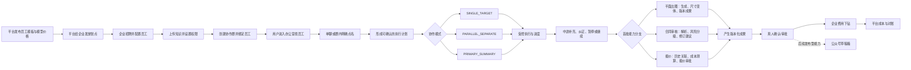

# 点联数字员工 V1 跨端 Golden Flow

> 文档状态：产品原型、接口契约与跨端验收的共同基线  
> 适用端：点联企业数字办公大厅、点联企业管理中心、点联平台运营中心  
> 产品原则：用户先找到合适的数字员工，再把工作交给他；任务、费用、成果和对外交付全程可见、可干预、可追溯。

---

## 1. 文档用法

本文档不是演示脚本，而是同一条业务链的可执行规格：

- 产品和 Figma 按步骤中的“前台反馈”、“失败/补偿”和“验收断言”设计页面及状态。
- 前端按权威事实映射状态，不使用假进度、本地计时器或独立布尔值推断业务结果。
- 后端按“权威事实”和“审计证据”建模，所有写命令使用幂等键与请求哈希。
- 测试逐条落实 `GF-*` 验收断言；同一断言同时用于原型走查、接口验收和端到端回归。

### 1.1 基准业务数据

| 类别 | 基准数据 |
|---|---|
| 平台角色 | 1 名平台运营管理员、1 名平台审计人员 |
| 企业角色 | 1 名企业管理员、1 名任务发起人、1 名企业审批人、1 名只读审计人员 |
| 租户 | 企业 A 为主流程租户，企业 B 用于跨租户零泄漏验证 |
| 数字员工 | 平面出图员工、法务合同审核员工、报价员工各 1 个企业实例；三者都由模板、能力包和企业配置组装，不写入平台内核 |
| 知识与记忆 | 企业知识空间、项目知识空间、品牌/设计资产、合同模板/条款库、历史项目/成本/报价案例、限权文档和已失效文档；个人、群、项目记忆作用域可分别验证 |
| 群聊 | 1 个项目协作群，包含普通成员、审批人和 3 位可用数字员工 |
| 商业 | 企业 A 有可用智点、预算上限、一个正常模型路由和一个可演练降级的备用模型 |
| 能力样例 | 一份含文字与图片参考的出图需求；一份带企业标准条款的待审合同；一份可与历史项目关联的报价需求 |
| 后续交付样例 | 公众号草稿箱只作为“受控对外发布”能力的后续契约验证，不是首批三个能力分支的准入前置 |

测试账号、密钥和 Provider 凭据不写入原型、文档、截图或通用日志。

---

## 2. 权威事实与跨端边界

| 业务事实 | 权威对象 | 可见端 | 不允许的替代真相 |
|---|---|---|---|
| 官方员工定义 | `AgentTemplate + AgentVersion + CapabilityPack` | 平台端管理，企业端只能选择已发布版本 | 企业实例反向修改平台模板 |
| 企业数字员工 | `EnterpriseAgent` 及已固定的版本、人设、模型、技能和权限 | 企业端管理，用户端按权限查看 | 前端卡片上写死的员工状态 |
| 会话与目标 | `Conversation + Member + MessageTarget + Message` | 用户端，企业端做治理 | 从文本猜测了哪个员工或靠最近消息默认路由 |
| 任务执行 | `Task + PlanVersion + Step + Run + Guidance + Checkpoint + Handoff` | 用户端展示和干预，企业端监控 | 百分比动画、SSE 瞬时事件或 Python 内存状态 |
| 成果、审批与交付 | `ArtifactVersion + Approval + Delivery + RemoteReceipt` | 用户端操作，企业端审批与监控 | 把“任务成功”当成“已发布” |
| 知识与引用 | `KnowledgeSpace + DocumentVersion + ACL + Citation` | 企业端管理，用户端仅见已授权证据 | 向量命中、文件名或提问者个人权限 |
| 智点与费用 | `PointAccount + PointLot + Reservation + LedgerEntry + UsageCall + RateSnapshot` | 企业端看本企业消耗，平台端再看 Provider 成本与对账 | 可修改的余额字段、浮点金额或临时聚合结果 |
| 办公室首页 | `OfficeSnapshot` | 用户端 | 不能成为第二套员工、任务或审批状态；它只是可重建读模型 |

### 2.1 成功不是一个状态

| 结果 | 成功判定 |
|---|---|
| 任务成功 | 计划要求的步骤达到终态，允许显式的 `PARTIAL_SUCCESS` |
| 成果成功 | 产生了符合输出契约的不可变 `ArtifactVersion` |
| 审批成功 | 审批人对指定成果版本做出有效决定 |
| 能力分支成功 | 平面出图、合同审核或报价能力分支各自的结构化输出契约通过，且运行轨迹、权限依据和费用可追溯 |
| 可选外部交付成功 | 指定目标系统已回执确认契约终点；公众号的终点只能是“草稿入库”，不是“已公开发布” |

### 2.2 三个首批能力共用的知识与记忆底座

| 底座约束 | 平面出图 | 法务合同审核 | 报价 |
|---|---|---|---|
| 使用的知识 | 经授权的品牌规范、设计资产、项目文案、图片参考和渠道尺寸规则 | 经授权的合同模板、标准条款、风险规则、合规要求和已确认历史处理案例 | 经授权的历史项目、客户、工项、供应价、成本、报价、折扣和已确认结果 |
| 可用的记忆 | 用户在当前作用域确认的视觉偏好、品牌禁忌与导出习惯 | 经确认的企业谈判偏好、条款接受边界与风险口径；不把未审批的一次建议当长期规则 | 经确认的企业报价偏好、成本口径、供应策略和客户/项目关联；不把模型推测写成历史事实 |
| 每次必须固定 | 知识/记忆作用域、资产版本、参考图哈希、模型/参数和授权快照 | 知识/记忆作用域、合同版本/哈希、条款引用、风险规则版本和授权快照 | 知识/记忆作用域、历史关联证据、数据截止时间、成本/税/利润口径版本和授权快照 |
| 零泄漏要求 | 不读取无权品牌资产、私人参考图或其他项目未授权成果 | 合同正文、条款摘要、修订建议和对话不进入无权群、其他项目或通用训练集 | 客户价格、成本、利润、折扣和历史报价不进入无权部门、群或其他租户 |

三个分支在生成结果前都必须重新鉴权。检索命中、记忆候选或过去任务的相似性只是输入证据，不能直接变成当前项目事实、法务结论或报价决策。

---

## 3. 跨端主链

上述主链在“受控执行”后分为三个等价的首批能力分支，任何分支都不能代表平台内核。知识、记忆、权限、任务/Run、成果版本、审批和智点是三个分支共用的底座。每个分支均可从失败节点进入“查看原因→修复前置条件→使用原业务幂等意图继续”，不通过新建重复任务或重复扣费伪造恢复。

---

## 4. 分步执行与验收规格

### GF-01 平台发布员工模板与模型价格

| 项 | 规格 |
|---|---|
| 前置条件 | 平台管理员拥有模板发布和价格发布权限；Provider 、官方模型、币种、计量单位和生效区间已定义；模板版本通过必要的 Schema 和安全校验。 |
| 主体 | 平台运营管理员发起，平台审核人按发布策略确认。 |
| 输入 | 模板基本信息、`AgentVersion`、能力包版本、默认模型策略、风险等级、Provider 费率、汇率/税口径、平台或企业销售倍率版本及生效时间。 |
| 权威事实 | 已发布的 `AgentVersion + CapabilityPackVersion + ModelCatalogVersion + ProviderRateVersion + PricingPolicyVersion`。历史版本只读，变价不改写旧费率或历史 `RateSnapshot`。 |
| 前台反馈 | 平台端显示版本、审核状态、生效范围、变价预览和回滚目标；企业端只看到已发布且对本企业可用的员工版本与预估智点口径。 |
| 失败/补偿 | 模板、能力包或价格任一校验失败时整体不发布；已生效版本通过新版本禁用或回滚，不删除历史事实。无有效价格的模型不能进入可用路由。 |
| 审计证据 | 操作人、审核人、发布前后版本、变更差异、生效区间、审批意见、配置哈希和发布事件 ID。 |
| 验收断言 | `GF-01-A` 企业只能招聘已发布版本；`GF-01-B` 旧企业实例不会因新版发布而静默升级；`GF-01-C` 价格变更后历史调用仍可还原原价格快照；`GF-01-D` 企业角色无平台模板发布权。 |

### GF-02 平台给企业发放智点

| 项 | 规格 |
|---|---|
| 前置条件 | 企业租户已启用，智点账户已建立，发放人拥有调账权限，超限发放已满足双人审批等平台策略。 |
| 主体 | 平台运营管理员发起，受控 Posting 服务记账，企业管理员查看。 |
| 输入 | 企业 ID、整数智点数量、智点批次、有效性策略、业务原因、审批引用和幂等键。页面固定提示 `1 元 = 100 智点`，账务内核仍使用整数最小单位。 |
| 权威事实 | `PointLot` 与不可变 `LedgerEntry`，`PointAccount` 余额为账本可重算快照，不是可独立修改的金额。 |
| 前台反馈 | 平台端展示“待审批/已过账/已拒绝”、发放数量和账本事务号；企业端展示可用、预占、已消耗和即将到期智点。 |
| 失败/补偿 | 过账前失败不产生正式分录；过账后发现错误只能追加冲正与补记，不更新或删除旧分录。 |
| 审计证据 | 发放申请、审批链、幂等键、请求哈希、账本事务/分录、操作前后快照、原因与附件引用。 |
| 验收断言 | `GF-02-A` 同一请求重放 100 次只发放一次；`GF-02-B` 同一幂等键更换数量必须冲突；`GF-02-C` 账户、批次和账本重算差异为 0；`GF-02-D` 企业 B 无法查看企业 A 的余额和分录。 |

### GF-03 企业招聘并配置数字员工

| 项 | 规格 |
|---|---|
| 前置条件 | 企业可使用目标模板版本，套餐/智点/模型策略允许创建实例，管理员拥有招聘与授权权限。 |
| 主体 | 企业管理员。 |
| 输入 | 员工模板版本、显示姓名/工号/形象、人设与企业提示词层、模型策略、技能包、工具授权、知识范围、可用部门/人员、预算与风险策略。 |
| 权威事实 | 企业内独立的 `EnterpriseAgent`，固定当时的 `AgentVersion`，并以版本化授权关联 `CapabilityPack`、模型、工具、知识与使用者范围。 |
| 前台反馈 | 企业端展示配置导航、冲突/缺失项、费用影响与发布前预览；用户端仅在实例发布且对当前用户可用后出现该员工。 |
| 失败/补偿 | 任一必选授权、模型或能力不可用时实例停留在草稿/不可用状态，不向用户端暴露“半可用”员工。已发布实例通过新配置版本调整，不篡改历史任务配置快照。 |
| 审计证据 | 操作人、模板/实例/配置版本、授权变更前后差异、生效范围、价格政策引用、工具凭据引用 ID（不记密钥正文）。 |
| 验收断言 | `GF-03-A` 企业只能定制实例，不能改平台模板；`GF-03-B` 同一模板可招聘多个彼此隔离的实例；`GF-03-C` 无权用户的办公室快照不含该员工；`GF-03-D` 停用实例后不能新建调用，但历史审计仍可查。 |

### GF-04 上传知识并设置权限

| 项 | 规格 |
|---|---|
| 前置条件 | 企业已建立知识空间；上传人拥有该空间管理权；文件类型、大小、安全扫描和数据分类策略通过。 |
| 主体 | 企业知识管理员上传与授权，Python 知识运行时解析/索引，Java 服务保存租户、ACL 与文档权威事实。 |
| 输入 | 原始文件、文档元数据、知识空间、部门/成员/群/项目/员工授权、生效区间和更新说明。 |
| 权威事实 | `KnowledgeSpace + DocumentVersion + KnowledgeACL + IndexJob`；OSS 原文件与内容哈希用于完整性校验，检索索引可重建、不是权限真相。 |
| 前台反馈 | 企业端逐文档显示上传、扫描、解析、切分、索引、可用、失败或已过期状态，并能查看 ACL 生效范围；用户端回答展示可点开的已授权引用和版本。 |
| 失败/补偿 | 索引失败不删除原文档，保留可重试任务与错误阶段；新版本失败时旧版仍按策略服务。撤权后新检索立即拒绝，缓存与活跃 Run 必须通过权限版本围栏失效。 |
| 审计证据 | 文档哈希、版本链、上传人、ACL 变更、解析/索引任务轨迹、索引版本、回答中的引用证据摘要和访问决策版本。 |
| 验收断言 | `GF-04-A` 企业 A/B 知识串读为 0；`GF-04-B` 跨群、跨项目和撤权后越权引用为 0；`GF-04-C` 回答可追溯至具体 `DocumentVersion`；`GF-04-D` 上传的群附件不会自动成为企业知识；`GF-04-E` 引用无权时前端不先请求正文再显示 403。 |

### GF-05 创建协作群并配置可用员工

| 项 | 规格 |
|---|---|
| 前置条件 | 创建人有建群权；选中的人类成员属于企业可授权范围；数字员工已发布且群成员具有使用权。 |
| 主体 | 企业管理员或有权的项目负责人。 |
| 输入 | 群名称、所属组织/项目、人类成员、审批人、可用数字员工、默认模式 `SINGLE_TARGET`、历史可见策略、项目知识/记忆范围和预算归属。 |
| 权威事实 | `Conversation + ConversationMember + ConversationAgentBinding + AccessPolicyVersion + MembershipVersion`。房间是组织和项目的动态投影，不是固定房间编号。 |
| 前台反馈 | 创建页实时说明谁能看历史、谁能调用哪位员工、费用归属和群记忆范围；用户端房间卡只向当前有效成员展示。 |
| 失败/补偿 | 任一成员、员工、知识范围或预算策略校验失败时不发布群。成员被移除后立即中断新消息/SSE 正文投递与新调用，活跃任务按转交或暂停策略处理。 |
| 审计证据 | 创建人、成员事件、员工绑定事件、访问策略版本、历史策略、知识/记忆范围、预算归属和撤权完成时间。 |
| 验收断言 | `GF-05-A` 普通群消息不调用模型、不扣智点；`GF-05-B` 群回答不读取任何成员的私人记忆；`GF-05-C` 撤权后越权正文投递为 0；`GF-05-D` 不存在写死九个房间或演示身份切换。 |

### GF-06 用户进入办公室找员工

| 项 | 规格 |
|---|---|
| 前置条件 | 用户已登录并选定企业，租户和成员状态有效，用户至少拥有一个可见员工、房间或任务入口。 |
| 主体 | 企业普通用户。 |
| 输入 | 当前企业、用户身份、权限版本、查询/筛选条件、`If-None-Match` 和可选恢复事件游标。 |
| 权威事实 | 鉴权后生成的 `OfficeSnapshot`，包含可见员工、动态房间、任务/成果/待办摘要、快照版本、ETag 和恢复游标。 |
| 前台反馈 | 现代明亮 2.5D 办公室直接展示员工工位、在线/工作/待补充/待审批/需关注状态和当前可执行操作；搜索结果以“员工能做什么”辅助用户找人，不改变员工优先的心智。 |
| 失败/补偿 | SSE 断线按事件 ID 重放；游标过期或出现 gap 时客户端丢弃本地推断，重新获取快照。部分摘要失败时显示明确降级，不伪造任务结果。 |
| 审计证据 | 快照版本、生成时间、权限版本、ETag、最后事件 ID、快照失效/重置事件；通用日志不记成果正文。 |
| 验收断言 | `GF-06-A` 首页第一主入口是员工而非任务表单；`GF-06-B` 快照状态可由权威事实重建；`GF-06-C` 无权员工/任务/成果在摘要查询前即被过滤；`GF-06-D` 无假进度、模拟运行数量和“恢复演示数据”。 |

### GF-07 单聊或群内明确点名

| 项 | 规格 |
|---|---|
| 前置条件 | 用户对会话、目标员工、附件和费用归属均有效权限；群内员工已绑定；成员资格版本未变化。 |
| 主体 | 企业普通用户。 |
| 输入 | 文本、附件、回复引用、任务归属以及结构化 `MessageTarget`。单聊的目标是当前员工；群聊通过员工选择、`@` 或回复员工消息明确目标。 |
| 权威事实 | 同一事务写入 `Message + MessageTarget + MessageAccessSnapshot + OutboxEvent`；群内消息序号单调递增。 |
| 前台反馈 | 发送前明示本次要叫谁、使用什么协作模式、任务归属和可能的智点消耗。目标、模式或任务归属不明时展示明确选择器，不显示伪“正在思考”。 |
| 失败/补偿 | 成员版本变化时整笔写入回滚并返回稳定错误；目标不明进入待用户选择，不调用模型、不预占智点。重复客户端消息 ID 返回第一次结果。 |
| 审计证据 | 发送者、会话/成员版本、客户端消息 ID、消息序号、目标类型/目标 ID/触发方式、权限快照、附件哈希和费用归属。 |
| 验收断言 | `GF-07-A` 无 `MessageTarget` 的普通群消息调用数为 0、智点变化为 0；`GF-07-B` 目标不明时系统必须询问，不得静默自动路由；`GF-07-C` 重放不产生第二条消息或第二次调用；`GF-07-D` 同幂等键改正文、附件或目标必须冲突。 |

### GF-08 形成可确认的执行计划

| 项 | 规格 |
|---|---|
| 前置条件 | 消息已绑定明确员工和任务归属；复杂工作已从普通问答升格为任务；权限、能力包、模型策略和费用上限可校验。 |
| 主体 | 发起用户提供目标，主责数字员工提出计划，Java 任务服务校验并落权威事实。 |
| 输入 | 已确认目标、约束、交付格式、时效、输入引用、协作模式、负责员工、费用上限、风险检查点和审批策略。 |
| 权威事实 | `Task + ExecutionPlanVersion + TaskStep + TaskCheckpoint`，每个步骤固定负责人、能力版本、输入引用、依赖、输出契约、预计智点、失败策略和风险检查点。 |
| 前台反馈 | 计划页按步骤显示“谁来做、用什么资料、会产出什么、依赖谁、预计消耗多少智点、哪里需要用户确认”；允许用户确认、修改或取消。 |
| 失败/补偿 | 缺关键信息时生成检查点，一次询问最影响结果的问题；权限、预算或能力缺失时不进入执行。计划被修改时创建新版本，不覆盖旧版。 |
| 审计证据 | 任务发起人/归属、源消息、计划版本、计划哈希、步骤图、预估依据、确认人/时间、审批策略快照和预算策略快照。 |
| 验收断言 | `GF-08-A` 每个步骤均有负责人、输入、输出、依赖、费用和失败处理；`GF-08-B` 高风险/超费用上限计划未确认前不执行；`GF-08-C` 变更只产生新计划版本；`GF-08-D` 目标、模式或任务归属不明时不允许开始。 |

### GF-09A 执行 `SINGLE_TARGET`

| 项 | 规格 |
|---|---|
| 前置条件 | 计划只指定一位目标员工，该员工在当前会话可用，预算和知识/工具权限通过。 |
| 主体 | 被点名的数字员工是唯一业务执行者。 |
| 输入 | `mode=SINGLE_TARGET`、唯一 `targetAgentId`、计划版本、任务输入快照和智点预占意图。 |
| 权威事实 | 一个任务下的步骤和 Run 归属唯一员工；模型或工具尝试不等于新的员工协作。 |
| 前台反馈 | 任务页只展示该员工为负责人，同时展示当前步骤、阶段成果、依据、已用/预计智点和可干预操作。 |
| 失败/补偿 | 执行中发现必须转交其他员工时暂停并请求用户确认新模式/新计划版本，不静默委派。 |
| 审计证据 | 模式、唯一员工、任务/计划/步骤/Run 关联、每次 Provider Attempt、智点预占/结算与结果。 |
| 验收断言 | `GF-09A-A` 一条消息最多触发一位员工；`GF-09A-B` 模型降级不改变业务负责员工；`GF-09A-C` 任何跨员工转交都需显式计划变更。 |

### GF-09B 执行 `PARALLEL_SEPARATE`

| 项 | 规格 |
|---|---|
| 前置条件 | 用户显式选择两位或以上数字员工，每位员工均可使用同一任务输入，并已展示聚合费用上限。 |
| 主体 | 被选员工各自独立执行，无默认主责汇总员工。 |
| 输入 | `mode=PARALLEL_SEPARATE`、明确员工列表、各自输出契约、共享输入引用、每个分支的费用上限和失败策略。 |
| 权威事实 | 一个父任务下建立独立分支步骤/Run/成果/费用关联；分支之间不互相传递未经计划授权的中间结果。 |
| 前台反馈 | 以并列员工轨道显示状态、输出、费用和失败原因；分别返回成果，明确提示“未自动汇总”；允许对单个分支重试或停止。 |
| 失败/补偿 | 一个分支失败不覆盖其他分支成果，父任务可显示部分成功；只重试失败分支，且用户显式“重新生成”才产生新收费意图。 |
| 审计证据 | 员工选择、分支 ID、分支输入哈希、每个分支的 Run/Attempt/成果/智点和父任务聚合状态。 |
| 验收断言 | `GF-09B-A` 产生与被选员工数一致的独立执行分支；`GF-09B-B` 系统不自动选主责员工或合并回答；`GF-09B-C` 单分支失败可见且不污染已成功分支；`GF-09B-D` 各分支费用可独立下钻。 |

### GF-09C 执行 `PRIMARY_SUMMARY`

| 项 | 规格 |
|---|---|
| 前置条件 | 用户已明确选择一位主责员工和至少一位协作员工；计划已定义子任务、转交边界、依赖和汇总输出。 |
| 主体 | 主责员工负责计划内分工和最终汇总；协作员工只执行分配给自己的步骤。 |
| 输入 | `mode=PRIMARY_SUMMARY`、`primaryAgentId`、协作员工列表、版本化步骤图、`Handoff` 契约、中间成果可见范围、汇总标准、总费用上限和每步失败策略。 |
| 权威事实 | `PlanVersion + Step + Handoff + Run + ArtifactVersion`；每次转交固定发出人、接收人、输入、依赖、期望输出、智点上限、超时和失败处理。 |
| 前台反馈 | 显示主责员工、协作员工、分工图、转交状态、阶段成果、阻塞点、分步及总智点；最终成果与中间成果分开标识。 |
| 失败/补偿 | 子任务失败按计划选择重试、降级、跳过或等待用户，不由员工自行无限拉人。新增员工、重新分工或可能超费用上限时生成新计划版本并等待确认。 |
| 审计证据 | 主责/协作员工、计划版本、每步责任归属、Handoff 输入输出哈希、中间成果、Run/Attempt、智点与失败决策。 |
| 验收断言 | `GF-09C-A` 未选主责员工时不得开始；`GF-09C-B` 每个步骤和转交只有一个当前责任人；`GF-09C-C` 员工不得在计划外无限自主对话或组队；`GF-09C-D` 最终汇总可追溯到每个中间成果与负责员工。 |

### GF-10 受控执行、转交与进度恢复

| 项 | 规格 |
|---|---|
| 前置条件 | 计划版本有效，需要的用户/审批确认已完成，权限未撤销，费用上限校验通过且智点预占成功。 |
| 主体 | Java 任务服务掌握业务任务、权限和智点真相；Python `dianlian-ai-runtime` 只执行经准入的知识/记忆/复杂 Agent Run；持久 Run Supervisor 负责排队、单活、lease、heartbeat、fencing、接管和恢复。 |
| 输入 | 任务执行代次、计划版本、步骤输入哈希、执行人、知识/记忆权限令牌、模型策略、费用预占 ID、幂等键和运行时准入令牌。 |
| 权威事实 | `TaskStep + TaskStepExecution + RuntimeRun + RuntimeEvent + Handoff + UsageCall + ProviderAttempt`；重要运行事件先持久化再通知。 |
| 前台反馈 | 用户能持续看到当前步骤、负责员工、依据/引用、阶段成果、已用/预计智点、失败原因和暂停/补充/取消入口；进度来自步骤状态而非伪百分比。 |
| 失败/补偿 | 工作进程崩溃时通过过期 lease 和 fencing 唯一接管；旧执行代次迟到结果被拒绝。超时/限流可用原幂等意图有界重试；权限拒绝、输入缺失和副作用结果未知不盲目重试。 |
| 审计证据 | 任务/计划/步骤/Run ID、执行代次、lease/fencing epoch、输入哈希、Runtime 事件序号、工具效果意图、Provider Attempt、费用快照和转交记录。 |
| 验收断言 | `GF-10-A` 进程崩溃后任务可从持久状态恢复；`GF-10-B` 同一 Thread 同时最多一个活动操作；`GF-10-C` 迟到事件不覆盖新执行代次；`GF-10-D` SSE 重放不重复创建消息、调用、扣费或交付；`GF-10-E` 任务详情能展示真实执行轨迹。 |

### GF-11 对话中途引导与用户干预

| 项 | 规格 |
|---|---|
| 前置条件 | 用户对目标任务有干预权，任务处于可引导状态，前端持有当前计划版本。当会话同时有多个进行中任务时已选明目标任务。 |
| 主体 | 有权用户可补充/纠正/修改/暂停/继续/取消；数字员工也可在信息缺失、资料冲突、高风险分支或超费用时主动创建检查点。 |
| 输入 | `ADD_CONTEXT / CORRECT_FACT / CHANGE_CONSTRAINT / CHANGE_GOAL / STYLE_GUIDANCE / ANSWER_CHECKPOINT / APPROVE / REJECT / PAUSE / RESUME / CANCEL / RETRY_FROM_STEP`，源消息、附件、目标步骤、`If-Match` 计划版本与幂等键。 |
| 权威事实 | `Guidance + GuidanceImpact + PlanVersion + Checkpoint + TaskTransition`。事实纠正、目标变化、审批失效、追加智点或不可逆副作用由确定性规则判定，不由模型直接改状态。 |
| 前台反馈 | 不只回复“已收到”，必须展示系统理解、受影响步骤、将失效成果/审批、不可逆效果、追加智点上限和是否需再确认。暂停/取消显示“已请求”与“已在安全点生效”的区别。 |
| 失败/补偿 | 计划版本冲突时拒绝覆盖并要求刷新；已发生的外部副作用不伪装回滚，产生补偿建议或人工处置。影响已成果步骤时标记旧成果过期并产生新版。 |
| 审计证据 | 操作人、源消息、引导类型、系统解释、前后计划版本、影响步骤、失效成果/审批、费用影响、确认令牌摘要和状态迁移。 |
| 验收断言 | `GF-11-A` 纠正上游事实后依赖的下游成果必须失效或重算；`GF-11-B` 已审批成果改变后原审批立即失效；`GF-11-C` 同一引导重放只生效一次；`GF-11-D` 无权群成员不能变更目标、取消或审批；`GF-11-E` “以后都这样”只生成待确认记忆候选，不静默写长期记忆。 |

### GF-12 三个能力分支共同的版本成果约束

| 项 | 规格 |
|---|---|
| 前置条件 | 平面出图、合同审核或报价分支的目标步骤已产生符合各自输出契约的结果，输入引用、证据、权限快照、能力版本和内容哈希可固定。 |
| 主体 | 任务执行服务生成成果版本，分支员工是生成者，用户查看与发起派生/修改。 |
| 输入 | 能力分支、成果类型、结构化输出或文件引用、源任务/步骤/Run、输入快照、证据引用、权限快照、父版本、能力版本和内容哈希。 |
| 权威事实 | 不可变 `ArtifactVersion`，包含版本链、来源、输入、证据、存储引用和内容哈希。修改一律新建版本，成果正文不回写消息或任务状态字段。 |
| 前台反馈 | 成果中心展示能力分支、版本号、创建人/员工、源任务、变更差异、引用、权限范围、运行轨迹、生成智点、审批状态和派生操作；阶段成果与最终成果标识明确。 |
| 失败/补偿 | 渲染、文件存储或 Schema 校验失败时不将该版标记为可交付；多成果部分成功时保留成功版本并逐项显示失败。 |
| 审计证据 | 成果/版本 ID、产生者、源任务/步骤/Run、输入与证据引用、能力版本、内容/存储哈希、父版本和生成费用关联。 |
| 验收断言 | `GF-12-A` 修改不覆盖旧成果；`GF-12-B` 任意版本可还原到输入、依据、权限快照、步骤/Run、生成者和费用；`GF-12-C` 派生内容保留父子链；`GF-12-D` 任务成功不会自动将成果标为已确认、已审批或已交付；`GF-12-E` 三个分支的费用、权限与运行轨迹字段使用同一底座契约。 |

### GF-12A 平面出图：图片生成、尺寸变体与版本成果

| 项 | 规格 |
|---|---|
| 前置条件 | 用户已确认用途、主题、画面约束、品牌资产、目标尺寸/比例和输出格式；当前员工对文字、参考图、Logo、字体和项目资产均有权；文生图/图生图模型、安全策略和智点预占可用。 |
| 主体 | 平面出图数字员工负责理解、生成和派生；用户负责方向选择与最终确认；高风险/品牌敏感场景可由指定审批人确认。 |
| 输入 | 文字要求、参考图引用与哈希、品牌规范版本、画布尺寸/比例、文案安全区、输出数量/格式、质量等级、可允许变体范围和费用上限。 |
| 权威事实 | 一个基础图成果族及其 `ArtifactVersion`；每个尺寸变体是绑定父版本、确切像素尺寸/比例、生成/适配参数、模型版本、内容哈希和质检结果的独立成果版本。 |
| 前台反馈 | 展示“需求理解→素材/权限检查→基础图生成→尺寸变体→质检→待人选”轨迹；基础图和每个变体分别显示预计/已用智点、状态、尺寸、文案溢出/品牌偏差等质检结果和“重做本变体”入口。 |
| 失败/补偿 | 单个尺寸生成或质检失败不使其他变体失效，任务可部分成功；自动技术重试不新建企业收费意图，用户显式“重新生成”才创建新版本和新收费意图。权限或品牌资产版本变化后未完成变体停止并重新确认。 |
| 审计证据 | 发起人/员工、输入与参考资产哈希、知识/记忆/权限快照、提示词配置版本及安全存储引用、生成参数、步骤/Run/Provider Attempt、远端响应 ID、成果版本链、质检结果和每次智点结算。 |
| 验收断言 | `GF-12A-01` 文字和图片两类输入都能形成可追溯任务；`GF-12A-02` 同一基础图至少生成两种明确尺寸的独立变体且保留父子版本链；`GF-12A-03` 单变体失败不污染其他结果；`GF-12A-04` 无权参考图/品牌资产不进入模型请求；`GF-12A-05` 每个成果可下钻到生成步骤、Provider Attempt 和智点分录。 |

### GF-12B 法务合同审核：解析、风险分级、修订建议与人工确认

| 项 | 规格 |
|---|---|
| 前置条件 | 合同文件已安全上传并固定版本/哈希；用户已确认合同类型、企业立场、适用地区/口径和审核范围；员工有权访问合同正文、标准条款、风险规则和相关案例；敏感文档不向无权群广播。 |
| 主体 | 法务合同审核数字员工执行解析、检索、风险匹配和建议生成；企业指定法务/审批人对风险与修订建议做最终确认。系统输出是审核辅助，不是自动生效的法律结论。 |
| 输入 | 合同版本、审核方立场、合同类型、重要金额/期限等业务上下文、标准条款/风险规则版本、作用域、风险分级口径、输出格式、审批规则和智点上限。 |
| 权威事实 | 合同原文 `DocumentVersion`、保留页码/段落/文本范围定位的结构化条款、版本化风险项（等级、依据、影响、建议）、修订建议成果和人工决定。模型的风险等级必须通过版本化规则映射，不直接改企业风险真相。 |
| 前台反馈 | 展示“文件解析→条款切分→标准条款/历史案例检索→规则命中→风险分级→修订建议→待人确认”轨迹；每个风险项显示原文定位、引用依据、风险等级、建议文本、模型置信提示、人工接受/修改/忽略和分步智点。 |
| 失败/补偿 | 解析页码缺失、条款定位不稳定、适用口径不明、资料冲突或无权时暂停并请求用户处理，不伪造完整审核。单个风险项重算不覆盖已确认项；合同正文改变后所有受影响风险与旧人工确认标记失效。 |
| 审计证据 | 合同文件版本/哈希、安全分类、知识/记忆/权限快照、条款定位、规则/案例引用、步骤/Run/Provider Attempt、风险分级口径、建议版本、人工逐项决定和每步智点结算。 |
| 验收断言 | `GF-12B-01` 合同条款可回到原文页码/段落且不丢失版本；`GF-12B-02` 每个风险等级都有规则/证据引用，无依据项明确标识；`GF-12B-03` 修订建议不自动替换原合同；`GF-12B-04` 未经指定人工确认不得标记审核完成；`GF-12B-05` 无权合同正文或风险摘要投递为 0；`GF-12B-06` 输出可下钻到解析/检索/风险步骤、Provider Attempt 和智点分录。 |

### GF-12C 报价：历史关联、成本测算与报价审批

| 项 | 规格 |
|---|---|
| 前置条件 | 用户已确认客户/项目、需求范围、数量/规格、时间/地点、税费/利润/舍入口径和报价日期；历史项目、成本、供应价和报价数据已版本化且在当前权限内；成本计算口径与审批规则有效。 |
| 主体 | 报价数字员工负责历史关联、假设整理和报价草案编排；确定性计算服务负责数量、单价、税费、成本、利润、折扣与舍入；指定业务/财务审批人做最终报价决策。 |
| 输入 | 当前项目需求快照、历史搜索条件、数据截止时间、可用历史项目/工项/成本/报价版本、数量与单位、当前供应价、税/利润/折扣/舍入规则版本、内部/客户输出范围、审批阈值和智点上限。 |
| 权威事实 | 带有关联原因、相似/差异字段、时间和数据版本的历史案例引用；由确定性规则产生的 `CostCalculationSnapshot`；内部报价分析版和客户版 `ArtifactVersion`；绑定指定版本与金额哈希的 `Approval`。历史报价只是证据，不直接复制为当前报价。 |
| 前台反馈 | 展示“需求拆解→历史项目/客户/工项关联→差异调整→确定性成本测算→利润/税费/折扣检查→报价草案→待人审批”轨迹；每个工项显示来源、公式、假设、可编辑项、变更影响、报价业务金额和 AI 智点消耗，两者不混为一个费用数字。 |
| 失败/补偿 | 历史数据无权、过期、单位/币种不兼容、关键成本缺失或公式版本不可用时暂停并列出待补充项，不由模型猜测缺失价格。历史关联变更只生成新测算/成果版本；已审批后任一金额或口径改变均使原审批失效。 |
| 审计证据 | 发起人/员工、当前需求快照、知识/记忆/权限快照、历史关联结果与原因、数据版本/截止时间、测算公式/参数/舍入结果、步骤/Run/Provider Attempt、成果版本、审批决定和每步智点结算。 |
| 验收断言 | `GF-12C-01` 当前需求可关联至至少一个有权历史项目并解释相似与差异；`GF-12C-02` 历史报价不被无条件复制，所有差异、数据时点和假设可见；`GF-12C-03` 金额由确定性公式可重算，同一输入与规则版本结果一致；`GF-12C-04` 成本/利润等内部字段不进入无权用户或客户版成果；`GF-12C-05` 未经指定审批人不得标记报价有效；`GF-12C-06` 报价业务金额与 AI 智点分开展示且均可追溯。 |

### GF-13 三个能力分支的真人确认、退回与审批

| 项 | 规格 |
|---|---|
| 前置条件 | 成果版本可供人工判断，任务风险与企业审批规则已确定确认/审批人，决策人对该版本及必要的内部依据有查看权。 |
| 主体 | 出图分支由用户选定最终图/变体；合同审核分支由指定法务逐项确认风险与修订建议；报价分支由指定业务/财务审批人按阈值正式通过或退回。 |
| 输入 | 不可变成果版本 ID/内容哈希、审批决定、意见、条件、附件和幂等键。 |
| 权威事实 | 绑定具体 `ArtifactVersion` 的 `Approval`；新成果版本不继承旧审批。 |
| 前台反馈 | 确认/审批页同时展示成果正文/差异、来源、引用、运行轨迹、AI 智点、能力分支特有风险、敏感字段和退回后的下一步。通过、退回、失效和待审批不共用模糊状态。 |
| 失败/补偿 | 成果哈希、版本、权限或审批规则已变化时拒绝旧确认；退回创建引导/新计划版本或新成果版本，不覆盖旧结果。 |
| 审计证据 | 审批人、角色/权限版本、成果版本/哈希、决定、意见、附件、时间、审批规则快照和幂等键。 |
| 验收断言 | `GF-13-A` 出图未经人工选定不得标记最终版；合同审核未经指定人工确认不得标记审核完成；报价未通过规则要求的审批不得标记有效；`GF-13-B` 重放审批命令只产生一个决定；`GF-13-C` 新成果版本使原确认/审批不再可用；`GF-13-D` 普通群成员不能凭可见权完成法务或报价审批；`GF-13-E` 三个分支的人工决定都绑定不可变成果版本。 |

### GF-14 V1 通用发布型能力契约：提交公众号草稿箱（独立于三类员工主链）

> 公众号草稿箱是 V1 需要独立验收的通用 Delivery 连接器，但不嵌入平面出图、法务合同审核和报价任一员工，也不能替代三个首批能力分支各自的验收结果。

| 项 | 规格 |
|---|---|
| 前置条件 | 目标成果版本已通过必要审批；目标公众号账号授权有效；内容、封面、摘要和格式符合公众号草稿契约；交付人有操作权。 |
| 主体 | 有权用户发起，对外交付服务与公众号适配器执行。 |
| 输入 | 不可变成果版本 ID/内容哈希、审批 ID、目标公众号 ID、交付预览确认、业务幂等键和请求哈希。 |
| 权威事实 | `Delivery + DeliveryAttempt + RemoteReceipt`，与具体成果版本/哈希和目标账号绑定。远端草稿 ID、请求 ID、回执状态和回执哈希持久保存。 |
| 前台反馈 | 提交前必须展示目标账号、成果版本、内容差异、审批状态和“只进入草稿箱，不会自动公开发布”。成功后显示远端草稿 ID/可用查看入口和回执时间。 |
| 失败/补偿 | 明确未发出、远端支持幂等键，或查询确认未创建草稿时才能自动重试。网络超时且远端结果不明时进入 `UNKNOWN/RECONCILING`，先查回执或人工处置，禁止盲目重发。授权过期时保留已审批成果并引导重新授权。 |
| 审计证据 | 交付人、成果版本/哈希、审批 ID、目标账号、幂等键/请求哈希、每次试图、远端请求/草稿 ID、回执、轮询/回调事件和处置结果。 |
| 验收断言 | `GF-14-A` 同一交付命令重放 100 次最多产生一个远端草稿；`GF-14-B` 结果未知时不标记失败、取消或成功；`GF-14-C` “草稿已入库”不显示为“已公开发布”；`GF-14-D` 成果内容变更后原审批与原交付意图不得复用。 |

### GF-15 企业管理端费用下钻

| 项 | 规格 |
|---|---|
| 前置条件 | 调用用量已定价或处于可见的待定价状态；智点预占已结算/释放或有明确待处理状态；查看人有本企业费用权限。 |
| 主体 | 企业管理员、预算负责人或只读审计人员。 |
| 输入 | 时间范围、数字员工、用户/部门、模型、能力分支/能力版本、任务、步骤/Run、成果版本、群聊、费用状态和智点分录等筛选条件。 |
| 权威事实 | 企业查看的消耗由 `UsageCall + billable RateSnapshot + Reservation + LedgerEntry` 联合得到；汇总是可重算读模型，不是独立计费真相。 |
| 前台反馈 | 企业总览显示总智点、可用、预占、实扣、释放、退回、预算占用与趋势；可分别查看平面出图、合同审核和报价分支的总量、单任务/单成果消耗与异常。每个聚合值可下钻到任务→步骤/Run→成果版本→逻辑调用→计价快照→智点分录，并区分平台自动重试与用户显式重新生成/重算。 |
| 失败/补偿 | 未定价用量、过期预占、待结算调用或账本勾稽差异作为异常显示，不用 0 或“已完成”隐藏。费用纠错通过智点退回/调账分录，不改原调用和原快照。 |
| 审计证据 | 调用/能力分支/能力版本/任务/步骤/Run/成果版本/员工/用户/群聊归属，模型用量，企业销售价格快照，预占分配，实扣/释放/退回分录和聚合口径版本。 |
| 验收断言 | `GF-15-A` 企业总智点消耗 100% 可按三个能力分支下钻到任务、步骤/Run、成果、调用与分录；`GF-15-B` 分支汇总、全局汇总、明细和账本重算差异为 0；`GF-15-C` Provider 自动重试可有多次 Attempt，但企业同一收费意图最多实扣一次；`GF-15-D` 企业端不暴露其他租户或平台敏感的 Provider 账单数据。 |

### GF-16 平台成本、倍率与对账

| 项 | 规格 |
|---|---|
| 前置条件 | Provider 用量与费率版本可获取，企业扣费已绑定销售价格快照，平台账单导入和对账人员有受控权限。 |
| 主体 | 平台运营、财务/对账人员和平台审计人员。 |
| 输入 | Provider Attempt 用量、供应商费率版本、官方账单、汇率/税口径、企业倍率版本、平台承担成本标记、企业智点实扣和对账期。 |
| 权威事实 | 每次 `ProviderAttempt` 的用量/成本事实、企业 billable `UsageCall`、销售 `RateSnapshot`、Provider 成本快照、智点分录、账单行与对账差异。从暂估到实际成本通过追加差异事实完成，不改历史。 |
| 前台反馈 | 平台端按企业、模型、Provider、员工、能力分支/版本、时间和对账状态展示企业智点消耗折算、供应商成本、平台吸收成本、直接贡献额与差异；平面出图、合同审核和报价三个分支均可下钻到步骤/Run、Provider Attempt、成果版本、账单行和价格版本。 |
| 失败/补偿 | 用量匹配失败、费率空洞、币种不一致、账单重复或差异超阈值时进入异常队列，不自动篡改企业账本。必要的企业退回或平台调账使用审批后的新分录。 |
| 审计证据 | Provider 请求/回执 ID、Attempt 用量、费率/汇率/税/倍率版本、企业扣费、账单来源/文件哈希/行号、匹配决策、差异处理和审批。 |
| 验收断言 | `GF-16-A` 每笔企业实扣 100% 可追溯到销售价格快照与账本分录；`GF-16-B` 每次 Provider Attempt 100% 保留成本证据；`GF-16-C` 同一供应商账单重复导入不重复入账；`GF-16-D` 变价/倍率变更不改历史调用结果；`GF-16-E` 平台汇总、Provider 账单、企业实扣和账本之间差异均有可下钻的处理状态。 |

---

## 5. 不可突破的协作与安全围栏

### 5.1 不得自动路由

以下任一项不明确时，任务进入等待用户选择，不调用数字员工、不预占智点：

- 谁是本次目标员工。
- 本次是普通消息、新任务还是对已有任务的引导。
- 使用 `SINGLE_TARGET`、`PARALLEL_SEPARATE` 还是 `PRIMARY_SUMMARY`。
- `PRIMARY_SUMMARY` 中谁是主责员工。
- 费用归属于哪个人、部门、项目或群任务。
- 多个进行中任务时，当前消息要修改哪个任务。

模型可以生成选项建议，但不能代替用户提交这些业务事实。

### 5.2 不得无限员工互聊

`PRIMARY_SUMMARY` 的数字员工协作必须是有限、有图、有费用上限的任务执行：

- 每个员工调用必须属于当前计划版本中的一个 `Step` 或 `Handoff`。
- 每个步骤只有一个当前责任员工，且具有输入、输出契约、依赖、超时、重试上限和失败策略。
- 任务固定最大步骤数、最大转交深度、最大总 Run 数、智点上限和最长执行时间；超限后等待用户确认或终止。
- 员工不得绕过 Java 任务计划直接拉起新员工；DeerFlow 子 Agent 只属于当前员工步骤，不拥有企业数字员工身份。
- 同一转交循环被检测到时立即暂停，向用户展示循环路径、已用智点和处理选项。

### 5.3 知识、记忆与群聊受众

- 群回答的知识范围是“数字员工授权 ∩ 群/项目授权 ∩ 当前全部接收者可见范围”，不是提问者个人最大权限。
- 群回答只能使用群记忆、授权项目记忆和企业记忆，任何 `USER_AGENT` 私人记忆进入群上下文均是验收失败。
- 群消息只能产生群记忆候选。从私人、其他群或其他项目提升记忆时必须明确展示源作用域、目标作用域、内容和确认人。
- 成员撤权后，历史审计记录保留，但新正文、附件、成果和 SSE 事件必须重新鉴权。

---

## 6. 幂等、重试、扣费与发布防重

### 6.1 幂等对象表

| 业务命令 | 业务幂等意图 | 重放结果 | 同键不同请求哈希 |
|---|---|---|---|
| 发放/退回/调账智点 | 一次已审批账务意图 | 返回第一次 Posting/账本结果 | 稳定冲突，不重新记账 |
| 发送消息 | 会话 + 发送者 + 客户端消息 ID | 返回原消息和原 Target | 稳定冲突，不创建新消息 |
| 创建任务/Run | 源消息 + 收费意图 + 执行代次 | 返回原任务/Run | 稳定冲突，不创建新 Run |
| 智点预占/实扣/释放/退回 | 业务对象 + 会计动作 + 原交易 | 返回原 Reservation/分录 | 稳定冲突，不重复改余额 |
| 执行中引导/确认 | 任务 + 引导 + 计划版本 | 返回原影响分析/迁移结果 | 稳定冲突，不覆盖新计划 |
| 外部工具副作用 | 工具类型 + 业务对象 + 效果意图号 | 查询并返回原效果/未知状态 | 稳定冲突，禁止重发 |
| 提交公众号草稿（后续发布型能力） | 企业 + 成果版本/哈希 + 目标账号 | 返回原 Delivery/远端草稿 ID | 稳定冲突，不发第二次远端请求 |

### 6.2 扣费唯一性

- 首次用户意图创建一个 BillingGroup/收费意图；平台自动重试只新增 `ProviderAttempt`，不新增企业收费意图。
- 用户明确点击“重新生成”，且看到新的费用影响后，才能创建新收费意图。
- 模型降级可能提高最大应扣智点时，先生成新价格快照、预览增量并追加预占；未通过不得向备用 Provider 发请求。
- 余额不足时新收费请求不发往 Provider；长任务保留已完成步骤并进入等待智点，补充后从未执行步骤继续。
- 预占、实扣、释放和退回均是独立幂等会计动作；实扣不超过有效预占，累计退回不超过原实扣。

### 6.3 后续外部发布的唯一性

- 交付幂等键必须同时绑定租户、成果版本、内容哈希、目标账号和交付类型。
- 同键同哈希返回原交付记录；同键不同哈希返回冲突，禁止以新请求覆盖。
- 远端结果不明时先用远端请求 ID、成果哈希或业务去重键查询；不能把 HTTP 超时等同于远端未执行。
- 重复回调、轮询和 SSE 事件只能更新同一 Delivery 的可见投影，不得创建新成果、新审批或新交付。

---

## 7. 原型必须覆盖的交互状态

| 区域 | 必须展示的状态 | 主操作 |
|---|---|---|
| 平台模板/价格 | 草稿、待审核、已发布、灰度、已停用、有价格空洞、变价待生效 | 预览差异、提交审核、发布、回滚、停用 |
| 智点 | 可用、预占、已消耗、已释放、已退回、待过账、差异待处理 | 发放、审批、冲正/调账、查看分录 |
| 员工实例 | 草稿、可用、限制使用、配置冲突、已停用、版本可升级 | 招聘、配置、预览、发布、停用、显式升级 |
| 知识文档 | 上传中、扫描中、解析中、索引中、可用、部分失败、失败、过期、已撤权 | 重试、上传新版、修改 ACL、停用、查看引用 |
| 群消息 | 普通消息、已选目标、目标待选、成员版本冲突、无权、附件不可见 | 选员工、`@`、回复、选模式、选任务归属、刷新成员状态 |
| 任务/步骤 | 规划中、待用户、排队中、执行中、应用引导、待确认、待审批、暂停中、等待智点、部分成功、失败、已取消 | 确认计划、补充、纠正、暂停、继续、取消、从步骤重试 |
| 平面出图分支 | 需求待确认、素材无权、基础图生成中、变体生成中、变体部分失败、质检不通过、待人选、最终版 | 确认需求、查看轨迹/费用、重做指定变体、比较版本、选定最终版 |
| 合同审核分支 | 解析中、原文定位失败、规则/案例检索中、资料冲突、风险待确认、修订建议待处理、已退回、审核完成 | 回到原文、查看依据/轨迹/费用、逐项接受/修改/忽略、重新解析、提交法务确认 |
| 报价分支 | 需求待补充、历史关联中、关联无证据、成本缺失、测算中、待审批、已退回、报价有效、已失效 | 查看历史依据/差异、补充成本、查看公式/轨迹/AI 费用、调整假设、重算、提交审批 |
| 成果 | 阶段成果、最终成果、过期、待审批、已通过、已退回、已派生 | 比较版本、查看依据、继续修改、提交审批、派生导出 |
| 公众号草稿（后续发布型能力） | 待提交、发送中、远端已接受、草稿已入库、授权过期、等待重试、结果未知、失败、已取消 | 预览、确认提交、重新授权、查询回执、人工处置 |
| 费用与对账 | 已定价、待定价、成本暂估、成本已确认、待对账、已匹配、差异待处理、已调整 | 下钻、导入账单、匹配、查看差异、申请调整、导出审计证据 |

---

## 8. 端到端准入断言

以下断言是整条 Golden Flow 的共同准入条件：

1. 平台、企业、用户与审批/审计人员权限严格分离，企业总经理或企业管理员不获得平台模板、Provider 或价格发布权。
2. 用户从办公室先看见可用员工，再进入单聊或协作房间；房间、员工和进度不使用固定演示数据。
3. 目标、协作模式、主责员工或任务归属不明时，系统询问用户，不静默自动路由。
4. `SINGLE_TARGET`、`PARALLEL_SEPARATE`、`PRIMARY_SUMMARY` 均使用可追溯的责任人、计划版本、步骤、Run、输入/输出、智点和失败决策。
5. 数字员工之间不得无限对话、自主拉人或绕过计划转交；步骤数、转交深度、Run 数、费用和时间均有上限。
6. 任务执行中用户可补充、纠正、暂停、继续、取消和从指定步骤重试；数字员工也会在重要分支主动引导用户。
7. 用户能看到当前步骤、负责人、依据、阶段成果、费用和可操作入口；断线后能从持久事件与快照恢复。
8. 私人记忆进入群聊、跨群泄漏、跨租户检索、越权知识引用和撤权后正文投递均为 0；图片/品牌资产、合同正文/风险、历史成本/报价均执行同级作用域隔离。
9. 平面出图分支能从文字或图片输入产生基础图与明确尺寸变体，每个版本的资产、参数、质检、Run、Provider Attempt 和智点可追溯。
10. 法务合同审核分支能将条款定位回原文，对风险分级提供规则/证据依据和修订建议；未经指定人工确认不得表达为审核完成或法律结论。
11. 报价分支能解释历史项目的关联与差异，使用可重算确定性公式完成成本测算，并将内部成本/利润、客户报价和 AI 智点分开；未经指定审批不得标记报价有效。
12. 任务成功、能力分支成功、成果成功、人工确认/审批成功和可选外部交付成功分别表达；公众号草稿箱不主导首批 Golden Flow，草稿入库也不得宣称为已公开发布。
13. 用户、网络、SSE、Worker 和 Provider 的重复、超时或乱序不会创建重复消息、任务、Run、成果版本、扣费或审批；执行后续公众号契约时同样不重复创建草稿。
14. 智点账本 100% 平衡，企业汇总可按三个能力分支下钻到任务、步骤、调用、价格快照、预占和分录；平台可继续下钻到每次 Provider Attempt、成本快照和账单行。
15. 任何结果未知、账务不平、越权、重复副作用或恢复不能达到门槛的能力必须降级、暂停或关闭，不通过扩容或前端文案掩盖。

---

## 9. 验收证据包

每次完整跑通 Golden Flow 至少保留以下证据，证据中的敏感正文、Token 和凭据必须脱敏：

- 三端关键页面截图/录屏，覆盖正常、等待、冲突、失败、恢复和无权状态。
- 从模板版本、企业员工实例、会话、消息目标到任务/计划/步骤/Run/分支成果/人工确认/审批的对象 ID 关联清单；执行可选发布契约时再加入 Delivery/RemoteReceipt。
- 一次单员工、一次并行分别执行和一次主责汇总的完整执行轨迹。
- 至少一次事实纠正、一次暂停/继续、一次计划版本冲突和一次审批失效证据。
- 平面出图分支的基础图/尺寸变体/质检/版本链，合同审核分支的原文定位/风险依据/修订建议/人工决定，以及报价分支的历史关联/测算公式/内外版成果/审批证据。
- 三个分支各至少一次 Worker 接管或安全恢复证据，以及 SSE 重放/gap 恢复和 Provider 自动重试证据。
- 对同一消息、任务、Run、分支生成/重算、预占、实扣、引导和确认/审批命令的重放结果；公众号草稿命令只在执行后续发布契约时补充。
- 企业费用下钻导出、平台 Provider 成本/对账导出和智点账本勾稽结果。
- 跨租户、跨群、私人记忆进群、成员撤权和越权成果访问的零泄漏断言报告。

只有当业务页面、权威事实、审计证据和幂等/故障结果四者一致时，该条 Golden Flow 才算验收通过。
